# 
ARM和DSP邮箱通信软件框架

​																								图1

​		图1上半部分是ARM和DSP之间通过mailbox通信的基本框架，双方都可作为发送方和接收方。发送方可以将一个4字节大小的消息发送到邮箱，邮箱随即触发中断给接收方。
​		图1下半部分展示了一种mailbox数据通信方案。首先开辟ARM和DSP用于数据交互的共享内存，对于ARM作为发送方DSP作为接收方的共享内存和DSP作为发送方ARM作为接收方的共享内存区域是分开的，本文以ARM作为发送方DSP作为接收方来描述该通信方案。共享内存有红色区域的数据块和绿色区域的位图，数据块存放ARM要发送给DSP的数据，每块大小相同。位图中每一位的值表示对应的一块数据块处于什么状态，0表示对应的是空闲块，ARM可以用它来存放数据发送给DSP；1表示对应的是占用块，表示该块的数据DSP还没有读取或者原地处理完，因此ARM不可在接下来的通信用它来发送数据给DSP，DSP在处理完之后会将该块在位图中对应的位设置为0，之后ARM又可以重新使用这个块了。邮箱通信一次只能发送一个4字节的message，因此只能在message中指定数据块地址的方式来告知接收方。由于事先确定了共享内存的地址，并且每个数据块大小相同，因此只需要一个块的索引值就可以定位到对应的数据块。在发送方将数据写入数据块并发送一个包含该块索引的message到mailbox后会立即触发一个中断给接收方的中断控制器，此时在接收方的中断服务函数中只需读取该消息，将该消息传给相应的数据处理代码后即可返回，块的释放由数据处理代码负责。

​		发送方通过一个搜索空闲块指针来寻找空闲块，使用下一次适配(next fit)搜索方法来维护指针的值，即指针在当前分配一个数据块后自动指向邻近的下一块。当发送方需要申请一个空闲块发送数据时，首先通过位图判断是否有空位，即不全为1就是有空位，通过搜索空闲块指针从当前位置往后依次寻找直到找到一个0位，然后将该位置1，使用该位对应的块作为发送给接收方的数据块；如果没有空位，则返回一个错误码给发送方调用双核发送api的应用程序，目的是告知应用端当前数据处理压力较大或者不正常，应用端可以再次轮询直到获取空位或者作一些出错处理。图 (a) - (f) 展现了一个通信的过程。

(a) 初始阶段，位图所有的位都为0，表示所有块都是空闲可用的，并且搜索空闲块指针指向第一个数据块。

(b) 发送方第一次申请空闲块，因为块0为空闲块，因此将该位置1，并使用该块作为发送数据的块，同时将指针往后移一位，发送方在申请到的数据块中写好要发送的数据后，发送一个携带块0的索引的message到邮箱。

(c) 发送方第二次申请空闲块，因为块1为空闲块，因此将该位置1，并使用该块作为发送数据的块，同时将指针往后移一位，发送方在申请到的数据块中写好要发送的数据后，发送一个携带块1的索引的message到邮箱。此时块0对应的位的值未知，取决于接收方是否已经读取或者原地处理完块0的数据然后释放。

(d) 同 (c)。

(e) 发送方第n次申请空闲块，因为块n-1为空闲块，因此将该位置1，并使用该块作为发送数据的块，因为这是最后一块，因此将搜索空闲块指针回零指向块0，发送方在申请到的数据块中写好要发送的数据后，发送一个携带块n-1的索引的message到邮箱。

(f) 发送方第n+1次申请空闲块，此时搜索空闲块指针重新指向了块0，但无法断定该块是否空闲，正常情况下是空闲的，因为这种方案提供了很多的缓冲时间，如果还在占用表示发送方已经处理和发送了n个数据块而接受方还没有处理完一个数据块，说明应用交互出现严重问题。
