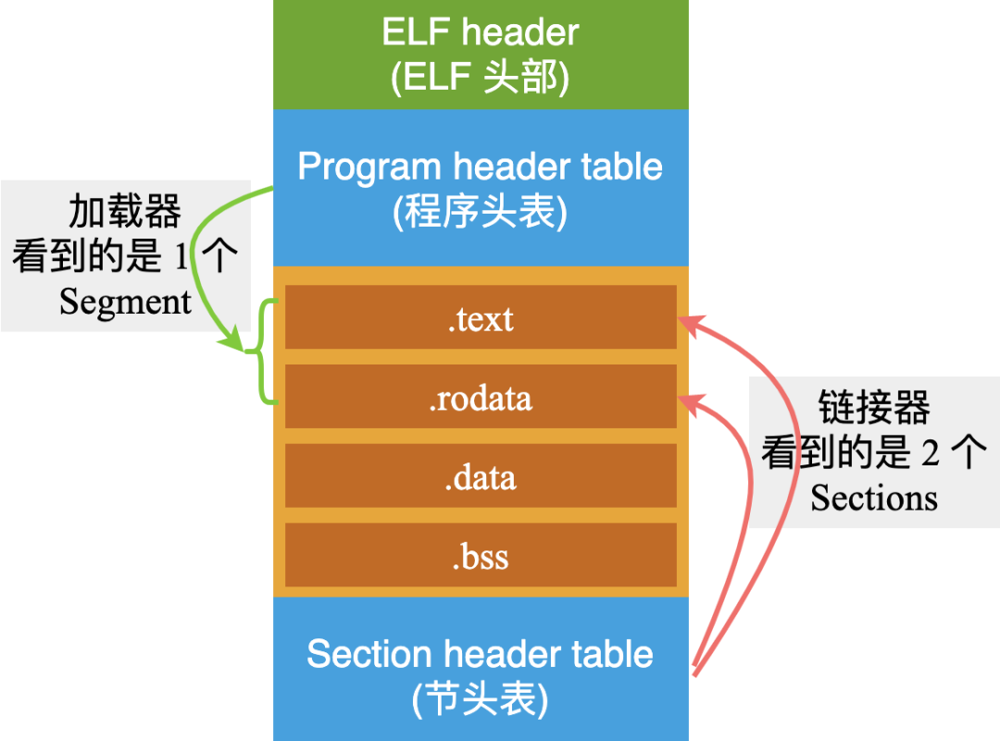
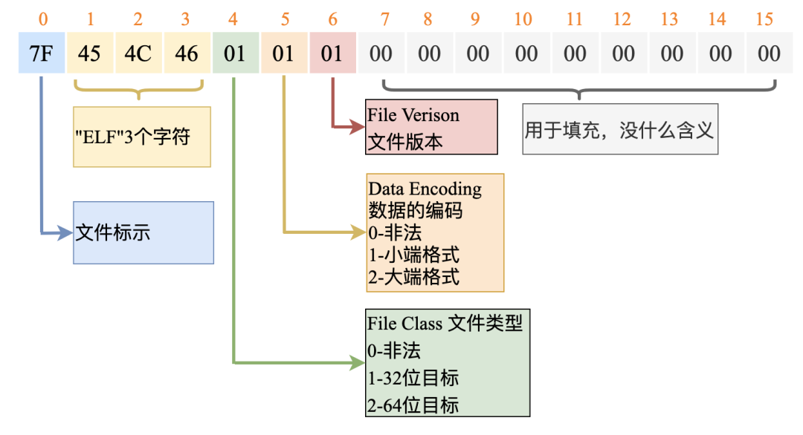
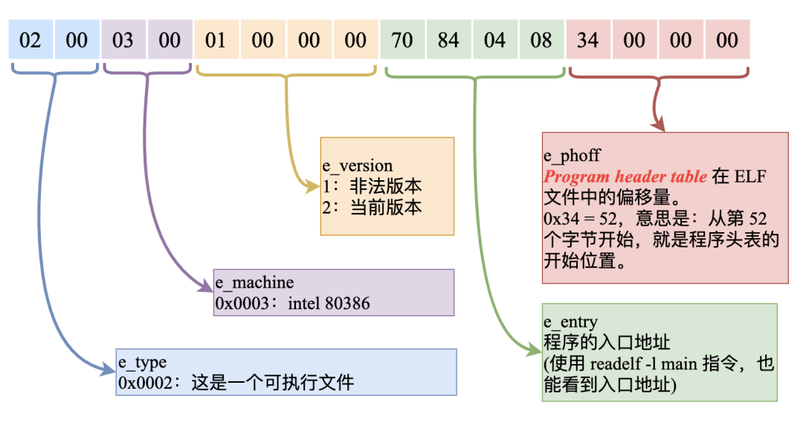
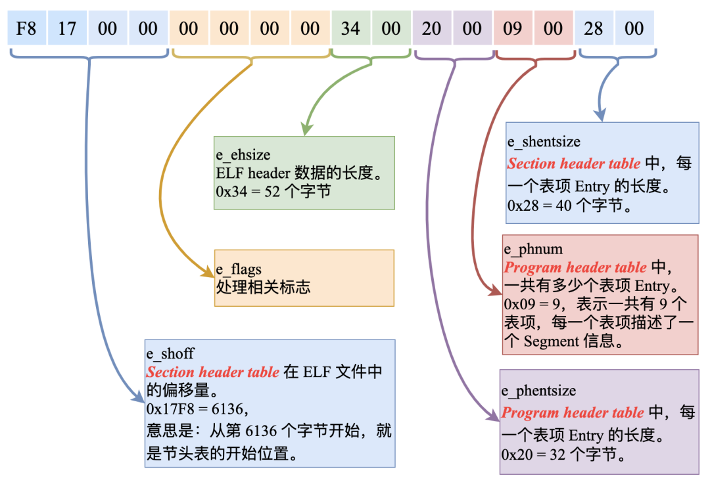
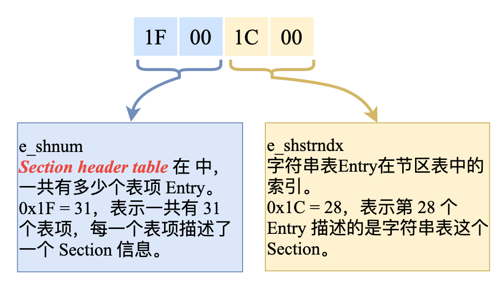
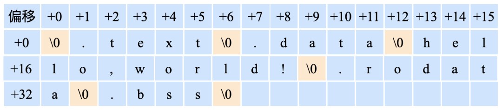

## <center>ELF文件剥析</center>
---

### 一、ELF文件类型与格式概括

#### 1. ELF文件类型与格式概括

&emsp;&emsp;一个elf文件的格式如下图所示：


ELF格式又可以主要分为三种子类型：

- 可执行文件：被操作系统中的加载器从硬盘上读取，载入到内存中去执行;
- 目标文件(.o)：被链接器读取，用来产生一个可执行文件或者共享库文件;
- 共享库文件(.so)：在动态链接的时候，由 ld-linux.so 来读取;

这些子类型被不同的组件使用，这些组件看到的视角也不同，比如链接器的视角为：


链接器只关心文件头，节和节头表三部分。而加载器的视角为：


加载器只关心文件头，程序头表和段。一个段可能包含一个或多个节，如下面这样：



#### 2. ELF文件分析主要工具介绍

- ELF文件解析工具readelf
- ELF文件反汇编工具objdump
- ELF文件符号显示工具nm
- 二进制文件显示工具od和hexdump


### 二、ELF文件剥析

#### 1. 文件头(ELF header)

&emsp;&emsp;文件头的数据结构为：

```c
#define EI_NIDENT	16

typedef struct {
    unsigned char	e_ident[EI_NIDENT];	  //elf魔数，32/64位（class），大小端，文件版本，填充
    Elf32_Half		e_type;				//elf类型，比如可执行还是.o或者.so
    Elf32_Half		e_machine;			//机器平台
    Elf32_Word		e_version;			//文件版本，和e_ident中的一样，只能为1
    Elf32_Addr		e_entry;			//加载到虚拟内存后的入口地址
    Elf32_Off		e_phoff;			//程序头表(段头表)在文件中的偏移
    Elf32_Off		e_shoff;			//节头表在文件中的偏移
    Elf32_Word		e_flags;			//内核当前没用
    Elf32_Half		e_ehsize;			//文件头的字节数
    Elf32_Half		e_phentsize;		//程序头表每一项的字节数
    Elf32_Half		e_phnum;			//程序头表的项数
    Elf32_Half		e_shentsize;		//节头表每一项的字节数
    Elf32_Half		e_shnum;			//节头表的项数
    Elf32_Half		e_shstrndx;			//包含节名称的字符串表在节头表中的索引
} Elf32_Ehdr;
```

&emsp;&emsp;举例：

```c
// mymath.c
int my_add(int a, int b)
{
    return a + b;
}

// main.c
#include <stdio.h>
extern int my_add(int a, int b);

int main()
{
   int i = 1;
   int j = 2;
   int k = my_add(i, j);
   printf("k = %d \n", k);
}

//编译
gcc -m32 -c main.c -o main.o
gcc -m32 -c mymath.c -o mymath.o
gcc -m32 -o main main.o mymath.o
```

&emsp;&emsp;首先用`readelf -h  main`来看一下main文件的elf文件头信息：

```c
ELF Header:
  Magic:   7f 45 4c 46 01 01 01 00 00 00 00 00 00 00 00 00
  Class:                             ELF32
  Data:                              2's complement, little endian
  Version:                           1 (current)
  OS/ABI:                            UNIX - System V
  ABI Version:                       0
  Type:                              EXEC (Executable file)
  Machine:                           Intel 80386
  Version:                           0x1
  Entry point address:               0x8048320
  Start of program headers:          52 (bytes into file)
  Start of section headers:          5972 (bytes into file)
  Flags:                             0x0
  Size of this header:               52 (bytes)
  Size of program headers:           32 (bytes)
  Number of program headers:         9
  Size of section headers:           40 (bytes)
  Number of section headers:         30
  Section header string table index: 29
```

&emsp;&emsp;从结果来看知道文件头本身占用了52字节，使用`od -Ax -t x1 -N 52 main`来进行验证：

```c
000000 7f 45 4c 46 01 01 01 00 00 00 00 00 00 00 00 00
000010 02 00 03 00 01 00 00 00 20 83 04 08 34 00 00 00
000020 54 17 00 00 00 00 00 00 34 00 20 00 09 00 28 00
000030 1e 00 1d 00
```

&emsp;&emsp;从od的输出信息看到文件头的0-15字节和readelf显示的Magic一样，这16个字节就是e_ident[EI_NIDENT]成员。具体部分对应的含义如图：

**0-15字节：**



&emsp;&emsp;因此readelf工具显示的Magic之后的三个Class，Data和Version就是从Magic中的16个字节中提取出来的，有些重复。文件头剩下的部分16-51字节(52-16=36)如下：

**16-31字节：**



fix：e_entry是20 83 04 08

**32-47字节：**



fix：e_shoff是0x1754=5972；

**48-51字节：**



fix：e_shnum是0x1e=30；e_shstrndx是0x1d=29

#### 2. 程序头表

程序头表表项的数据结构为：

```c
/* 32字节 */
typedef struct {
    Elf32_Word	p_type;		//段类型，比如PT_LOAD表示可装载段，需要映射到内存中
    Elf32_Off	p_offset;	//段在elf文件中的偏移
    Elf32_Addr	p_vaddr; 	//段加载映射到内存的虚拟地址
    Elf32_Addr	p_paddr; 	//和虚拟地址相同，没有mmu才有用
    Elf32_Word	p_filesz; 	//段在elf文件中占据的字节数
    Elf32_Word	p_memsz; 	//段加载到内存占据的字节数,常见的两种情况是0和p_filesz
    Elf32_Word	p_flags; 	//权限，PF_R读权限，PF_W写权限，PF_E执行权限
    Elf32_Word	p_align;	//对齐2的P_align次方
} Elf32_Phdr;
```

&emsp;&emsp;从上文的例子知道main文件的程序头表的文件偏移为52，有9项，每一项32字节，因此可以通过`od -Ax -t x1 -j 52 -N 288 main`读取程序头表所有表项：

```c
000034 06 00 00 00 34 00 00 00 34 80 04 08 34 80 04 08
000044 20 01 00 00 20 01 00 00 04 00 00 00 04 00 00 00
000054 03 00 00 00 54 01 00 00 54 81 04 08 54 81 04 08
000064 13 00 00 00 13 00 00 00 04 00 00 00 01 00 00 00
000074 01 00 00 00 00 00 00 00 00 80 04 08 00 80 04 08	//代码段p_type，p_offset，p_vaddr，p_paddr
000084 80 06 00 00 80 06 00 00 05 00 00 00 00 10 00 00	//代码段p_filesz,p_memsz,p_flags,p_align
000094 01 00 00 00 04 0f 00 00 04 9f 04 08 04 9f 04 08	//数据段p_type，p_offset，p_vaddr，p_paddr
0000a4 18 01 00 00 1c 01 00 00 06 00 00 00 00 10 00 00	//数据段p_filesz,p_memsz,p_flags,p_align
0000b4 02 00 00 00 0c 0f 00 00 0c 9f 04 08 0c 9f 04 08
0000c4 f0 00 00 00 f0 00 00 00 06 00 00 00 04 00 00 00
0000d4 04 00 00 00 68 01 00 00 68 81 04 08 68 81 04 08
0000e4 20 00 00 00 20 00 00 00 04 00 00 00 04 00 00 00
0000f4 50 e5 74 64 28 05 00 00 28 85 04 08 28 85 04 08
000104 44 00 00 00 44 00 00 00 04 00 00 00 04 00 00 00
000114 51 e5 74 64 00 00 00 00 00 00 00 00 00 00 00 00
000124 00 00 00 00 00 00 00 00 06 00 00 00 10 00 00 00
000134 52 e5 74 64 04 0f 00 00 04 9f 04 08 04 9f 04 08
000144 fc 00 00 00 fc 00 00 00 04 00 00 00 01 00 00 00
000154
```

&emsp;&emsp;通过`readelf -l main`可以直接得到可读性较强的程序头表信息：

```c
Elf file type is EXEC (Executable file)
Entry point 0x8048320
There are 9 program headers, starting at offset 52	//程序头表表项数和文件偏移

Program Headers:
  Type           Offset   VirtAddr   PhysAddr   FileSiz MemSiz  Flg Align
  PHDR           0x000034 0x08048034 0x08048034 0x00120 0x00120 R   0x4
  INTERP         0x000154 0x08048154 0x08048154 0x00013 0x00013 R   0x1
      [Requesting program interpreter: /lib/ld-linux.so.2]
  LOAD           0x000000 0x08048000 0x08048000 0x00680 0x00680 R E 0x1000	//代码段
  LOAD           0x000f04 0x08049f04 0x08049f04 0x00118 0x0011c RW  0x1000	//数据段
  DYNAMIC        0x000f0c 0x08049f0c 0x08049f0c 0x000f0 0x000f0 RW  0x4
  NOTE           0x000168 0x08048168 0x08048168 0x00020 0x00020 R   0x4
  GNU_EH_FRAME   0x000528 0x08048528 0x08048528 0x00044 0x00044 R   0x4
  GNU_STACK      0x000000 0x00000000 0x00000000 0x00000 0x00000 RW  0x10
  GNU_RELRO      0x000f04 0x08049f04 0x08049f04 0x000fc 0x000fc R   0x1

 Section to Segment mapping:
  Segment Sections...
   00
   01     .interp
   02     .interp .note.ABI-tag .hash .gnu.hash .dynsym .dynstr .gnu.version .gnu.version_r .rel.dyn .rel.plt .init .plt .plt.got .text .fini .rodata .eh_frame_hdr .eh_frame	//代码段
   03     .init_array .fini_array .dynamic .got .got.plt .data .bss	//数据段
   04     .dynamic
   05     .note.ABI-tag
   06     .eh_frame_hdr
   07
   08     .init_array .fini_array .dynamic .got
```

&emsp;&emsp;这里主要拿代码段和数据段来对比一下od和readelf的输出信息是否符合：可以看出是符合的，普通人觉得有点奇怪的是代码段的偏移p_offset为0，**说明从文件头开始就是代码段的部分**。

#### 3. 节头表

节头表表项的数据结构为：

```c
/* 40字节 */
typedef struct {
    Elf32_Word	sh_name;	//节的名字在字符串表中的索引
    Elf32_Word	sh_type;	//节类型，比如SHT_PROGBITS表示程序执行代码或者数据等
    Elf32_Word	sh_flags;	//权限，读写，分配内存，可执行等
    Elf32_Addr	sh_addr; 	//映射到内存的虚拟地址
    Elf32_Off	sh_offset; 	//节在elf文件的偏移
    Elf32_Word	sh_size; 	//节的长度，单位字节
    Elf32_Word	sh_link; 	//对于重定位节是相应符号表在节头表中的索引
    Elf32_Word	sh_info; 	//对于重定位节是该重定位节所作用的节在节头表中的索引
    Elf32_Word	sh_addralign;	//对齐2的sh_addralign次方
    Elf32_Word	sh_entsize; //对于包含固定大小项的节表示每项的大小，否则为0
} Elf32_Shdr;
```

&emsp;&emsp;从上文的例子知道main文件的节头表的文件偏移为5972，有30项，每一项40字节，因此可以通过`od -Ax -t x1 -j 5972 -N 1200 main`读取程序头表所有表项：

```c
001754 00 00 00 00 00 00 00 00 00 00 00 00 00 00 00 00
*
001774 00 00 00 00 00 00 00 00 1b 00 00 00 01 00 00 00
001784 02 00 00 00 54 81 04 08 54 01 00 00 13 00 00 00
...
...
001bd4 01 00 00 00 00 00 00 00 11 00 00 00 03 00 00 00
001be4 00 00 00 00 00 00 00 00 5f 16 00 00 f2 00 00 00
001bf4 00 00 00 00 00 00 00 00 01 00 00 00 00 00 00 00
001c04
```

&emsp;&emsp;通过`readelf -S main`可以直接得到可读性较强的程序头表信息：

```c
There are 30 section headers, starting at offset 0x1754:

Section Headers:
  [Nr] Name              Type            Addr     Off    Size   ES Flg Lk Inf Al
  [ 0]                   NULL            00000000 000000 000000 00      0   0  0
  [ 1] .interp           PROGBITS        08048154 000154 000013 00   A  0   0  1
  [ 2] .note.ABI-tag     NOTE            08048168 000168 000020 00   A  0   0  4
  [ 3] .hash             HASH            08048188 000188 000028 04   A  5   0  4
  [ 4] .gnu.hash         GNU_HASH        080481b0 0001b0 000020 04   A  5   0  4
  [ 5] .dynsym           DYNSYM          080481d0 0001d0 000050 10   A  6   1  4
  [ 6] .dynstr           STRTAB          08048220 000220 00004c 00   A  0   0  1
  [ 7] .gnu.version      VERSYM          0804826c 00026c 00000a 02   A  5   0  2
  [ 8] .gnu.version_r    VERNEED         08048278 000278 000020 00   A  6   1  4
  [ 9] .rel.dyn          REL             08048298 000298 000008 08   A  5   0  4
  [10] .rel.plt          REL             080482a0 0002a0 000010 08  AI  5  23  4
  [11] .init             PROGBITS        080482b0 0002b0 000023 00  AX  0   0  4
  [12] .plt              PROGBITS        080482e0 0002e0 000030 04  AX  0   0 16
  [13] .plt.got          PROGBITS        08048310 000310 000008 08  AX  0   0  8
  [14] .text             PROGBITS        08048320 000320 0001e2 00  AX  0   0 16
  [15] .fini             PROGBITS        08048504 000504 000014 00  AX  0   0  4
  [16] .rodata           PROGBITS        08048518 000518 000010 00   A  0   0  4
  [17] .eh_frame_hdr     PROGBITS        08048528 000528 000044 00   A  0   0  4
  [18] .eh_frame         PROGBITS        0804856c 00056c 000114 00   A  0   0  4
  [19] .init_array       INIT_ARRAY      08049f04 000f04 000004 04  WA  0   0  4
  [20] .fini_array       FINI_ARRAY      08049f08 000f08 000004 04  WA  0   0  4
  [21] .dynamic          DYNAMIC         08049f0c 000f0c 0000f0 08  WA  6   0  4
  [22] .got              PROGBITS        08049ffc 000ffc 000004 04  WA  0   0  4
  [23] .got.plt          PROGBITS        0804a000 001000 000014 04  WA  0   0  4
  [24] .data             PROGBITS        0804a014 001014 000008 00  WA  0   0  4
  [25] .bss              NOBITS          0804a01c 00101c 000004 00  WA  0   0  1
  [26] .comment          PROGBITS        00000000 00101c 00002d 01  MS  0   0  1
  [27] .symtab           SYMTAB          00000000 00104c 000420 10     28  45  4
  [28] .strtab           STRTAB          00000000 00146c 0001f3 00      0   0  1
  [29] .shstrtab         STRTAB          00000000 00165f 0000f2 00      0   0  1
Key to Flags:
  W (write), A (alloc), X (execute), M (merge), S (strings), I (info),
  L (link order), O (extra OS processing required), G (group), T (TLS),
  C (compressed), x (unknown), o (OS specific), E (exclude),
  p (processor specific)
```

&emsp;&emsp;od和readelf的对照信息就不看了，和程序头表类似。结合上一节的段的信息知道代码段的文件偏移为0，长度为0x680，代码段最后一节为.eh_frame。看这里readelf输出信息得到.eh_frame的文件偏移为0x0056c，长度为0x00114，加起来就是0x680。

#### 4.MISC

##### 4.1 字符串表表项

&emsp;&emsp;在一个ELF文件中，存在很多字符串，例如：变量名、节名、链接器加入的符号名等等。这些字符串的长度都不是固定的，因此用一个固定的结构来表示这些字符串，肯定是不现实的。于是前辈就想到：把这些字符串集中起来，统一放在一起，作为一个独立的节来管理。在文件中的其他地方如果想表示或者引用一个字符串，就在这个地方用一个数字索引代替：表示这个字符串位于字符串统一存储地方的某个偏移位置。比如下面的图就是一个字符串表：



如果想引用字符串"hello,world!"，那么就用13这个数字来表示。回到main的elf文件，在文件头的最后两个字节是1d00，对应的是e_shstrndx，表示节头字符串表是第29个节头表表项描述的。通过上文就知道是.shstrtab没错。

##### 4.2 读取字符串表的内容

&emsp;&emsp;从上文readelf输出信息知道.shstrtab节的文件偏移为0x165f，长度为f2字节，因此可以通过命令`od -Ad -t c -j 5727 -N 242 main`来读取字符串表.shstrtab的内容：

```c
0005727  \0   .   s   y   m   t   a   b  \0   .   s   t   r   t   a   b
0005743  \0   .   s   h   s   t   r   t   a   b  \0   .   i   n   t   e
0005759   r   p  \0   .   n   o   t   e   .   A   B   I   -   t   a   g
0005775  \0   .   g   n   u   .   h   a   s   h  \0   .   d   y   n   s
0005791   y   m  \0   .   d   y   n   s   t   r  \0   .   g   n   u   .
0005807   v   e   r   s   i   o   n  \0   .   g   n   u   .   v   e   r
0005823   s   i   o   n   _   r  \0   .   r   e   l   .   d   y   n  \0
0005839   .   r   e   l   .   p   l   t  \0   .   i   n   i   t  \0   .
0005855   p   l   t   .   g   o   t  \0   .   t   e   x   t  \0   .   f
0005871   i   n   i  \0   .   r   o   d   a   t   a  \0   .   e   h   _
0005887   f   r   a   m   e   _   h   d   r  \0   .   e   h   _   f   r
0005903   a   m   e  \0   .   i   n   i   t   _   a   r   r   a   y  \0
0005919   .   f   i   n   i   _   a   r   r   a   y  \0   .   d   y   n
0005935   a   m   i   c  \0   .   g   o   t   .   p   l   t  \0   .   d
0005951   a   t   a  \0   .   b   s   s  \0   .   c   o   m   m   e   n
0005967   t  \0
```

&emsp;&emsp;可以发现.shtrtab都是节名。同样可以`od -Ad -t c -j 5228 -N 499 main`读取另一个字符串表.strtab的内容：

```c
0005228  \0   c   r   t   s   t   u   f   f   .   c  \0   d   e   r   e
0005244   g   i   s   t   e   r   _   t   m   _   c   l   o   n   e   s
0005260  \0   _   _   d   o   _   g   l   o   b   a   l   _   d   t   o
0005276   r   s   _   a   u   x  \0   c   o   m   p   l   e   t   e   d
0005292   .   6   9   3   9  \0   _   _   d   o   _   g   l   o   b   a
0005308   l   _   d   t   o   r   s   _   a   u   x   _   f   i   n   i
0005324   _   a   r   r   a   y   _   e   n   t   r   y  \0   f   r   a
0005340   m   e   _   d   u   m   m   y  \0   _   _   f   r   a   m   e
0005356   _   d   u   m   m   y   _   i   n   i   t   _   a   r   r   a
0005372   y   _   e   n   t   r   y  \0   m   a   i   n   .   c  \0   m
0005388   y   m   a   t   h   .   c  \0   _   _   F   R   A   M   E   _
0005404   E   N   D   _   _  \0   _   _   i   n   i   t   _   a   r   r
0005420   a   y   _   e   n   d  \0   _   D   Y   N   A   M   I   C  \0
0005436   _   _   i   n   i   t   _   a   r   r   a   y   _   s   t   a
0005452   r   t  \0   _   _   G   N   U   _   E   H   _   F   R   A   M
0005468   E   _   H   D   R  \0   _   G   L   O   B   A   L   _   O   F
0005484   F   S   E   T   _   T   A   B   L   E   _  \0   _   _   l   i
0005500   b   c   _   c   s   u   _   f   i   n   i  \0   _   _   x   8
0005516   6   .   g   e   t   _   p   c   _   t   h   u   n   k   .   b
0005532   x  \0   p   r   i   n   t   f   @   @   G   L   I   B   C   _
0005548   2   .   0  \0   _   e   d   a   t   a  \0   _   _   d   a   t
0005564   a   _   s   t   a   r   t  \0   _   _   g   m   o   n   _   s
0005580   t   a   r   t   _   _  \0   _   _   d   s   o   _   h   a   n
0005596   d   l   e  \0   _   I   O   _   s   t   d   i   n   _   u   s
0005612   e   d  \0   _   _   l   i   b   c   _   s   t   a   r   t   _
0005628   m   a   i   n   @   @   G   L   I   B   C   _   2   .   0  \0
0005644   _   _   l   i   b   c   _   c   s   u   _   i   n   i   t  \0
0005660   _   d   l   _   r   e   l   o   c   a   t   e   _   s   t   a
0005676   t   i   c   _   p   i   e  \0   _   f   p   _   h   w  \0   _
0005692   _   b   s   s   _   s   t   a   r   t  \0   m   a   i   n  \0
0005708   m   y   _   a   d   d  \0   _   _   T   M   C   _   E   N   D
0005724   _   _  \0
```

&emsp;&emsp;这个字符串表就包含了我们程序中的变量名函数名和一起编译器加进去的字符串。

##### 4.3  符号表表项

&emsp;&emsp;符号表表项的数据结构为：

```c
/* 16字节 */
typedef struct elf32_sym {
    Elf32_Word		st_name;	//该符号名在字符串表.strtab中的索引
    Elf32_Addr		st_value;	//通常是符号定义的地址
    Elf32_Word		st_size;	//符号大小
    unsigned char	st_info;	//符号类型和绑定信息，如STB_GLOBAL和STT_FUNC
    unsigned char	st_other;	//没有使用
    Elf32_Half		st_shndx;	//符号所在段在程序头表的索引，有特殊值SHN_ABS,SHN_COMMON,SHN_UNDEF
} Elf32_Sym;
```

&emsp;&emsp;通过`readelf -s main`读取符号表信息：

```c
Symbol table '.dynsym' contains 5 entries:
   Num:    Value  Size Type    Bind   Vis      Ndx Name
     0: 00000000     0 NOTYPE  LOCAL  DEFAULT  UND
     1: 00000000     0 FUNC    GLOBAL DEFAULT  UND printf@GLIBC_2.0 (2)
     2: 00000000     0 NOTYPE  WEAK   DEFAULT  UND __gmon_start__
     3: 00000000     0 FUNC    GLOBAL DEFAULT  UND __libc_start_main@GLIBC_2.0 (2)
     4: 0804851c     4 OBJECT  GLOBAL DEFAULT   16 _IO_stdin_used

Symbol table '.symtab' contains 66 entries:
   Num:    Value  Size Type    Bind   Vis      Ndx Name
     0: 00000000     0 NOTYPE  LOCAL  DEFAULT  UND
     1: 08048154     0 SECTION LOCAL  DEFAULT    1
     2: 08048168     0 SECTION LOCAL  DEFAULT    2
     3: 08048188     0 SECTION LOCAL  DEFAULT    3
     4: 080481b0     0 SECTION LOCAL  DEFAULT    4
     ...
     ...
    48: 00000000     0 FUNC    GLOBAL DEFAULT  UND printf@@GLIBC_2.0
    49: 0804a01c     0 NOTYPE  GLOBAL DEFAULT   24 _edata
    50: 08048504     0 FUNC    GLOBAL DEFAULT   15 _fini
    51: 0804a014     0 NOTYPE  GLOBAL DEFAULT   24 __data_start
    52: 00000000     0 NOTYPE  WEAK   DEFAULT  UND __gmon_start__
    53: 0804a018     0 OBJECT  GLOBAL HIDDEN    24 __dso_handle
    54: 0804851c     4 OBJECT  GLOBAL DEFAULT   16 _IO_stdin_used
    55: 00000000     0 FUNC    GLOBAL DEFAULT  UND __libc_start_main@@GLIBC_
    56: 080484a0    93 FUNC    GLOBAL DEFAULT   14 __libc_csu_init
    57: 0804a020     0 NOTYPE  GLOBAL DEFAULT   25 _end
    58: 08048360     2 FUNC    GLOBAL HIDDEN    14 _dl_relocate_static_pie
    59: 08048320     0 FUNC    GLOBAL DEFAULT   14 _start
    60: 08048518     4 OBJECT  GLOBAL DEFAULT   16 _fp_hw
    61: 0804a01c     0 NOTYPE  GLOBAL DEFAULT   25 __bss_start
    62: 08048436    83 FUNC    GLOBAL DEFAULT   14 main
    63: 08048489    13 FUNC    GLOBAL DEFAULT   14 my_add
    64: 0804a01c     0 OBJECT  GLOBAL HIDDEN    24 __TMC_END__
    65: 080482b0     0 FUNC    GLOBAL DEFAULT   11 _init
```

&emsp;&emsp;通过上文知道符号表.symtab的文件偏移为4172(104c) ，大小为1056(420)，然后使用`od -Ax -t x1 -j 4172 -N 1056 main` 读取未解析的符号表内容：

```c
00104c 00 00 00 00 00 00 00 00 00 00 00 00 00 00 00 00
00105c 00 00 00 00 54 81 04 08 00 00 00 00 03 00 01 00
...
0013dc c2 00 00 00 20 a0 04 08 00 00 00 00 10 00 19 00
0013ec b0 01 00 00 60 83 04 08 02 00 00 00 12 02 0e 00
0013fc 51 01 00 00 20 83 04 08 00 00 00 00 12 00 0e 00
00140c c8 01 00 00 18 85 04 08 04 00 00 00 11 00 10 00
00141c cf 01 00 00 1c a0 04 08 00 00 00 00 10 00 19 00
00142c db 01 00 00 36 84 04 08 53 00 00 00 12 00 0e 00
00143c e0 01 00 00 89 84 04 08 0d 00 00 00 12 00 0e 00
00144c e7 01 00 00 1c a0 04 08 00 00 00 00 11 02 18 00
00145c aa 01 00 00 b0 82 04 08 00 00 00 00 12 00 0b 00
```

&emsp;&emsp;刚好有66个符号表表项，与readelf的一一对应。

##### 4.4 重定位表表项

&emsp;&emsp;重定位表表项的数据结构为：

```c
/* 8字节 */
typedef struct elf32_rel {
    Elf32_Addr	r_offset;	//对于可重定位文件来说，是要修正的位置第一字节相对于该节的偏移
    Elf32_Word	r_info;		//重定位表表项的类型(相对pc和绝对)和引用的符号在符号表中的索引
} Elf32_Rel;
```

另外一个例子：

```c
/*
 * SimpleSection.c
 *
 * gcc -m32 -c SimpleSection.c
 *
 */

int printf(const char* format, ...);

int global_init_var = 84;
int global_uninit_var;

void func1(int i)
{
    printf("%d\n", i);
}

int main(void)
{
    static int static_var1 = 85;
    static int static_var2;
    int a = 1;
    int b;
    func1(static_var1 + static_var2 + a + b);

    return a;
}
```

&emsp;&emsp;首先通过`readelf -s SimpleSection.o`查看符号表：

```c
Symbol table '.symtab' contains 16 entries:
   Num:    Value  Size Type    Bind   Vis      Ndx Name
     0: 00000000     0 NOTYPE  LOCAL  DEFAULT  UND
     1: 00000000     0 FILE    LOCAL  DEFAULT  ABS SimpleSection.c
     2: 00000000     0 SECTION LOCAL  DEFAULT    1
     3: 00000000     0 SECTION LOCAL  DEFAULT    3
     4: 00000000     0 SECTION LOCAL  DEFAULT    4
     5: 00000000     0 SECTION LOCAL  DEFAULT    5
     6: 00000004     4 OBJECT  LOCAL  DEFAULT    3 static_var1.1741
     7: 00000000     4 OBJECT  LOCAL  DEFAULT    4 static_var2.1742
     8: 00000000     0 SECTION LOCAL  DEFAULT    7
     9: 00000000     0 SECTION LOCAL  DEFAULT    8
    10: 00000000     0 SECTION LOCAL  DEFAULT    6
    11: 00000000     4 OBJECT  GLOBAL DEFAULT    3 global_init_var
    12: 00000004     4 OBJECT  GLOBAL DEFAULT  COM global_uninit_var
    13: 00000000    28 FUNC    GLOBAL DEFAULT    1 func1
    14: 00000000     0 NOTYPE  GLOBAL DEFAULT  UND printf
    15: 0000001c    70 FUNC    GLOBAL DEFAULT    1 main
```

&emsp;&emsp;然后通过`readelf -r SimpleSection.o`查看重定位表：

```c
Relocation section '.rel.text' at offset 0x2a0 contains 5 entries:
 Offset     Info    Type            Sym.Value  Sym. Name
0000000d  00000501 R_386_32          00000000   .rodata
00000012  00000e02 R_386_PC32        00000000   printf
00000036  00000301 R_386_32          00000000   .data
0000003b  00000401 R_386_32          00000000   .bss
00000050  00000d02 R_386_PC32        00000000   func1

Relocation section '.rel.eh_frame' at offset 0x2c8 contains 2 entries:
 Offset     Info    Type            Sym.Value  Sym. Name
00000020  00000202 R_386_PC32        00000000   .text
00000040  00000202 R_386_PC32        00000000   .text
```

#### 5. 符号解析与重定位

&emsp;&emsp;在链接器完成各个段和符号的内存空间地址分配之后就进入了符号解析和重定位过程。

##### 5.1 符号解析

- 编译器将符号的定义放在符号表中
- 编译器将符号的引用放在重定位表中
- 链接器将符号额引用和定义联系起来

##### 5.2 重定位

&emsp;&emsp;参考**程序员的自我修养 一一 链接、装载与库**的**4.2小节**。


