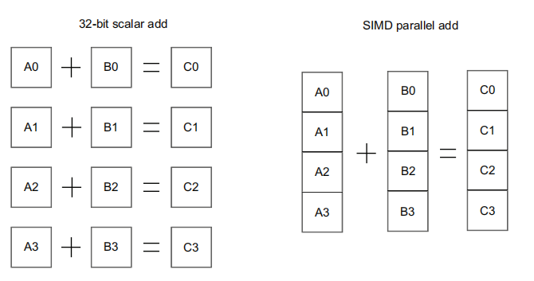
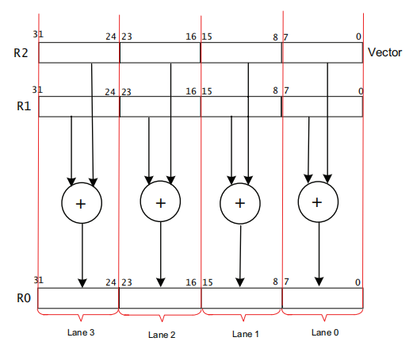
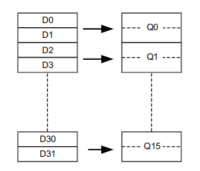
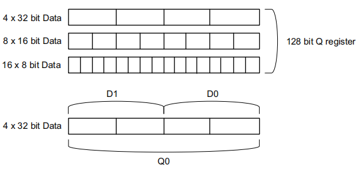
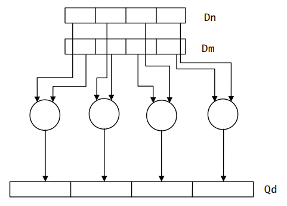
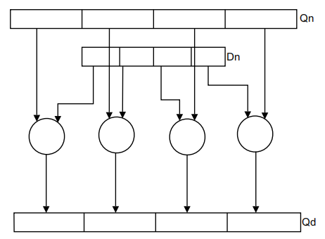
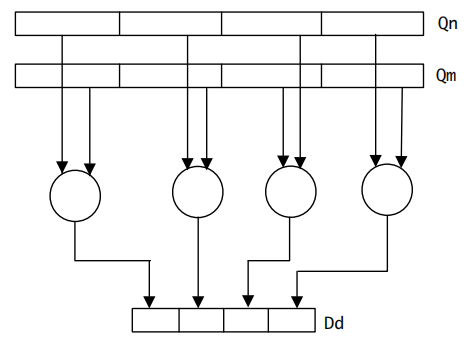

## <center>ARM SIMD指令集</center>

[TOC]

### 一、NEON介绍

&emsp;&emsp;NEON是ARM CORTEX系列处理器的SIMD处理单元。SIMD是一种计算技术，使用一条指令处理通常需要几条普通指令处理的一些数据，操作的数据打包到特殊的宽寄存器中。



&emsp;&emsp;如上图所示，要在不使用SIMD的情况下实现四个单独的加法操作，需要使用四个ADD指令，SIMD只需要一条指令就可以做到了。



&emsp;&emsp;上图展示了SIMD指令`UADD8 R0, R1, R2`的操作。该操作并行计算四对8位元素（称为通道）的加法，操作数被打包到通用寄存器R1和R2中的向量中，并将结果放置到寄存器R0中的向量中。各个通道的操作是真正独立的。通道0的位[7]的溢出借位不影响通道1的位[0]（整个寄存器的[8]位[8]），这是一个单独的计算。

---

### 二、NEON架构

#### 1. NEON数据类型

&emsp;&emsp;NEON支持8、16、32和64位整数和单精度（32位）浮点数据的SIMD操作。具体主要操作的类型如下：

- 32位的单精度浮点。

- 8, 16, 32 and 64位的无符号和有符号整数

&emsp;&emsp;NEON指令中的数据类型说明符由一个表示数据类型的字母和一个表示数据宽度的数字组成。 它们与指令助记符通过一个点分开，例如`VMLAL.S8`。所以有以下的可能性：

- 无符号整型 U8 U16 U32 U64
- 有符号整型 S8 S16 S32 S64
- 不确定符号整型 I8 I16 I32 I64
- 浮点型 F16 F32

#### 2. NEON寄存器

&emsp;&emsp;NEON寄存器组有32个64位（D0 - D31）的寄存器，也可以看成16个128位（Q0 - Q31）的寄存器。如下所示：



&emsp;&emsp;下图的寄存器视图由所使用的指令的形式决定。这样，软件就不必显式地更改状态了。



&emsp;&emsp;NEON数据处理指令通常可用于**正常、长、宽、窄**四种寄存器相对长度模式。

- 正常模式指令可以在任何类型数据上操作，并且操作数寄存器的长度与结果寄存器的长度相同。
- 长模式指令用于操作64位的双字长度的寄存器，产生的结果存放在128位的4字长度寄存器中。长模式指令要在助记符后加一个L，如`VADDL.I16 Qd, Dn, Dm`。



- 宽模式指令对双字向量操作数和四字向量操作数进行操作，产生四字向量结果。结果元素和第一个操作数是第二个操作数元素宽度的两倍。宽的指令在指令上附加了一个W，如`VADDW.I16 Qd, Qn, Dn`。



- 窄指令对四字向量操作数进行操作，并产生双字向量结果。结果元素通常是操作数元素宽度的一半。使用指令中附加的N指定窄指令。下图显示了这一点，输入操作数在操作前被降级。`VADDHN.I16 Dd, Qn, Qn`。



#### 3. NEON指令集

&emsp;&emsp;NEON指令都以V开头，这些指令通常可以操作不同类型和宽度的数据类型，其中操作的数据的类型和宽度在助记符的点号的后缀表示。比如指令`VADD.I8 D0, D1, D2`中VADD是指令的助记符，表示一个NEON加法操作；后缀I8表示操作数据为8位的整型。D0是存放结果的寄存器，D1和D2是存放第一和第二操作数的寄存器，因此这条指令表示8个通道的8位整型数据的相加操作。 

##### NEON语法

&emsp;&emsp;NEON语法格式如下：   
`V{<mod>}<op>{<shape>}{<cond>}{.<dt>} <dest1>{, <dest2>}, <src1>{, <src2>}`  
其中： 

`<mod>` 结果模式描述符，有以下的值：

- Q (Saturating)，如果结果超限则将结果设置为最大值或最小值。
- H (Halving)，将结果向右移动一位。
- D (Doubling)，将结果乘以2。
- R (Rounding)，将结果舍入，等效于先将结果加上0.5再截断。

`<op>` 操作符 (比如 ADD, SUB, MUL)

`<shape>` 相对寄存器长度描述符，有以下的值：

- L (Long)，操作数宽度相同，结果宽度是每个操作数宽度的两倍。比如 `VADDL.S16 Q0, D2, D3`
- W (Wide)，第一个操作数和结果是第二个操作数宽度的两倍。比如 `VADDW.I16 Q0, Q1, D4`
- N (Narrow)，操作数宽度相同，结果宽度是每个操作数宽度的一半。比如 `VADDHN.I16 D0, Q1, Q2`

`<cond>` 条件码

`<dt>` 表示操作数据类型的类型和宽度。比如 `U32`

`<dest1>, <dest2>` 目的寄存器

`<src1>, <src2>` 操作数源寄存器

##### NEON常用指令

###### 数据移动指令

```c
/* (Vector Bitwise Move) (immediate), places an immediate value into every element of the 
destination register. */
VMOV{cond}.datatype Qd, #imm
VMOV{cond}.datatype Dd, #imm
/*  (Vector Move) (register) copies a value from a source register to a destination register. */
VMOV{cond}{.datatype} Qd, Qm
VMOV{cond}{.datatype} Dd, Dm
/* puts a floating-point immediate value into a single-precision or double-precision register, 
or copies one register into another register. */
VMOV{cond}.F32 Sd, #imm
VMOV{cond}.F64 Dd, #imm
VMOV{cond}.F32 Sd, Sm
VMOV{cond}.F64 Dd, Dm
/* Transfer contents between a single-precision floating-point register and an ARM register. */
VMOV{cond} Rd, Sn
VMOV{cond} Sn, Rd
/* Transfer contents between two ARM registers and a 64-bit NEON register, or two consecutive 
32-bit NEON registers. */
VMOV{cond} Dm, Rd, Rn
VMOV{cond} Rd, Rn, Dm
VMOV{cond} Sm, Sm1, Rd, Rn
VMOV{cond} Rd, Rn, Sm, Sm1
/* Transfer contents between an ARM register and a NEON scalar. */
VMOV{cond}{.size} Dn[x], Rd
VMOV{cond}{.datatype} Rd, Dn[x]
```

###### 单数据加载指令

`vldr{cond}{.size} Fd, [Rn{, #offset}]`。这是一条vfp和neon共同使用的指令，对于neon来说size只能是64，Fd是个d寄存器；对于vfp来说size可以是32或者64，size是32时Fd是s寄存器，size是64时Fd是d寄存器。比如：

```c
/* 这只能是vfp指令，将r0指向的32位数据加载到s0寄存器 */
vldr.32 s0, [r0]
/* 这是vfp和neon的通用指令，将r0指向的64位数据加载到d0寄存器 */
vldr.64 d0, [r0]
```

###### 单数据存储指令

`vstr{cond}{.size} Fd, [Rn{, #offset}]` 比如：

```c
/* 这只能是vfp指令，将s0寄存器中的32位数据写到r0指向的地址 */
vstr.32 s0, [r0]
/* 这是vfp和neon的通用指令，d0寄存器中的64位数据写到r0指向的地址 */
vstr.64 d0, [r0]
```

###### 多数据加载指令

`vld1{cond}.datatype list, [Rn]{!}` 比如：

```c
/* 从r0指向的地址处加载2个32位数据到d0，并更新r0 */
vld1.32 {d0}, [r0]!
/* 从r0指向的地址处加载4个32位数据到d0和d1，并更新r0 */
vld1.32 {d0,d1}, [r0]!   
/* 从r0指向的地址处加载4个32位数据到q0，并更新r0 */
vld1.32 {q0}, [r0]!    
```

###### 多数据存储指令 

`vst1{cond}.datatype list, [Rn]{!}` 比如：

```c
/* 将d0的两个32位数据写到r0指向的地址，并更新r0 */
vst1.32 {d0}, [r0]!
/* 将d0和d1的4个32位数据写到r0指向的地址，并更新r0 */    
vst1.32 {d0,d1}, [r0]!
/* 将q0的4个32位数据写到r0指向的地址，并更新r0 */     
vst1.32 {q0}, [r0]!
```

###### 加法指令 

```c
V{Q}ADD{cond}.datatype {Qd,} Qn, Qm
V{Q}ADD{cond}.datatype {Dd,} Dn, Dm
/* 比如，将d0中的两个32位数据和d1中的两个32位数据进行无符号32位加法，
 * 结果分别存入d2的前32位和后32位 
 */
vadd.u32 d2, d0, d1
```

###### 减法指令

`v{q}sub{cond}.datatype {Qd,} Qn, Qm` 比如：

```c
/* 将q0中的4个无符号32位数据分别减去q1中的4个无符号32位数据，
 * 结果分别存入q2对应的部分中
 */
vsub.u32 q2, q0, q1
```

###### 乘法指令

`vmul{cond}.datatype {Qd,} Qn, Qm`或者`vmull{cond}.datatype {Qd,} Qn, Qm`。对于vmul，datatype可以是i8, i16, i32, f32；对于vmull，datatype可以是s8，s16，s32，u8，u16，u32。比如：

```c
/* neon指令，将d0中的两个32位单精度浮点数和d1中的两个进行乘法，
 * 结果分别存入d2的前32位和后32位 
 */
vmul.f32 d2, d0, d1
/* neon指令，将d0中的两个32位有符号整数和d1中的两个进行乘法，
 * 结果分别存入d2的前32位和后32位 
 */
vmull.s32 d2, d0, d1
/* vfp指令，s0除以s1，结果存到s2 */
vmul.f32 s2, s0, s1
/* vfp指令，neon不支持f64，d0除以d1，结果存到d2 */
vmul.f64 d2, d0, d1
```

###### 除法指令

neon没有除法指令，这是vfp指令。`VDIV{cond}.F32 {Sd,} Sn, Sm`

```c
/* s0除以s1结果存到s2*/
vdiv.f32 s2, s0, s1
```

---

### 三、NEON代码示例

&emsp;&emsp;使用neon主要有几种方式：

- 第三方neon优化库
- 向量化编译器
- neon intrinsics
- neon内联汇编
- neon单独汇编

&emsp;&emsp;第一种不讲述；第二种方案对gcc来说是在编译时加入`-ftree-vectorize`选项，这样编译器可能利用neon指令来优化编译的程序，但是这种方法不透明，程序员不知道编译器到底会不会在自己想要优化的地方优化；第三到第五种方案就解决了第二种方案的不确定性，它们都强制使用neon指令，**下文主要讲述这三种方式**。其中第三种方案也是一个事先实现的库，arm-gcc交叉编译器自带的，提供了直接c语言调用的接口；第四种方案在c语言中按照特定 的规则插入neon汇编；第五种将实现的函数写成单独的汇编文件，自己处理寄存器的保存和恢复，需要arm架构调用规范的知识。

#### 1. NEON intrinsics 

&emsp;&emsp;在使用neon intrinsics的代码中首选需要包含头文件arm_neon.h，里面定义了neon相关的数据类型和函数。

##### intrinsics.c 

```c
#include <stdio.h>
#include <arm_neon.h>	//需要包含该头文件

// C version
void add_int_c(int* dst, int* src1, int* src2, int count)
{
    int i;
    for (i = 0; i < count; i++)
        dst[i] = src1[i] + src2[i];
}
 
// NEON version
void add_int_neon(int* dst, int* src1, int* src2, int count)
{
    int i;
    for (i = 0; i < count; i += 4) {
        int32x4_t in1, in2, out;
        in1 = vld1q_s32(src1);
        src1 += 4;
        in2 = vld1q_s32(src2);
        src2 += 4;
        out = vaddq_s32(in1, in2);
        vst1q_s32(dst, out);
        dst += 4;
    }
}

int main(void)
{
    printf("intrinsics test\n");
  	int src1[5] = {1, 2, 3, 4, 5};
    int src2[5] = {6, 8, 0, 2, 4};
    int dst[5] = {0};
    add_int_c(dst, src1, src2, 5);
    add_int_neon(dst, src1, src2, 5);
    return 0;
}
```


#### 2. 内联汇编形式

##### inline.c

```c
#include <stdio.h>

int main(void)
{
    printf("inline test\n");
    unsigned int result1,result2, src1, src2, src3, src4;
    src1 = 0x11223344;
    src2 = 0x44332211;
    src3 = 0x55667788;
    src4 = 0x88776655;
    
    asm volatile (
//        "vadd.u16 %0, %1, %2    \n"
        "nop    \n"
        "vmov d0, %2, %3  \n"
        "vmov d1, %4, %5  \n"
        "vadd.u32 d2, d0, d1   \n"
        "vmov.32 %0, d2[0]  \n"
        "vmov.32 %1, d2[1]  \n"
        :"=&r"(result1), "=&r"(result2)
        :"r"(src1), "r"(src2), "r"(src3), "r"(src4)
        :"memory", "cc", "q0" , "q1"
    );

    return 0;
}
```


#### 3. 单独汇编实现

##### assemble.S

```c
@@ double word one time addition neon operation 
@ r0 = operand1 input array pointer
@ r1 = operand2 input array pointer
@ r2 = output array pointer
@ r3 = length of data in each array, unit word
@ one vector = 2 words
.global neon_addd
.align	4
neon_addd:
	add r3, r3, #1
	lsr r3, r3, #1 			@ find the number of vectors 
loop1:
	subs r3, r3, #1 		@ decrement the loop counter,and set flags
	vld1.32 {d0}, [r0]!		@ load 2 elements from the operand1 array pointed to
							@ by r0 into d0, and update r0 to point to the
							@ next vector
	vld1.32 {d1}, [r1]!		@ same as the operand1 array		

	vadd.u32 d2, d0, d1 		@ count the sum
	vst1.32 {d2}, [r2]!		@ str result to output array
	bne loop1				@ if r3 is not equal to 0, back to loop
exit1:
	mov pc, lr				@ back to c caller
```


##### assembletest.c

```c
#include <stdio.h>
#include <arm_neon.h>
typedef unsigned int u32;
typedef int s32;

void neon_addd(u32 *opd1, u32 *opd2, u32 *result, s32 size);

int main(void)
{
    printf("neon test\n");
    unsigned int src1[8] = {1,2,3,4,5,6,7,8};
    unsigned int src2[8] = {1,2,3,4,5,6,7,8};
    unsigned int dst[8] = {0};
    neon_addd(src1, src2, dst, 4);
    return 0;

}
```


#### 4. 测试对比

&emsp;&emsp;使用intrinsics形式和普通形式进行测试对比。

##### speedtest.c

```c
#include <stdio.h>
#include <stdlib.h>
#include <sys/time.h>
#include <string.h> 
#include <arm_neon.h>
typedef unsigned int u32;
typedef int s32;

// C version
void add_int_c(int* dst, int* src1, int* src2, int count)
{
  int i;
  for (i = 0; i < count; i++)
    dst[i] = src1[i] + src2[i];
}
 
// NEON version
void add_int_neon(int* dst, int* src1, int* src2, int count)
{
  int i;
  for (i = 0; i < count; i += 4)
  {
    int32x4_t in1, in2, out;
    in1 = vld1q_s32(src1);
    src1 += 4;
    in2 = vld1q_s32(src2);
    src2 += 4;
    out = vaddq_s32(in1, in2);
    vst1q_s32(dst, out);
    dst += 4;
  }
}

int main(void)
{
    printf("intrinsics test\n");
    
    s32 size = 1000000;
    u32 *src1 = malloc(size * sizeof(int));
    u32 *src2 = malloc(size * sizeof(int));
    u32 *dst = malloc(size * sizeof(int));

    struct timeval tv;
    
    memset(src1, 1, size * sizeof(int));
    memset(src2, 2, size * sizeof(int));
    gettimeofday(&tv, NULL);
    printf("neon begin usec: %d\n", tv.tv_usec);
    add_int_neon(src1, src2, dst, 250000);
    gettimeofday(&tv, NULL);
    printf("neon end usec: %d\n", tv.tv_usec);

    memset(src1, 1, size * sizeof(int));
    memset(src2, 2, size * sizeof(int));
    gettimeofday(&tv, NULL);
    printf("normal begin usec: %d\n", tv.tv_usec);
    add_int_c(dst, src1, src2, size);
    gettimeofday(&tv, NULL);
    printf("normal end usec: %d\n", tv.tv_usec);

    free(src1);
    free(src2);
    free(dst);

    return 0;
}
```

##### 结果

```c
root@~/nfs/yz# ./intrinsics
intrinsics test
neon begin usec: 610253
neon end usec: 619818
normal begin usec: 624241
normal end usec: 665594
```

&emsp;&emsp;进行同样32位整数一百万次的加法运算，正常的运算需要665594 - 624241 = **41353**微秒，而neon运算只要619818 - 610253 = **9565**微秒，大约4倍的速度。

