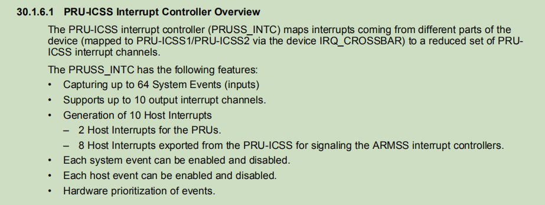
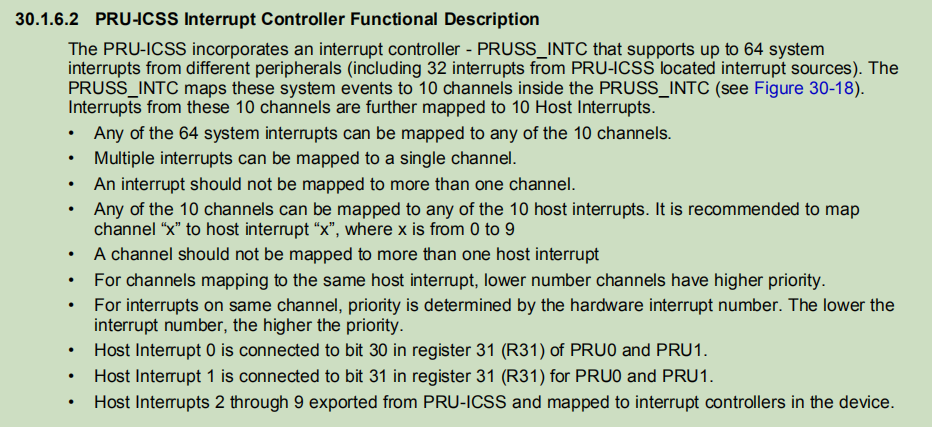
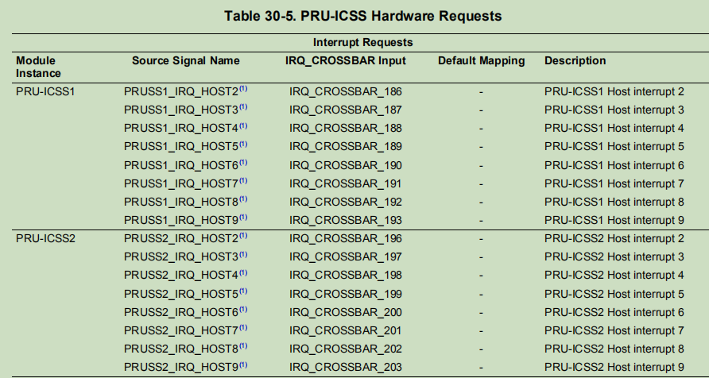
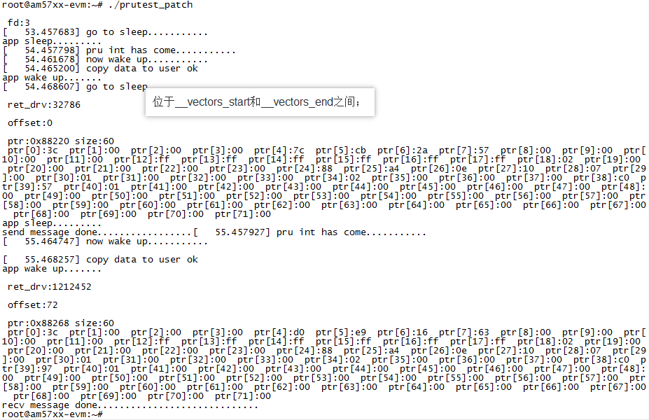

# <center>PRU中断</center>

**芯片手册pru中断相关架构图**









**pru中断相关设备树信息**

```c
/ {
	#address-cells = <2>;
	#size-cells = <2>;

	compatible = "ti,dra7xx";
	interrupt-parent = <&crossbar_mpu>;		//
	.....
        
     gic: interrupt-controller@48211000 {
		compatible = "arm,cortex-a15-gic";
		interrupt-controller;
		#interrupt-cells = <3>;
		reg = <0x0 0x48211000 0x0 0x1000>,
		      <0x0 0x48212000 0x0 0x2000>,
		      <0x0 0x48214000 0x0 0x2000>,
		      <0x0 0x48216000 0x0 0x2000>;
		interrupts = <GIC_PPI 9 (GIC_CPU_MASK_SIMPLE(2) | IRQ_TYPE_LEVEL_HIGH)>;
		interrupt-parent = <&gic>;
	};		 /* gic节点,第1层  */ 

	wakeupgen: interrupt-controller@48281000 {
		compatible = "ti,omap5-wugen-mpu", "ti,omap4-wugen-mpu";
		interrupt-controller;
		#interrupt-cells = <3>;
		reg = <0x0 0x48281000 0x0 0x1000>;
		interrupt-parent = <&gic>;
	};		/* wakeupgen节点,第1层  */ 

	.....
        
    ocp {
		compatible = "ti,dra7-l3-noc", "simple-bus";
		#address-cells = <1>;
		#size-cells = <1>;
		ranges = <0x0 0x0 0x0 0xc0000000>;
		ti,hwmods = "l3_main_1", "l3_main_2";
		reg = <0x0 0x44000000 0x0 0x1000000>,
		      <0x0 0x45000000 0x0 0x1000>;
		interrupts-extended = <&crossbar_mpu GIC_SPI 4 IRQ_TYPE_LEVEL_HIGH>,
				      <&wakeupgen GIC_SPI 10 IRQ_TYPE_LEVEL_HIGH>;       
  		.....

		pruss_soc_bus2: pruss-soc-bus@4b2a6004 {
			compatible = "ti,am5728-pruss-soc-bus";
			reg = <0x4b2a6004 0x4>;
			ti,hwmods = "pruss2";
			#address-cells = <1>;
			#size-cells = <1>;
			ranges;
			status = "disabled";

			pruss2: pruss@4b280000 {
				compatible = "ti,am5728-pruss";
				reg = <0x4b280000 0x80000>;
				interrupts = <GIC_SPI 196 IRQ_TYPE_LEVEL_HIGH>,
				<GIC_SPI 197 IRQ_TYPE_LEVEL_HIGH>,
				<GIC_SPI 198 IRQ_TYPE_LEVEL_HIGH>,
				<GIC_SPI 199 IRQ_TYPE_LEVEL_HIGH>,
				<GIC_SPI 200 IRQ_TYPE_LEVEL_HIGH>,
				<GIC_SPI 201 IRQ_TYPE_LEVEL_HIGH>,
				<GIC_SPI 202 IRQ_TYPE_LEVEL_HIGH>,
				<GIC_SPI 203 IRQ_TYPE_LEVEL_HIGH>;
				interrupt-names = "host2", "host3", "host4",
				"host5", "host6", "host7",
				"host8", "host9";
				#address-cells = <1>;
				#size-cells = <1>;
				ranges;
				status = "disabled";
				/* interrupt-parent没有指明则是父节点的interrupt-parent，最终是crossbar_mpu */
				.....

				pruss2_intc: interrupt-controller@4b2a0000 {
                    compatible = "ti,am5728-pruss-intc";
                    reg = <0x4b2a0000 0x2000>;
                    interrupt-controller;
                    #interrupt-cells = <1>;
				};		/* pruss2_intc节点,第4层  */ 


				/* pru0核 */
				pru2_0: pru@4b2b4000 {
                    compatible = "ti,am5728-pru";
                    reg = <0x4b2b4000 0x3000>,
                    <0x4b2a2000 0x400>,
                    <0x4b2a2400 0x100>;
                    reg-names = "iram", "control", "debug";
                    firmware-name = "am57xx-pru2_0-fw";
                    interrupt-parent = <&pruss2_intc>;
                    interrupts = <16>, <17>;	//映射到
                    interrupt-names = "vring", "kick";
				};		/* pru2_0节点,第4层  */ 

				/* pru1核 */
				pru2_1: pru@4b2b8000 {
                    compatible = "ti,am5728-pru";
                    reg = <0x4b2b8000 0x3000>,
                    <0x4b2a4000 0x400>,
                    <0x4b2a4400 0x100>;
                    reg-names = "iram", "control", "debug";
                    firmware-name = "am57xx-pru2_1-fw";
                    interrupt-parent = <&pruss2_intc>;
                    interrupts = <18>, <19>;	//
                    interrupt-names = "vring", "kick";
				};		/* pru2_1节点,第4层  */ 
				.....
                
            };		/* pruss2节点,第3层  */ 
        	.....
                
        }; /*pruss_soc_bus2节点,第2层  */                
		......
       
		
            : crossbar@4a002a48 {
			compatible = "ti,irq-crossbar";
			reg = <0x4a002a48 0x130>;
			interrupt-controller;
			interrupt-parent = <&wakeupgen>;
			#interrupt-cells = <3>;
			ti,max-irqs = <160>;
			ti,max-crossbar-sources = <MAX_SOURCES>;
			ti,reg-size = <2>;
			ti,irqs-reserved = <0 1 2 3 5 6 131 132>;
			ti,irqs-skip = <10 133 139 140>;
			ti,irqs-safe-map = <0>;
		};   	/* crossbar_mpu节点,第2层  */ 
		.....
            
    };	 /* ocp节点,第1层  */ 
	.....
    
} /* /节点,第0层  */         
```


**芯片厂商pru驱动**

​	芯片厂商即ti，ti的pru驱动有好几个，但是必须的和在加载pru字符设备驱动前加载的不是全部，只要pruss_int，pruss，pruss_soc_bus。最重要的是pruss_int，它负责配置中断控制器，包括通道映射级联等。这几个驱动的框架都很类似，以下拿pruss_soc_bus举例。
​		如上图设备树，因为pruss-soc-bus的父节点ocp是根结点的直接子节点，所以内核启动会直接将ocp节点转换成platform device，并且ocp节点的compatible中含有simple-bus，所以ocp节点的直接子节点也会转化成platform device。因此pruss-soc-bus节点会在内核初始化阶段就被转化为platform device。

```c
static const struct of_device_id pruss_soc_bus_of_match[] = {
	{ .compatible = "ti,am3356-pruss-soc-bus", .data = &am335x_data, },
	{ .compatible = "ti,am4376-pruss-soc-bus", .data = &am437x_data, },
	{ .compatible = "ti,am5728-pruss-soc-bus", .data = &am57xx_data, },
	{ .compatible = "ti,k2g-pruss-soc-bus", .data = &k2g_data, },
	{ .compatible = "ti,am654-icssg-soc-bus", .data = &k2g_data, },
	{ /* sentinel */ },
};
MODULE_DEVICE_TABLE(of, pruss_soc_bus_of_match);

static SIMPLE_DEV_PM_OPS(pruss_soc_bus_pm_ops,
			 pruss_soc_bus_suspend, pruss_soc_bus_resume);

static struct platform_driver pruss_soc_bus_driver = {
	.driver	= {
		.name = "pruss-soc-bus",
		.pm = &pruss_soc_bus_pm_ops,
		.of_match_table = pruss_soc_bus_of_match,
	},
	.probe	= pruss_soc_bus_probe,
	.remove	= pruss_soc_bus_remove,
};
module_platform_driver(pruss_soc_bus_driver);
```

​		因此在加载了pruss_soc_bus驱动后就匹配到了pruss-soc-bus节点生成的platform device，因此会调用到pruss_soc_bus_probe。

```c
static int pruss_soc_bus_probe(struct platform_device *pdev)
{
	.....

    /* 设置psoc_bus结构体和一些初始化设置 */
	psoc_bus = devm_kzalloc(dev, sizeof(*psoc_bus), GFP_KERNEL);
	.....
	psoc_bus->has_reset = data->has_reset;
	psoc_bus->skip_syscfg = !data->uses_prcm;
	platform_set_drvdata(pdev, psoc_bus);

	.....

    /* 对pruss_soc_bus节点的直接子节点都调用of_platform_bus_create */
	ret = of_platform_populate(node, NULL, NULL, dev);
	if (ret)
		goto fail_of;

	return 0;

.....
}

```

​		因为对pruss_soc_bus节点的直接子节点都调用of_platform_bus_create，所以pruss节点会被转化为platform device，所以pruss的platform device的驱动也可以按照这种方法对pruss的直接子节点生成platform device。


**pru字符设备驱动框架**

**1.入口函数**

```c
int __init gree_pruss_init(void)
{
	int ret,rtn;
	void *data = rxbuf;
	void **buf = &data;

	/* 申请pti5728_device，并将pti5728_device->rpdev指向全局变量gree_device_data1的地址，
     * 接下来的许多初始化设置都是往这个地址中填充内容
     */
	pti5728_device = kmalloc(sizeof(struct gree_ti5728_dev),GFP_KERNEL);
	pti5728_device->rpdev = &gree_device_data1;

    
    /* 绑定gree_pruss_fops，注册字符设备驱动 */
	gree_pruss_dev = MKDEV(major, minor);	
	ret = register_chrdev_region(gree_pruss_dev, 1, "gree_pruss");
	if(ret < 0){
		printk(KERN_ERR "error:	register dev_t fail \n");
		return ret ;
	}
	gree_pruss_cdev = cdev_alloc();
	cdev_init(gree_pruss_cdev, &gree_pruss_fops);
	ret = cdev_add(gree_pruss_cdev, gree_pruss_dev, 1);
	if(ret < 0 ){
		printk(KERN_ERR "[err] error:add cdev fail \n");
		return ret;
	}
	

	/* 创建设备节点/dev/gree_pruss */
	gree_pruss_class = class_create(THIS_MODULE, "gree_class_pruss");
	device_create(gree_pruss_class, NULL, gree_pruss_dev, NULL, "gree_pruss");

	.....

	/* 从设备树获取device node */
	struct device_node *prunode;
	prunode = of_find_node_by_path("/ocp/pruss_soc_bus@4b2a6004/pruss@0/pru@34000");
	
	/* 从device node得到kick中断对应的虚拟中断号	*/
	int irqnum;
	irqnum = irq_of_parse_and_map(prunode, 1);

	/* 为kick中断注册中断处理函数 */
	ret = request_irq(irqnum, pru_int_handler, IRQF_TRIGGER_RISING,
		"pru-int", NULL);

	.....

	/* 申请映射pru的IO内存，并填入到pti5728_device->rpdev中 */
	if(0 != initPruIcss(pti5728_device->rpdev))
		return -1;
    
	/* 先将pru固件从文件系统路径fw_path_2_0拷贝到buf中，
     * 然后再从buf拷贝到pti5728_device->rpdev中设置好的pru内存区域中
     */
	if(0 != pruss_pru_download(0,pti5728_device->rpdev,fw_path_2_0,buf,sizeof(rxbuf)))
		return -1;
	if(0 != pruss_pru_download(1,pti5728_device->rpdev,fw_path_2_1,buf,sizeof(rxbuf)))
		return -1;

    /* 设置pti5728_device->rpdev中的共享数据结构的wokrtyoe */
	startPruIcss(pti5728_device->rpdev,0);
	startPruIcss(pti5728_device->rpdev,1);

    /* 使能pru，此时pru开始运行上面拷贝的固件 */
	runPruIcss(pti5728_device->rpdev); 

	return 0;
}
```

**2.字符设备操作函数**

- **gree_pruss_open：**应用程序调用open打开dev/gree_pruss时调用。
- **gree_pruss_write：** 应用程序调用write操作open打开dev/gree_pruss对应的文件描述符时调用
- **gree_pruss_ioctl：** 应用程序调用ioctl操作open打开dev/gree_pruss对应的文件描述符时调用

```c
static struct file_operations gree_pruss_fops={
	.owner = THIS_MODULE,
	.open = gree_pruss_open,	/* 应用程序调用open打开dev/gree_pruss时调用 */
	.release = gree_pruss_release,
	.write = gree_pruss_write,	/* 应用程序调用write操作dev/gree_pruss时调用 */
	.unlocked_ioctl = gree_pruss_ioctl,	/* 应用程序调用ioctl操作dev/gree_pruss时调用 */
};
```

**2.1 gree_pruss_open**

```c
static int gree_pruss_open(struct inode *inode,struct file *filp)
{
	/* 将入口函数中主要设置的pti5728_device->rpdev赋给filp->private_data，
     * 然后在其他文件操作接口(write,ioctl等)中可以提取出来使用	
    */
	filp->private_data = pti5728_device->rpdev;//pti5728_str->rpdev;
	return 0;
}
```

**2.2 gree_pruss_write**

```c
static ssize_t gree_pruss_write(struct file *filp, const char __user * buf, size_t count, loff_t *f_pos)
{
	struct gree_device_data *pti5728_priv_da;

	u32 *ptr = (u32 *)buf;
	u32 pru_n = *ptr++;
	u32 ptr_in = *ptr;

    /* 提取出pti5728_device->rpdev */
	pti5728_priv_da = filp->private_data;
	if(pru_n < NUMBER_PRU) {
         /* 调用SendFrame将数据发送给pru固件，
          * 其中SendFrame仅仅是将数据放在pru共享内存区域中，
          * pru固件会定期过来读取
         */
		if(SendFrame(pti5728_priv_da, pru_n, ptr_in) == 0){
			return 0;
		}	
		printk(KERN_ERR "[error]gree pruss wirte error \n");		
	}
	return -1;
}
```

**2.2.1 SendFrame**

```c
int SendFrame(struct gree_device_data *device_data, u32 pru_n, u32 ptr_in)
{
	u32 ret = 0;
	if(pru_n < NUMBER_PRU && device_data->pru_enable[pru_n]) {
		struct PRU_MII_Data *shared_data = (struct PRU_MII_Data *)(device_data->gree_share[pru_n].va);
		
		/* 将数据从BuffTx[pru_n]写到pru共享内存shared_data->buf_tx中 */
		if(ret = copy_from_user(((char* )(shared_data->buf_tx)), (BuffTx[pru_n]), (SHARED_MEMORY_SIZE))){
			printk("copy_from_user err\n");
			return -1;
   			}

		if(ptr_in < SHARED_MEMORY_SIZE_DWORD) {		
			shared_data->txp.tx_ptr_in = ptr_in;
			//printk("[test] send frame[%d] \n",pru_n);
			return 0;
		}
	}
	return -1;
}
```

**2.3 gree_pruss_ioctl**

```c
static long gree_pruss_ioctl(struct file *filp,unsigned int cmd,  unsigned long arg) long
{
	u32 pru_n, n;
	u32 *arg_dw_ptr;

    /* 提取出pti5728_device->rpdev */
	struct gree_device_data *pti5728_priv_da;
	pti5728_priv_da = filp->private_data;

	switch (cmd){
		.....
		/* 将用户传入的arg设置到BuffRx[pru_n]中，
         * 接下来如果使用RecieveFrame就会通过copy_to_user
         * 将数据从pru共享内存拷贝到BuffRx[pru_n]中存放的arg中
         */
		case IOCTL_SET_USER_PAGES_RX1:
			pru_n = 1;
			AllocBuffer(pti5728_priv_da, pru_n, (u32*)arg, 1);
			break;
		/* 将用户传入的arg设置到BuffTx[pru_n]中，
          * 接下来如果使用SendFrame就会通过copy_from_user
          * 从BuffTx[pru_n]中存放的arg中指定的用户地址取数据放到pru共享内存中
         */
		case IOCTL_SET_USER_PAGES_TX1:
			pru_n = 1;
			AllocBuffer(pti5728_priv_da, pru_n, (u32*)arg, 0);
			break;
		/* 调用收帧函数读取pru固件发送过来的数据 */
		case IOCTL_READ_FRAMES:
#ifdef PRU_INT
			if (!(filp->f_flags & O_NONBLOCK))	/* 阻塞模式 */
				*(u32*)arg = RecieveFrame(pti5728_priv_da, PRU_BLOCK);
			else							/* 非阻塞模式 */
				*(u32*)arg = RecieveFrame(pti5728_priv_da, *(u32*)arg);
			break;
#else
			*(u32*)arg = RecieveFrame(pti5728_priv_da, *(u32*)arg);
			break;
#endif			
		.....
		case IOCTL_SET_WORK_TYPE:
			pru_n = (u32)arg >> 16;
			setWorkType(pti5728_priv_da, pru_n, arg & 0xFF);
			break;
		.....
#ifdef PRU_INT
		/* 设置为非阻塞模式 */
		case IOCTL_SET_PRU_NONBLOCK:
			filp->f_flags |= O_NONBLOCK;
			break;
		/* 设置为阻塞模式 */
		case IOCTL_SET_PRU_BLOCK:
			filp->f_flags &= ~O_NONBLOCK;
			break;
#endif			
		default:
			return -1;
	}
	return 0;
}
```

**2.3.1 IOCTL_SET_USER_PAGES_RX1和IOCTL_SET_USER_PAGES_TX1**

如果传入以上两个命令，则调用AllocBuffer

```c
void AllocBuffer(struct gree_device_data *device_data, int pru_n, u32 *arg, int is_rx)
{
	struct PRU_MII_Data *shared_data;
	shared_data = (struct PRU_MII_Data *)(device_data->gree_share[pru_n].va);

	if(pru_n < NUMBER_PRU && device_data->pru_enable[pru_n]) {
		if(arg == 0) { // adapter is closing
			setWorkType(device_data, pru_n, ewtAutoforward);
		}
		else { 		// adapter is opening
			/* 将用户传入的*arg写入BuffRx[pru_n]或者BuffTx[pru_n] */
			if(is_rx == 1)
				BuffRx[pru_n] = *arg;	
			}
			else{
				BuffTx[pru_n] = *arg;
			}
			
			if(!is_rx)
				shared_data->tx_ptrs = 0;
		}
	}
	//printk("[test] alloc buffer success \n");
}
```

**2.3.2 IOCTL_READ_FRAMES**

如果传入以上命令，则调用RecieveFrame，并根据之前是否设置了阻塞模式而往wait参数传入PRU_BLOCK

```c
u32 RecieveFrame(struct gree_device_data *device_data, u32 wait)
{
	u32 pru_n;
	u32 ret = 0;


	/* 根据wait参数决定是否阻塞在等待队列上 */
	if (wait != PRU_BLOCK)
		goto POLL;
	
	/* 没有数据则挂起进程休眠 */
	printk("go to sleep...........\n");
	wait_event_interruptible(pru_wait, atomic_read(&pru_is_not_empty));	
	atomic_set(&pru_is_not_empty, 0);
	printk("now wake up...........\n");

POLL:
	/* 被唤醒了，然后读取数据 */
	for(pru_n = 0; pru_n < NUMBER_PRU; pru_n ++) {
        
		.....
		
		if(ret) {
			.....
			
             /* 将数据传到之前设置到BuffRx[pru_n]的地址中 */
			if ((ret1 = copy_to_user((BuffRx[pru_n]), ((char*)shared_data->buf_rx), SHARED_MEMORY_SIZE ))){
				printk("copy_to_user err\n");
				return -1;
			}

			printk("copy data to user ok\n");
			break;
		} 

	}

	return ret;
	
}

```


**pru应用**

**1.主函数**

```c
int main()
{
	/* 打开pru驱动的设备节点 */
	int fd;
	fd = open("/dev/gree_pruss",O_RDWR);	
	printf("\n\r fd:%d \r\n",fd);
    
    /* 申请发送和接收缓冲区 */
	unsigned char *pBufTx;
	unsigned char *pBufRx;
	pBufTx = (char*)malloc(8100*sizeof(char));
	pBufRx = (char*)malloc(8100*sizeof(char));


#ifdef PRU_INT
	void *res;
    /* 设置对该设备节点的操作为阻塞模式 */
	ioctl(fd,IOCTL_SET_PRU_BLOCK,NULL);	
#endif
	
	/* 将用户发送和接收缓冲区设置到驱动的BuffRx[pru_n]中，设置work type */
	ioctl(fd,IOCTL_SET_USER_PAGES_TX1,(unsigned long)&pBufTx);	
	ioctl(fd,IOCTL_SET_USER_PAGES_RX1,(unsigned long)&pBufRx);		
	ioctl(fd,IOCTL_SET_WORK_TYPE,(1 << 16) + 0x3);			   


	/* 创建负责接收固件数据的子线程 */
	zh myArg;
	myArg.fd = fd;
	myArg.pBufRx = pBufRx;
	pthread_t tid;
	pthread_attr_t attr;
	struct sched_param param = { .sched_priority = 93};
	pthread_attr_init(&attr);
	pthread_attr_setdetachstate(&attr, PTHREAD_CREATE_JOINABLE);
	pthread_attr_setinheritsched(&attr, PTHREAD_EXPLICIT_SCHED);
	pthread_attr_setschedpolicy(&attr, SCHED_FIFO);
	pthread_attr_setschedparam(&attr, &param);
	pthread_create(&tid, &attr, (void *)KpaNicTaskReceive, (void *)&myArg);	

    /* 每隔一秒发送一次数据给pru，pru固件很快会回数据过来并产生中断 */
	unsigned long buf[2] = {1, 0};
	int i = 0;
	for(i = 0; i<128; i = i + 64)
	{
		pBufTx[i+0] = 0x3c;pBufTx[i+1] = 0x00;pBufTx[i+2] = 0x00;	pBufTx[i+3] = 0x00;
		.....		
		pBufTx[i+18] = 0x0e;pBufTx[i+19] = 0x10;
		.....	
		buf[1] = buf[1]+16;
		sleep(1);
		write(fd, (char*)buf, 8);	
	}

	printf("send message done.................\n");

    /* 主线程等待子线程结束 */
	zh_flag = 1;
	pthread_join(tid, &res);
	
	return 0;
}
```


**2.子线程**

```c
int KpaNicTaskReceive(void* hArg)
{
    /* 获取打开的/dev/gree_pruss文件描述符 */
	int fd = (int)(pArg->fd);
	.....

	while(1) 
	{
		.....
         /* 调用到驱动中的RecieveFrame，并传入PRU_BLOCK */
		ioctl(fd, IOCTL_READ_FRAMES, &ret_drv);
		.....

         /* 打印接收到的pru固件发送过来的数据 */
		unsigned long pru_n = (ret_drv >> 15) & 0x01;
		unsigned long ptr_in = ret_drv & 0x3FFF;
		unsigned long ptr_out = (ret_drv >> 16) & 0x3FFF;
		if(ptr_in != ptr_out)
		{
			.....
			for(i = 0; i < size + 12; i++)
			{
				printf(" ptr[%d]:%02x ",i,ptr[i]);
			}
			printf("\n");
		}

		if(zh_flag == 1)
		{
			printf("recv message done.............................\n");
			break;
		}		
	}

	return 0;	
}

```


**测试结果**

​		先insmod pru_fw_download-03patch.ko，然后./prutest_patch得到如下结果：


​		结果显示正确。