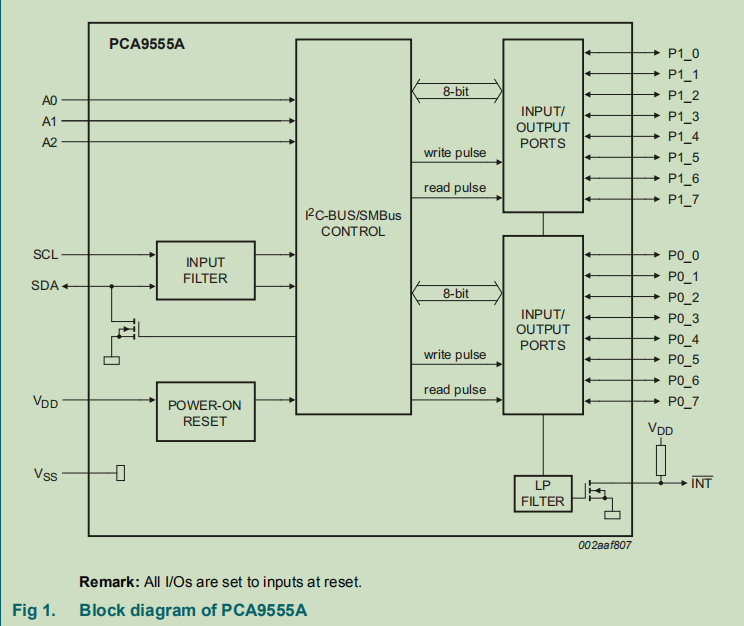
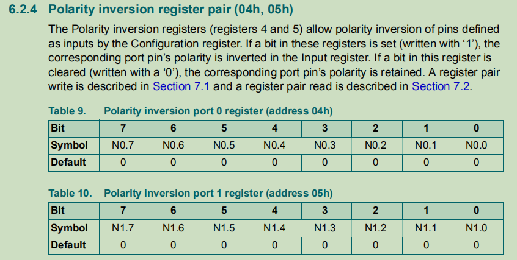
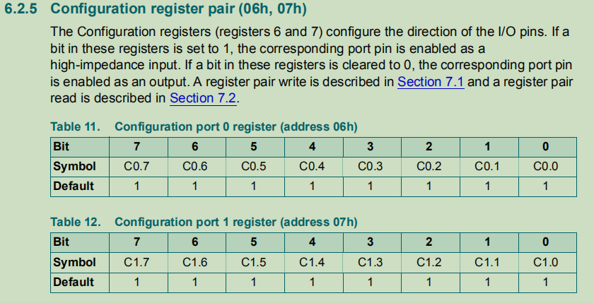
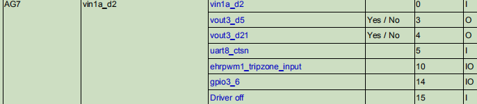

## </center>am5728 bsp<center>
[TOC]

### 一、环境搭建

#### 1.下载安装sdk包

​		先从ti官网下载sdk包ti-processor-sdk-linux-am57xx-evm-06.03.00.106-Linux-x86-Install.bin。然后在拷贝到/home/jared/yeshen/5728sdk目录下，然后输入./ ti-processor-sdk-linux-am57xx-evm-06.03.00.106-Linux-x86-Install.bin运行就在的当前目录得到解压后的sdk包。

#### 2.配置交叉编译工具链

​		将sdk包中的交叉工具链配置到环境变量中，在/etc/profile文件中修改PATH变量，然后每次系统启动都设置PATH。

```c
export PATH=/home/jared/yeshen/5728sdk/linux-devkit/sysroots/x86_64-arago-linux/usr/bin/:$PATH
```

#### 3.编译配置脚本
##### 3.1 uboot编译配置脚本

- 切换到uboot源码根目录

  ```c
  cd /home/jared/yeshen/5728sdk/board-support/u-boot-2019.01+gitAUTOINC+333c3e72d3-g333c3e72d3
  ```
  
- 创建uboot的编译配置脚本build.sh

  ```c
  touch build.sh && chmod a+x build.sh
  ```

- 编写build.sh

  ```c
  /* 清除 */
  make ARCH=arm CROSS_COMPILE=arm-linux-gnueabihf- distclean
  /* 配置 */
  make ARCH=arm CROSS_COMPILE=arm-linux-gnueabihf- am57xx_evm_defconfig all -j8
  /* 编译 */
  make ARCH=arm CROSS_COMPILE=arm-linux-gnueabihf-
  ```

##### 3.2 kernel编译配置脚本

- 切换到kernel源码根目录

  ```c
  cd /home/jared/yeshen/5728sdk/board-support/linux-4.19.94+gitAUTOINC+be5389fd85-gbe5389fd85
  ```

- 创建kernel的编译配置脚本build.sh

  ```c
  touch build.sh && chmod a+x build.sh
  ```

- 编写build.sh

  ```c
  /* 清除编译痕迹包括.config */
  make ARCH=arm CROSS_COMPILE=arm-linux-gnueabihf- distclean
  /* 清除编译痕迹但不删除.config */
  make ARCH=arm CROSS_COMPILE=arm-linux-gnueabihf- clean
  /* 按照ti的评估板配置得到.config */
  make ARCH=arm CROSS_COMPILE=arm-linux-gnueabihf- tisdk_am57xx-evm_defconfig
  /* 编译kernel的包含解压缩代码的压缩镜像zImage */
  make ARCH=arm CROSS_COMPILE=arm-linux-gnueabihf- zImage -j8
  /* 编译设备树 */
  make ARCH=arm CROSS_COMPILE=arm-linux-gnueabihf- am57xx-evm-reva3.dtb -j8
  /* 编译模块 */
  make ARCH=arm CROSS_COMPILE=arm-linux-gnueabihf- modules -j8
  /* 安装模块 */
  make ARCH=arm CROSS_COMPILE=arm-linux-gnueabihf- modules_install INSTALL_MOD_PATH=/media/jared/rootfs -j8
  ```

#### 4.制作sd卡

##### 4.1 格式化sd卡

​		如果选择使用sd卡启动，则先格式化sd卡。参照sdk论坛或者第三方开发板厂商，这里使用第三方开发板厂商创龙给的命令脚本mksdboot-tl.sh制作sd卡。从gerrit上下载压缩包，然后解压，通过df命令查看sd卡是/dev/sd*中哪个设备，然后插入sd卡并在解压目录执行如下命令:

```c
sudo ./mksdboot-tl.sh --device /dev/sdx
```

通过上面命令会将sd卡格式化两个分区并分别格式化为vfat和ext4的文件系统，用mount命令可以查看。其中第一个分区存放的是MLO和u-boot.img，第二个分区存放的是根文件系统和内核镜像、设备树镜像，其中内核镜像和设备树镜像存放在根文件系统的/boot中。

##### 4.2 替换sd卡镜像

​		前面步骤不但会格式化sd卡，还会默认拷贝镜像进去，这里可以删除所有镜像与根文件系统。然后在自己解压的sdk包的uboot源码目录和内核源码目录下编译得到镜像，将sdk包中的根文件系统解压到第二个分区，再将uboot源码目录下编译得到的MLO和u-boot.img拷贝到第一个分区，将内核源码目录下编译得到的zImage和am57xx-evm-reva3.dtb拷贝到第二个分区的/boot中。

### 二、uboot移植

#### 1. 修改引脚配置

​		由于sdk的评估板和我们的板引脚使用稍有不同，因此需要稍微修改引脚配置，uboot启动阶段主要配置的是串口引脚，其他引脚大部分在驱动中配置，在后面的驱动移植中再讲。

##### 1.1 查看原理图


​		从原理图中可以看到soc中的Y2引脚接到串口3的输入，因此要设置该引脚复用为串口3输入功能，并且设置为输入和对应的上下拉等，同理，Y1引脚一样。

##### 1.2 修改源码

​		修改board/ti/am57xx/mux_data.h。

```c
	.....
	{RMII_MHZ_50_CLK, (M14 | PIN_INPUT_PULLUP)},	/* RMII_MHZ_50_CLK.gpio5_17 */
//	{UART3_RXD, (M14 | PIN_INPUT_SLEW)},	/* uart3_rxd.gpio5_18 */
//	{UART3_TXD, (M14 | PIN_INPUT_SLEW)},	/* uart3_txd.gpio5_19 */
	{UART3_RXD, (M0 | PIN_INPUT_PULLUP | SLEWCONTROL)},	/* uart3_rxd.gpio5_18 */
	{UART3_TXD, (M0 | PIN_OUTPUT | SLEWCONTROL)},	/* uart3_txd.gpio5_19 */	
	.....
     {UART1_RXD, (M0 | PIN_INPUT_PULLUP | SLEWCONTROL)},	/* uart1_rxd.uart1_rxd */
	{UART1_TXD, (M0 | PIN_OUTPUT | SLEWCONTROL)},	/* uart1_txd.uart1_txd */
     .....
```

​		将原来的两个配置注释掉，然后重新配置这两个引脚，模仿串口1的引脚配置。

#### 2. 修改uboot环境变量

##### 2.1 简单修改sdk的uboot环境变量跑起来

​		在uboot启动内核倒计时阶段打断，printenv输出环境变量查看bootcmd。

```c
bootcmd=if test ${dofastboot} -eq 1; then echo Boot fastboot requested, resetting dofastboot ...;setenv dofastboot 0; saveenv;echo Booting into fastboot ...; fastboot 1; fi;if test ${boot_fit} -eq 1; then run update_to_fit;fi;run findfdt; run envboot; run mmcboot;run emmc_linux_boot; run emmc_android_boot; run setconsole;
```

​		其中findfdt命令是一大串命令为了找到设备树名字给fdtfile，这里可以直接将用命令setenv findfdt将findfdt设为空再saveenv，然后通过setenv fdtfile am572x-idk.dtb(am57xx-evm-reva3.dtb)将设备树名字设置为am572x-idk.dtb(am57xx-evm-reva3.dtb)再saveenv。
​		mmcboot命令是从sd卡启动的核心。

```c
mmcboot=mmc dev ${mmcdev}; setenv devnum ${mmcdev}; setenv devtype mmc; if mmc rescan; then echo SD/MMC found on device ${mmcdev};if run loadimage; then if test ${boot_fit} -eq 1; then run loadfit; else run mmcloados;fi;fi;fi;
```

```c
loadfit=run args_mmc; run run_fit;
loadimage=load ${devtype} ${bootpart} ${loadaddr} ${bootdir}/${bootfile}
run_fit=bootm ${fit_loadaddr}#${fdtfile}${overlaystring}
```

​		mmcboot命令大致意思是先扫描看是否有sd卡，如果有则选择从sd卡启动，如果没有则扫描emmc从emmc启动。然后从sd卡或emmc中的根文件系统中加载内核镜像和设备树镜像到内存，然后启动。

##### 2.2 按照项目的板的环境变量修改

### 三、驱动移植调试
**gerrit文件修改**
		在移植驱动前先通过gerrit服务器查看这个驱动修改或增加的文件，如下图所示的rtc pca9555a驱动的修改或新增文件，diff表示修改文件，blob表示新加文件，**有一点要注意的是记得通过tree查看最新的文件，因为这里显示的提交不一定是最新的后来可能会被修改，因为硬件也会改**。


#### 1. i2c pca9555a驱动

##### 1.0 硬件原理图和芯片手册分析



这是pca9555a芯片手册的框图，对应原理图中的U51和U52。一块pca9555a芯片是一个i2c从设备，其中包含两个端口，每个端口8位引脚，每个端口的引脚可以配置为输入或输出。


这是pca9555a芯片的i2c地址描述，其中前4位固定，后三位通过U51和U52的原理图得知分别为001和000，因此U51和U52的设备从地址分别为0x21和0x20。


这是pca9555a芯片的寄存器地址，在i2c通信的时候除了指定从设备地址还要指定寄存器地址，表示往哪个设备的哪个寄存器读写数据。


这是端口0和端口1的输入寄存器，当端口配置成输入端口时读这些寄存器就是读到芯片端口引脚的输入值。


这是端口0和端口1的输出寄存器，当端口配置成输出端口时往这些寄存器写值就会往芯片端口引脚驱动相应的电平。



这是端口0和端口1的极性设置寄存器，当端口被配置成输入时才有用。



这是端口0和端口1的配置寄存器，如果某位置1则该引脚配置成输入，如果置0则该引脚配置成输出。


这是io板上的输入和输出插座。


这是io板插座原理图，第7引脚连接到网络X0。


第7引脚通过X0连接到光耦放大器的一个输入引脚。如果X0和COM0电平不同则光耦导通，此时USER_X0为低电平，如果光耦不导通则USER_X0为高电平。


这是一块pca9555a芯片，上图的光耦输出最终连到引脚p0_0。该芯片的scl和sda引脚连到网络i2c_scl和i2c_sda。


芯片的scl和sda引脚通过网络i2c_scl和i2c_sda连到插座J3。最后J3通过排线将io板连到主板。


这是主板上通过排线和io板连接的插座J18。io板插座J3的引脚9连到J18的引脚9。


J18的引脚9通过网络I2C5_SDA连接到soc的i2c控制器的sda。

##### 1.1 arch/arm/boot/dts/am57xx-beagle-x15-common.dtsi

```c
&dra7_pmx_core {
        pca9555a_pin_default: pca9555a_pin_default {
                 pinctrl-single,pins =<
                        DRA7XX_CORE_IOPAD(0x3500, (INPUT_EN | MUX_MODE14)) /*vin1a_d3.gpio3_7*/
                >;
        };
    	...
        i2c5_pins_default: i2c5_pins_default {
            pinctrl-single,pins = <
                DRA7XX_CORE_IOPAD(0x3744, (PIN_INPUT_PULLUP | MUX_MODE4)) /* i2c5_scl */
                DRA7XX_CORE_IOPAD(0x3748, (PIN_INPUT_PULLUP | MUX_MODE4)) /* i2c5_sda */
                >;
        };    
    	...
}   

&i2c5 {
       status = "okay";
       clock-frequency = <400000>;
       pinctrl-names = "default";
       pinctrl-0 = <&i2c5_pins_default>;
       pca9555a: pca9555a@20{
             compatible = "nxp,pca9555a";
             reg = <0x21>;	
             pinctrl-names = "defalut";
             pinctrl-0 = <&pca9555a_pin_default>;
             pca9555a-int = <&gpio3 7 GPIO_ACTIVE_LOW>;
       };
};
```

pca9555a_pin_default节点将soc引脚vin1a_d3复用成gpio3_7和相应配置。i2c5_pins_default节点讲相应的soc引脚复用为i2c控制器5的时钟和数据引脚并相应配置。在i2c5节点中 pinctrl-0 = <&i2c5_pins_default>表示根据i2c5_pins_default配置引脚。在pca9555a@20节点中pinctrl-0 = <&pca9555a_pin_default>表示根据pca9555a_pin_default配置引脚。pca9555a-int = <&gpio3 7 GPIO_ACTIVE_LOW>表示pca9555a的中断引脚为gpio管脚gpio3_7。

##### 1.2 arch/arm/configs/tisdk_am57xx-evm_defconfig

```c
.....
CONFIG_PCA9555A=y
....
```

表示编译进内核。

##### 1.3 drivers/misc/Kconfig 

```c
....
source "drivers/misc/pca9555a/Kconfig"
endmenu    
```

##### 1.4 drivers/misc/Makefile

```c
....
obj-y                           += pca9555a/
```

表示将misc下的pca9555a/编译进内核，但是里面编译什么文件还要看misc/pca9555a/Makefile。

##### 1.5 drivers/misc/pca9555a/Kconfig

```c
config PCA9555A
         tristate "PCA9555A driver support"
         help
           This driver provides i2c interface.
```

##### 1.6 drivers/misc/pca9555a/Makefile

```c
obj-y += pca9555a.o
```

表示将pca9555a.c编译进内核。

##### 1.7 drivers/misc/pca9555a/pca9555a.c

```c
#include <linux/module.h>
#include <linux/clk-provider.h>
#include <linux/mutex.h>
#include <linux/fs.h>
#include <linux/init.h>
#include <asm/uaccess.h>
#include <linux/miscdevice.h>
#include <linux/slab.h>
#include <linux/kernel.h>
#include <linux/i2c.h>
#include <linux/of.h>
#include <linux/err.h>
#include <linux/irq.h>
#include <linux/of_gpio.h>
#include <linux/gpio.h>
#include <linux/gpio_keys.h>
#include <linux/wait.h>
#include <linux/interrupt.h>
#include <asm/io.h>
#include <asm/mach/map.h>


#define PCA9555A_MODE_CONFIG_REG		0x07
#define INPUT_MODE_REG_DATA	0Xff
#define OUTPUT_MODE_REG_DATA	0x00
#define INPUT_SLAVE_ADDR	0x21
#define OUTPUT_SLAVE_ADDR	0x20
#define WRITE_REG_ADDR		0x03
#define READ_REG_ADDR		0x01

/*硬件延时时间*/
#define DEBOUNCE_PCA_TIME 		1000
#define IRQNAME				"pca9555a INT"
#define IRQFLAGS 			(IRQF_TRIGGER_FALLING)
#define READ_BLOCK			(_IO(0xEF,0x1))

static struct i2c_client *g_client;

/* 通知用户态方式1：使用信号 */
static struct fasync_struct *pca_syn;

/* 通知用户态方式2：使用信号量，阻塞式 */
static struct semaphore pca_sem;

static int pca9555a_irq_num = -1;
static int pca9555a_gpio_id =-1;
static int irq_value;
static int PCA_NONBLOCK = 1;

static irqreturn_t pca9555a_detect_irq(int irq,void *date){

	/* 通知用户态方式1：发送信号给用户进程 */
	kill_fasync(&pca_syn, SIGIO, POLL_IN);
	
	/* 通知用户态方式2：释放信号量，解除用户进程阻塞 */
	up(&pca_sem);
	
//	pr_info("pca9555a设备释放信号量、信号成功！\n");
	return IRQ_HANDLED;
	
}
/* 读从设备地址slave_addr的设备的寄存器reg和reg+1的内容放到reg_buf中 */
static int pca9555a_read_reg_data(int slave_addr, unsigned char reg, unsigned char *reg_buf)
{
        struct i2c_msg msgs[] = {
                {/* setup read ptr */
                        .addr = slave_addr,
                        .len = 1,
                        .buf = &reg,
                },
                {
                        .addr = slave_addr,
                        .flags = I2C_M_RD,
                        .len = 2,
                        .buf = reg_buf
                },
        };

        if ((i2c_transfer(g_client->adapter, msgs, 2)) != 2) {
                dev_err(&g_client->dev, "%s: read error\n", __func__);
                return -EIO;
        }

        return 0;
}

/* 往从设备地址slave_addr的设备的寄存器reg写buf中的两字节数据 */
static int pca9555a_write_reg_data(int slave_addr,unsigned char reg,unsigned char *buf)
{
    int err;
	
	unsigned char w_buf[3]={reg,buf[0],buf[1]};

	struct i2c_msg msg={

		.addr = slave_addr,
		.len = 3,
		.buf = w_buf,		
	};        

	err = i2c_transfer(g_client->adapter,&msg,1);
	
	if(err !=1){
		pr_err("pca9555a_write_reg_data fail!!!\n");
		return -EIO;	
	}       

    return 0;
}

 /* 设置两块pca9555a芯片的引脚各为输入和输出 */ 
static int  pca9555a_init(void)
{	
	int err;
	int reg = PCA9555A_MODE_CONFIG_REG;	//0x7
	
	//配置成输入的pca9555a芯片的从设备地址0x21
	int slave_in_addr = INPUT_SLAVE_ADDR;	//0x
	
	//配置成输出的pca9555a芯片的从设备地址0x20
	int slave_out_addr = OUTPUT_SLAVE_ADDR; 

	// init pca9555a mode is input//0XFF,0XFF
	char ibuf[] = {INPUT_MODE_REG_DATA,INPUT_MODE_REG_DATA};
	
	// init pca9555a mode is output//0X00,0X00
	char obuf[] = {OUTPUT_MODE_REG_DATA,OUTPUT_MODE_REG_DATA};
	/* 将设备0x21的端口0和1设置成输入 */
	err = pca9555a_write_reg_data(slave_in_addr,reg,ibuf);
	if(err<0){
		return -1;
	}
	/* 将设备0x20的端口0和端口1设置成输出 */
	err = pca9555a_write_reg_data(slave_out_addr,reg,obuf);
	if(err<0){
		return -1;
	}
	
	pr_info("pca9555a 0x20 0x21 output/input mode init !!!\n");
	
	return 0;

}

static int pca9555a_open(struct inode *nd,struct file *file){

	return 0;
}

static ssize_t pca9555a_read(struct file *filp,  char __user *buf, size_t size,loff_t *loff)
{
	int slave_addr = INPUT_SLAVE_ADDR;
	char reg = READ_REG_ADDR;
	char reg_buf[2];

	int err;
	
	//user have to use 2 byte
	if(size!=2){
		return -1;
	}

	/*默认为非阻塞的方式访问*/
	if (PCA_NONBLOCK){
		err = pca9555a_read_reg_data(slave_addr,reg,reg_buf);
			if(err<0){
				return -1;
			}
		err = copy_to_user(buf,reg_buf,size);
		if(err<0){  
	 		return -1;
		}
	
	/*用阻塞的方式访问*/
	}else{			

		/* 通知用户态方式2：调用会造成用户进程阻塞 */
		err = down_interruptible(&pca_sem);
		if(err != 0){
			pr_err("down_interruptible func is fail!\n");
			return -1;
		}
		/*读到的值返回给用户*/	
		err = pca9555a_read_reg_data(slave_addr,reg,reg_buf);
			if(err<0){
				return -1;
			}

//		pr_info("begin write date to user\n");
		err = copy_to_user(buf,reg_buf,size);
		if(err<0){  
			 return -1;
		}
	
	}

	return 0;	

}

static ssize_t pca9555a_write(struct file *file,const char __user *buf,size_t size,loff_t *loff){
	
	int err;	
	char kbuf[2];
	int slave_addr = OUTPUT_SLAVE_ADDR;
	int reg = WRITE_REG_ADDR;

	if(size != 2){
		return -1;
	}
	
	err = copy_from_user(kbuf,buf,size);
	if(err){
		
		printk("write fial\n");
		return -1;
	}

	err = pca9555a_write_reg_data(slave_addr,reg,kbuf);
	if(err<0){
		return -1;
	}

	return 0;
}

static int pca9555a_fasync(int fd, struct file *filp, int mode){
	/* 通知用户态方式1：注册哪些进程接收信号 */
	return fasync_helper(fd, filp, mode, &pca_syn);

}

static long pca9555a_ioctl(struct file *filp,unsigned int cmd,unsigned long arg){

		switch(cmd){

			case READ_BLOCK:
				PCA_NONBLOCK = 0;
				break;
			default:
				PCA_NONBLOCK = 1;
				return -ENOTTY;
		}

		return 0;
}

static int pca9555a_release(struct inode *inode, struct file *filp){

	fasync_helper(-1, filp, 0, &pca_syn);
	return 0;

}

static struct file_operations pca9555a_fops = {

	.owner 	= THIS_MODULE,
	.open 	= pca9555a_open,
	.read 	= pca9555a_read,
	.write  = pca9555a_write,
	.fasync = pca9555a_fasync,/* 会在应用调用fcntl(，F_SETFL，)时被调用 */
	.release = pca9555a_release,
	.unlocked_ioctl  = pca9555a_ioctl,

};

static struct miscdevice pca9555a_misc = {
	
	.minor = MISC_DYNAMIC_MINOR,
	.name = "pca9555a_misc",
	.fops = &pca9555a_fops,

};

static const struct i2c_device_id pca9555a_id[] = {
	{ "pca9555a", 0 },
	{}
};


MODULE_DEVICE_TABLE(i2c,pca9555a_id);

static const struct of_device_id pca9555a_of_match[] = {
	{ .compatible = "nxp,pca9555a" },
	{}
};

MODULE_DEVICE_TABLE(of,pca9555a_of_match);

static int pca9555a_probe(struct i2c_client *client,const struct  i2c_device_id *id){
	/* 获取设备树节点pca9555a@20 */
	struct device_node *nd = client->dev.of_node;
	int err ;
	printk("pca9555a device is detected!\n");
	g_client = client;
    
	/* 设置pca9555a芯片的引脚的输入输出模式 */	
	err = pca9555a_init();
	if(err < 0){
		pr_err("pca9555a init fail!!!\n");
	}	

    /* 利用misc快速创建并注册一个字符设备 */
	err = misc_register(&pca9555a_misc);

	if(err){
		pr_err("register pca9555a device fail!!!\n");
		return -1;
	}

	/*获取芯片中断gpio管脚*/
//	nd = of_find_node_by_path("/ocp/i2c@4807c000/pca9555a@20");
	if(nd == NULL){
		pr_err("not find /ocp/i2c@4807c000/pca9555a@20 node!!!\n");
		return -1;
	}
	/* 获取pca9555a@20节点中名为pca9555a-int的gpio管脚号 */
	pca9555a_gpio_id = of_get_named_gpio(nd, "pca9555a-int", 0);
	if(gpio_is_valid(pca9555a_gpio_id)){
		/* 申请获取该gpio的使用权 */
		err = gpio_request(pca9555a_gpio_id, "pca9555a-int");	
		if(err != 0){
			pr_err("pca9555a-int gpio request fail!!!\n");
			return err;
		}		

		pr_info("pca9555a-int request success!\n");

		/*设置gpio管脚为输入方向*/
		err = gpio_direction_input(pca9555a_gpio_id);
		if(err != 0){
			pr_err("set pca9555a direction fail!!!\n");
			goto fail;
		}

		pr_info("pca9555a_gpio_direction request success!\n");

		/*实现硬件延时1ms*/
		err = gpio_set_debounce(pca9555a_gpio_id, DEBOUNCE_PCA_TIME);
		if (err)
     	{
             pr_err("Set gpio %d debounce %d fail! (%d)\n", pca9555a_gpio_id, DEBOUNCE_PCA_TIME, err);
             goto fail;
      	}
		/* 获取该gpio对应的虚拟irq号 */
		pca9555a_irq_num = gpio_to_irq(pca9555a_gpio_id);
		if(pca9555a_irq_num < 0){
			pr_err("Get irq_num %d is fail!!!\n",pca9555a_irq_num);
			goto fail;
		}

		pr_info("requets pca9555a_irq_num:%d success!!!\n ",pca9555a_irq_num);
		/* 注册中断处理函数 */
		err = request_irq(pca9555a_irq_num, pca9555a_detect_irq, IRQFLAGS, IRQNAME, client);
		if(err){
			pr_err("reauest_irq %s is fail!!!\n",IRQNAME);
			goto fail;
		}
		pr_info("requets pca9555a_irq success!!!\n ");
	
	}
	
	/* 信号量初始值为0 */
	sema_init(&pca_sem, 0);
	return 0;
	
fail:
	gpio_free(pca9555a_gpio_id);
	return err;
}

static struct i2c_driver pca9555a_driver = {
	.driver		= {
		.name	= "pca9555a",
		.of_match_table = of_match_ptr(pca9555a_of_match),
	},
	.probe		= pca9555a_probe,
	.id_table	= pca9555a_id,
};

module_i2c_driver(pca9555a_driver);

MODULE_LICENSE("GPL");
MODULE_AUTHOR("mlk");

```

首先通过module_i2c_driver(pca9555a_driver)将驱动注册到i2c总线上，然后通过pca9555a_of_match中的"nxp,pca9555a"和设备树中的pca9555a@20节点的compatible属性匹配，然后调用pca9555a_probe。在pca9555a_probe中首先获取设备树节点pca9555a@20，然后调用pca9555a_init()初始化芯片的输入输出模式，然后注册misc设备，

##### 1.8 drivers/misc/pca9555a/test_int.c

```c
#include <stdio.h>
#include <stdlib.h>
#include <unistd.h>
#include <fcntl.h>
#include <sys/ioctl.h>
#include <signal.h>
#include <errno.h>

#define PCA9555A_DEV_NAME "/dev/pca9555a_misc"
#define READ_NONBLOCK		(_IO(0xEF,0x2))
#define READ_BLOCK			(_IO(0xEF,0x1))
#define SIGNAL			0			/*为1则以信号通知用户读取设备设备，为0以信号量来通知用户读取设备数据*/

int fd = -1;
int ret;

char pca_buf1[2] = {0xff,0x6e};
char pca_buf2[2];

void pca9555a_sig(int sig){
	ret = read(fd,pca_buf2,sizeof(pca_buf2));
	if(ret < 0){
		printf("read date falil!!!\n");
	}else{

	printf("read high bit is 0x%x\n",pca_buf2[0]);
	printf("read low bit is 0x%x\n",pca_buf2[1]);
			
	}
}

int  main(void){
	/*  */
	fd = open(PCA9555A_DEV_NAME,O_RDWR);

	if(fd<0){
		printf("open /dev/pca9555a_misc fail!\n");
		return -1;
	}

	/*用户写数据*/
	ret = write(fd,pca_buf1,sizeof(pca_buf1));
	if(ret < 0){
		printf("pca9555a_write fail!\n");
		return ret;
	}
	
	/*默认以非阻塞(即轮询)的方式读取设备中的初始数据*/
	ioctl(fd,READ_NONBLOCK, NULL);
	
	ret = read(fd,pca_buf2,sizeof(pca_buf2));
	if(ret < 0){
		printf("read date falil!!!\n");
	}else{

		printf("read high bit is 0x%x\n",pca_buf2[0]);
		printf("read low bit is 0x%x\n",pca_buf2[1]);
	}

	/*后续如果想用中断的形式来读取设备则使用下面的代码段，	
	以异步信号的形式主动来通知用户驱动可读，通过宏"SIGNAL"来确定是异步通知还是阻塞*/

/*
	//以信号通知的方式来通知用户读取驱动设备数据
	if(SIGNAL){

		int flags = 0;
		
		//注册用户态"SIGIO"信号的处理函数 	
        signal(SIGIO, pca9555a_sig);

		//把当前进程注册到fd的异步通知上
        fcntl(fd, F_SETOWN, getpid());
        flags = fcntl(fd, F_GETFL);
        fcntl(fd, F_SETFL, flags|FASYNC);

        while(1)
		{
			sleep(100);
		}

	}
	
	//以阻塞的方式，应用程序不断阻塞来查询驱动是否可读
	else{

		//使设备之后都以阻塞的形式被读取
		ioctl(fd,READ_BLOCK, NULL);
		
		while(1){
			ret = read(fd,pca_buf2,sizeof(pca_buf2));
			if(ret < 0){
				printf("read date falil!!!\n");
			}else{

				printf("read high bit is 0x%x\n",pca_buf2[0]);
				printf("read low bit is 0x%x\n",pca_buf2[1]);
					
			}
			
		}

	}

*/
	
	close(fd);
	return 0;
	
}
```

##### 1.9 调试


#### 2. fpga固件加载配置驱动

##### 2.0 硬件原理图和芯片手册分析


这是fpga芯片手册中的配置概图。


这是配置时序图。在配置开始之前fpga处于用户模式，开始时主机端拉低nCONFIG，然后fpga至于配置模式。nCONFIG至少要拉低500ns，在nCONFIG被拉低tcf2st0(最大500ns)后fpga将nSTATUS拉低，nCONFIG被拉低tcf2cd(最大500ns)后fpga将CONF_DONE拉低，在主机将nCONFIG拉高后tcf2st1(最大230us)fpga自动将nSTATUS拉高，然后再经过tst2ck(最少2us)后主机便可通过DCLK和DATA[0]往fpga发送数据。配置数据过程中fpga会在DCLK为高时采样数据，在DCLK拉高前先在DATA[0]上准备好数据，并且提前tdsu准备好。在发送完数据后fpga将CONF_DONE拉高，并且经过tcd2um后fpga将INIT_DONE拉高使fpga退出配置模式回到用户模式。


以上三个原理图照片包含了fpga芯片手册中配置部分全部的引脚。


以上两个原理图照片是5728中连接到fpga配置的引脚部分。


从5728原理图中可以知道SCLK连接的是A9引脚。通过AM572x Sitara_ Processors.pdf查看A9引脚为vout1_d21。


通过5728技术手册搜索vout1_d21得到这个引脚的配置寄存器地址。因此该引脚对应的gpio为gpio8_21。

##### 2.1 arch/arm/boot/dts/am57xx-beagle-x15-common.dtsi

```c
 243         fpga {
 244                 compatible = "greerobot,cycloneIV_fpga_config";
 245                 
 246                 /*fpga config 1*/
 247                 INIT_DONE = <&gpio4 21 GPIO_ACTIVE_HIGH>;
 248                 NCONFIG = <&gpio8 17 GPIO_ACTIVE_HIGH>;
 249                 NSTATUS = <&gpio8 19 GPIO_ACTIVE_HIGH>;
 250                 SCLK = <&gpio8 21 GPIO_ACTIVE_HIGH>;
 251                 DATA0 = <&gpio8 22 GPIO_ACTIVE_HIGH>;
 252                 CONF_DONE = <&gpio8 23 GPIO_ACTIVE_HIGH>;
 253                 FPGA_RST = <&gpio4 1 GPIO_ACTIVE_HIGH>;
 254                 DSP_RST = <&gpio7 11 GPIO_ACTIVE_HIGH>;
 255 
 256                 /*fpga config 2*/
 257                 //DATA0 = <&gpio3 5 GPIO_ACTIVE_HIGH>;
 258                 //INIT_DONE = <&gpio3 6 GPIO_ACTIVE_HIGH>;
 259                 //NCONFIG = <&gpio3 7 GPIO_ACTIVE_HIGH>;
 260                 //NSTATUS = <&gpio3 8 GPIO_ACTIVE_HIGH>;
 261                 //SCLK = <&gpio3 9 GPIO_ACTIVE_HIGH>;
 262                 //CONF_DONE = <&gpio3 10 GPIO_ACTIVE_HIGH>;
 263 
 264         
 265                 pinctrl-names = "default";
 266                 pinctrl-0 = <&fpga_pins_default>;
 267         };

....
     279         fpga_pins_default: fpga_pins_default {
 280                 pinctrl-single,pins = <
 281                         /*fpga config 1*/
 282                         DRA7XX_CORE_IOPAD(0x35D0, (PIN_INPUT_PULLUP | MUX_MODE14))      /* gpio4_21 */
 283                         DRA7XX_CORE_IOPAD(0x3620, (PIN_INPUT_PULLUP | MUX_MODE14))      /* gpio8_17 */
 284                         DRA7XX_CORE_IOPAD(0x3628, (PIN_INPUT_PULLUP | MUX_MODE14))      /* gpio8_19 */
 285                         DRA7XX_CORE_IOPAD(0x3630, (PIN_INPUT_PULLUP | MUX_MODE14))      /* gpio8_21 */
 286                         DRA7XX_CORE_IOPAD(0x3634, (PIN_INPUT_PULLUP | MUX_MODE14))      /* gpio8_22 */
 287                         DRA7XX_CORE_IOPAD(0x3638, (PIN_INPUT_PULLUP | MUX_MODE14))      /* gpio8_23 */  
 288                         DRA7XX_CORE_IOPAD(0x3568, (PIN_INPUT_PULLUP | MUX_MODE14))      /* gpio4_1 */   
 289                         DRA7XX_CORE_IOPAD(0x37b4, (PIN_INPUT_PULLUP | MUX_MODE14))      /* gpio7_11 */  
 290                         >;
 291     };
```

从设备树中可以看到SCLK = <&gpio8 21 GPIO_ACTIVE_HIGH>;因此和原理图描述的一致。在pinctrl节点中DRA7XX_CORE_IOPAD(0x3630, (PIN_INPUT_PULLUP | MUX_MODE14))，0x3630地址即vout1_d21引脚对应的寄存器地址，配置成模式14即0xe，因此配置成了gpio8_21。

##### 2.2 drivers/misc/Kconfig 

```c
+
+source "drivers/misc/fpga/Kconfig"
+
 endmenu
```

##### 2.3 drivers/misc/Makefile

```c
+obj-$(CONFIG_FPGA_DEV)         += fpga/
```

##### 2.4 drivers/misc/fpga/Kconfig

```c
   1 config FPGA_DEV
   2         bool "FPGA_DEV  driver"
   3         default y
   4         help
   5           ARM Ltd write by liuyazhong.
```

##### 2.5 drivers/misc/fpga/Makefile

```c
obj-$(CONFIG_FPGA_DEV)  += fpga_driver.o
```

##### 2.6 drivers/misc/fpga/driver_test.c

```c
#include<stdio.h>
#include<stdlib.h>
#include<fcntl.h>
#include<time.h>
#include<sys/stat.h>
#include<sys/types.h>
#include<unistd.h>
#include<string.h>
#include<curses.h>


#define REQUEST_BUFFER_OF_PATH_FAILED -1
#define OPEN_FILE_FAILED -2
#define WRITE_PATH_FAILED -3
#define CLOSE_FILE_FAILED -4

#define MISCDEVICE_NAME_PATH "/dev/fpga_update_driver"

int main(int argc, char* argv[])
{
	int fd = 0;
	char c = 0;
	int ret = 0;
	int path_size = 0;
	int node_size = 0;
	ssize_t ret_write = 0;
	char* path_buffer = NULL;
	char* node_buffer = NULL;
		
	/*default mode,default of device node,default of file-path */
	if(argc < 3){
		printf("\nthis default module\ndevice node:/dev/fpga_update_driver\npath of file:/home/fpga_update.rbf\n");
        /* 打开fpga驱动设备节点 */
 		fd = open("/dev/fpga_update_driver",O_RDWR);
        /* 将字符串"/home/fpga_update.rbf"传送给驱动，
         * 然后驱动检测通过后就自动驱动数据给fpga
        */
		ret_write = write(fd, "/home/fpga_update.rbf", strlen("/home/fpga_update.rbf") + 1);
		if(ret_write == -1){
			printf("write error\n");
			return WRITE_PATH_FAILED;
		}
		close(fd);
		if(ret != 0){
			printf("close file failed\n");
			return CLOSE_FILE_FAILED;
		}
	}
	
	/*user-defined mode*/
	if(argc >= 3){
		node_size = strlen(argv[1]) + 1;
		node_buffer = (char*)malloc(node_size);
		strcpy(path_buffer,argv[1]);
		if(path_buffer == NULL){
			printf("request  buffer of file path failed\n");
			return REQUEST_BUFFER_OF_PATH_FAILED;
		}
			
		fd = open(path_buffer, O_RDWR);
		if(!fd){
			printf("open file failed\n");
			return OPEN_FILE_FAILED;
		}		
		free(node_buffer);

		path_size = strlen(argv[2]) + 1;
		path_buffer = (char*)malloc(path_size);

		printf("file path:%s\n", argv[2]);
		strcpy(path_buffer,argv[2]);
		printf("file path:%s\n", path_buffer);
	      	ret_write = write(fd, &path_buffer,path_size);
		if(ret_write == -1){
			printf("write error\n");
			return WRITE_PATH_FAILED;
		}
		free(path_buffer);
			
		close(fd);
		if(ret != 0){
			printf("close file failed\n");
			return CLOSE_FILE_FAILED;
		}        
	}

	return 0;
};
```

##### 2.7 drivers/misc/fpga/fpga_driver.c

```c
#include <linux/fs.h>		/* everything... */
#include <linux/uaccess.h>
#include <linux/slab.h>		/* kmalloc() */
#include <linux/delay.h>
#include <linux/miscdevice.h>
#include <linux/of_device.h>
#include <linux/of_gpio.h>
#include <linux/io.h>

/*出错返回值*/
#define REQUEST_FILE_PATH_BUFFER -1
#define COPY_FILE_PATH_FROM_USER -2
#define OPEN_FILE_FALIED -3
#define NCONFIG_NOT_ZERO -4
#define UPDATE_THREE_FAILED -5
#define SET_DEFAULT_PIN_FAILED -6
#define REQUEST_GPIO_RESOURCE_FAILED -7
#define SET_GPIO_DIRECTION_OUTPUT_FAILED -8
#define SET_GPIO_DIRECTION_INPUT_FAILED -9
#define MISC_REGISTER_FAILED -10
#define PLATFORM_DRIVER_REGISTER_FAILED -11

#define READ_SIZE_PRE	512
static int burn_status = 0;
/*设备结构体*/
struct cycloneIV{
	struct pinctrl*   cycloneIV_pinctrl;
	struct pinctrl_state*	cycloneIV_gpio;/*gpio*/
	struct mutex	mutexlock;	/*定义一个互斥锁*/
	int fpga_NCONFIG;
	int fpga_RST;
	int dsp_RST;
	int fpga_NSTATUS;
	int fpga_CONF_DONE;
	int fpga_SCLK;
	int fpga_DATA0;
	int fpga_INIT_DONE;
};

static struct cycloneIV cycloneIV;

/*读函数，从设备读取数据*/
ssize_t cycloneIV_fpga_read(struct file *filp, char __user *buf, size_t size, loff_t *f_pos)
{
	char user_buf[1];
    int err;
    user_buf[0] = burn_status;
    err = copy_to_user(buf,user_buf,size);
    if(err < 0){ 
        return -1; 
    }
    return 0;
};

/*写函数，将数据写入设备*/
ssize_t cycloneIV_fpga_write(struct file *filp, const char __user *buf, size_t count, loff_t *f_pos)
{
	struct file *fp;
	char temp_buf[READ_SIZE_PRE];
	int read_num = 0;
	int update_num = 3;
	int i,j;
	char *file_path = NULL;
	long ret;
	mm_segment_t old_fs;	/*记录内存空间的模式*/	
	loff_t read_pos = 0;

	/*动态分配内核空间,并对分配的内存空间内容清零*/
	file_path = (char *)kzalloc(count, GFP_KERNEL);
	if(file_path == NULL){
		printk(KERN_INFO"request file path buffer failed\n");
		return REQUEST_FILE_PATH_BUFFER;
	}
		
	/*检查用户空间的文件路径是否正确复制到内核空间*/
	ret = copy_from_user(file_path, buf, count);
	if(ret != 0){	
		printk(KERN_INFO"copy file path from user error\n");
		return COPY_FILE_PATH_FROM_USER;
	}

	/*0.打开系统逻辑文件*/
	printk(KERN_INFO"Open system logic file : %s\n", file_path);
	fp = filp_open (file_path, O_RDONLY, 0);
	if (IS_ERR(fp)){
		printk(KERN_INFO"open file failed\n");
		return OPEN_FILE_FALIED;
	}
	/*释放申请的内核空间*/
	kfree(file_path);	
	

	/*给fpga更新数据部分代码上自旋锁，实现多线程有序访问*/
	mutex_lock(&cycloneIV.mutexlock);
	/*禁止内核抢占*/	
//	preempt_disable();
	/*1 fpga_NCONFIG="0",fpga_SCLK="0",保持2us以上。*/
	gpio_set_value(cycloneIV.fpga_NCONFIG, 0);
	gpio_set_value(cycloneIV.fpga_SCLK,0);

	udelay(10);

	/*2 检测fpga_NSTATUS，如果为"0",表明FPGA已响应配置要求，可开始进行配置，
	否则报错。正常情况下，fpga_NCONFIG="0"后1us内fpga_NSTATUS将为"0"。*/ 
//	printk(KERN_INFO"Start init system logic!\n");

	if(gpio_get_value(cycloneIV.fpga_NSTATUS) != 0){
		printk(KERN_INFO"\nBoot fpga step 1, nSTATUS!=0 \n");
		filp_close(fp,NULL);
		mutex_unlock(&cycloneIV.mutexlock);
		preempt_enable();
		return NCONFIG_NOT_ZERO;
	}
	
	/*3 fpga_NCONFIG="1"*/
	gpio_set_value(cycloneIV.fpga_NCONFIG, 1);
	/*允许内核抢占*/
//	preempt_enable();
	while(!(gpio_get_value(cycloneIV.fpga_NSTATUS))){
		printk("cycloneIV.fpga_NSTATUS = %d\n",cycloneIV.fpga_NSTATUS);
	}

	
	/*4 fpga_DATA0 上放置数据（LSB first)，fpga_SCLK="1"，延时*/ 
	do
	{
		/*将文件指针设为内核模式*/
		old_fs = get_fs();	//获取当前内存空间模式保存起来
		set_fs(KERNEL_DS);	//将当前内存空间模式设置为kernel
		read_pos = fp->f_pos;

        /* 一次性读取512字节的fpga固件内容到temp_buf */
		read_num = vfs_read(fp, temp_buf, sizeof(temp_buf), &read_pos);

		while(read_num > 0){
			for (j = 0; j < read_num; j++){ 	/* 一个循环处理1个字节 */
			     for(i=0; i<8; i++){	/* 一个循环处理1位 */
				  /*fpga_SCLK低电位，为fpga_DATA0写入数据做准备*/
				  if((temp_buf[j] >> i) & 0x01){
					
					/*如果读取的数据是1，那么写入数据1*/
					gpio_set_value(cycloneIV.fpga_DATA0,1); 
				  }
				  else{
					/*如果读取的数据是0，那么写入数据0*/
					gpio_set_value(cycloneIV.fpga_DATA0,0);
				  }
			    
				/*fpga_SCLK高电位，更新写入fpga_DATA0里的数据*/
				gpio_set_value(cycloneIV.fpga_SCLK,1);

				gpio_set_value(cycloneIV.fpga_SCLK,0);

			    }
			}
			
			    /*6 准备下一位数据，并重复执行步骤4，5，直到所有数据送出为止*/  
			read_num = vfs_read(fp, temp_buf, sizeof(temp_buf), &read_pos); 
	     }

		set_fs(old_fs);
		filp_close(fp,NULL);
		udelay(2);
	
		/*7 此时 fpga_CONF_DONE应该成"1"，表明FPGA的配置已完成。如果所有数据送出后，
		fpga_CONF_DONE不为"1"，必须重新配置（从步骤1开始）*/
		if(gpio_get_value(cycloneIV.fpga_CONF_DONE) == 1){
			printk(KERN_INFO"\nBoot fpga step 7, Conf_done =1 ,update succeed\n");
			update_num = 0; 
			burn_status = 1;    
		}
		else{
			printk(KERN_INFO"\nBoot fpga step 7, Conf_done!=1 ,update again\n");
			update_num--;
			
			if(update_num == 0){
				printk(KERN_INFO"\nBoot fpga step 7, Conf_done!=1 ,update 3th again failed\n");
				mutex_unlock(&cycloneIV.mutexlock);
				burn_status = -1;
				return UPDATE_THREE_FAILED;
			}    
		}
	}while(update_num);

	/*8 配置完成后，在送出40个周期的fpga_SCLK,以使FPGA完成初始化*/
	for(i=0;i<40;i++) 
	{
		gpio_set_value(cycloneIV.fpga_SCLK,0);
 
		gpio_set_value(cycloneIV.fpga_SCLK,1); 
	}

	/*引脚复位为0*/
	gpio_set_value(cycloneIV.fpga_NCONFIG,1);

     gpio_set_value(cycloneIV.fpga_SCLK,0);

     gpio_set_value(cycloneIV.fpga_DATA0,0);

	if(gpio_get_value(cycloneIV.fpga_INIT_DONE) != 1){
	
		printk(KERN_INFO"fail init system logic!\n");
	}
	
	printk(KERN_INFO"Success init system logic!\n");
	/*给fpga代码解锁*/
	mutex_unlock(&cycloneIV.mutexlock);


	return 0;
};

/*混杂设备驱动操纵方法集*/
static struct file_operations cycloneIV_fpga_fops ={

	.owner = THIS_MODULE,
	.read  = cycloneIV_fpga_read,
	.write = cycloneIV_fpga_write,
};

/*混杂设备驱动结构体*/
static struct miscdevice misc = {
	.minor = MISC_DYNAMIC_MINOR,/*此设备号，动态*/
	.name = "fpga_update_driver",/*混杂设备的名字*/
	.fops = &cycloneIV_fpga_fops,/*设备的操作函数，和字符设备相同*/
};
static int cycloneIV_reset(struct platform_device *pdev)
{
	int ret = 0;
	struct device_node *np = pdev->dev.of_node;

	/* 获取 GPIO4_1 的 ID 号 ,然后申请一个 GPIO 操作对象，设置GPIO的方向。*/
	cycloneIV.fpga_RST = of_get_named_gpio(np,"FPGA_RST", 0);
	printk("cycloneIV.RST:%d\n",cycloneIV.fpga_RST);
	if(gpio_is_valid(cycloneIV.fpga_RST)){
		/*申请（标识）一个GPIO资源*/
		ret = gpio_request(cycloneIV.fpga_RST,"FPGA_RST");
		if(ret != 0){
			printk(KERN_INFO"request gpio source failed\n");
			return REQUEST_GPIO_RESOURCE_FAILED;
		}
		/*设置GPIO方向为输出*/
		ret = gpio_direction_output(cycloneIV.fpga_RST, 0);
		if(ret != 0){
			printk(KERN_INFO"set gpio directtion of output failed\n");
			return SET_GPIO_DIRECTION_OUTPUT_FAILED;
		}
		mdelay(1);
		ret = gpio_direction_output(cycloneIV.fpga_RST, 1);
		if(ret != 0){
			printk(KERN_INFO"set gpio directtion of output failed\n");
			return SET_GPIO_DIRECTION_OUTPUT_FAILED;
		}
		printk(KERN_INFO" fpga reset succeed\n");
	}

	/* 获取 GPIO7_11 的 ID 号 ,然后申请一个 GPIO 操作对象，设置GPIO的方向。*/
	cycloneIV.dsp_RST = of_get_named_gpio(np,"DSP_RST", 0);
	printk("cycloneIV.DSP_RST:%d\n",cycloneIV.dsp_RST);
	if(gpio_is_valid(cycloneIV.dsp_RST)){
		/*申请（标识）一个GPIO资源*/
		ret = gpio_request(cycloneIV.dsp_RST,"DSP_RST");
		if(ret != 0){
			printk(KERN_INFO"request gpio source failed\n");
			return REQUEST_GPIO_RESOURCE_FAILED;
		}
		/*设置GPIO方向为输出*/
		ret = gpio_direction_output(cycloneIV.dsp_RST, 0);
		if(ret != 0){
			printk(KERN_INFO"set gpio directtion of output failed\n");
			return SET_GPIO_DIRECTION_OUTPUT_FAILED;
		}
		mdelay(1);
		ret = gpio_direction_output(cycloneIV.dsp_RST, 1);
		if(ret != 0){
			printk(KERN_INFO"set gpio directtion of output failed\n");
			return SET_GPIO_DIRECTION_OUTPUT_FAILED;
		}
		printk(KERN_INFO" dsp reset succeed\n");
	}
	return 0;
}
/*平台设备驱动探测函数*/
static int cycloneIV_probe(struct platform_device *pdev)
{
	int ret = 0;
	struct device_node *np = pdev->dev.of_node;
	ret=cycloneIV_reset(pdev);
	if(ret != 0){
		printk(KERN_INFO"reset failed\n");
		return ret;
	}
	/* 获取 GPIO8_17 的 ID 号 ,然后申请一个 GPIO 操作对象，设置GPIO的方向。*/
	cycloneIV.fpga_NCONFIG = of_get_named_gpio(np,"NCONFIG", 0);
	printk("cycloneIV.fpga_NCONFIG:%d\n",cycloneIV.fpga_NCONFIG);
	if(gpio_is_valid(cycloneIV.fpga_NCONFIG)){
		/*申请（标识）一个GPIO资源*/
		ret = gpio_request(cycloneIV.fpga_NCONFIG,"NCONFIG");
		if(ret != 0){
			printk(KERN_INFO"request gpio source failed\n");
			return REQUEST_GPIO_RESOURCE_FAILED;
		}

		/*设置GPIO方向为输出*/
		ret = gpio_direction_output(cycloneIV.fpga_NCONFIG, 1);
		if(ret != 0){
			printk(KERN_INFO"set gpio directtion of output failed\n");
			return SET_GPIO_DIRECTION_OUTPUT_FAILED;
		}
		printk(KERN_INFO"gpio_direction_output fpga_NCONFIG succeed\n");
	}
	
	/* 获取 GPIO8_21 的 ID 号 ,然后申请一个 GPIO 操作对象，设置GPIO的方向。*/
	cycloneIV.fpga_SCLK = of_get_named_gpio(np,"SCLK", 0);
	printk("cycloneIV.fpga_SCLK:%d\n",cycloneIV.fpga_SCLK);
	if(gpio_is_valid(cycloneIV.fpga_SCLK)){
		/*申请（标识）一个GPIO资源*/
		ret = gpio_request(cycloneIV.fpga_SCLK,"SCLK");
		if(ret != 0){
			printk(KERN_INFO"request gpio source failed\n");
			return REQUEST_GPIO_RESOURCE_FAILED;
		}

		/*设置GPIO方向为输出*/
		ret = gpio_direction_output(cycloneIV.fpga_SCLK, 0);
		if(ret != 0){
			printk(KERN_INFO"set gpio directtion of output failed\n");
			return SET_GPIO_DIRECTION_OUTPUT_FAILED;
		}
		printk(KERN_INFO"gpio_direction_output fpga_SCLK succeed\n");
	}

	/* 获取 GPIO8_22 的 ID 号 ,然后申请一个 GPIO 操作对象，设置GPIO的方向。*/
	cycloneIV.fpga_DATA0 = of_get_named_gpio(np,"DATA0", 0);
	printk("cycloneIV.fpga_DATA0:%d\n",cycloneIV.fpga_DATA0);
	if(gpio_is_valid(cycloneIV.fpga_DATA0)){
		/*申请（标识）一个GPIO资源*/
		ret = gpio_request(cycloneIV.fpga_DATA0,"fpga_DATA");
		if(ret != 0){
			printk(KERN_INFO"request gpio source failed\n");
			return REQUEST_GPIO_RESOURCE_FAILED;
		}

		/*设置GPIO方向为输出*/
		ret  = gpio_direction_output(cycloneIV.fpga_DATA0, 0);
		if(ret != 0){
			printk(KERN_INFO"set gpio directtion of output failed\n");
			return SET_GPIO_DIRECTION_OUTPUT_FAILED;
		}
		printk(KERN_INFO"gpio_direction_output fpga_DATA0 succeed\n");
	}

	/* 获取 GPIO8_19 的 ID 号 ,然后申请一个 GPIO 操作对象，设置GPIO的方向。*/
	cycloneIV.fpga_NSTATUS = of_get_named_gpio(np,"NSTATUS", 0);
	printk("cycloneIV.fpga_NSTATUS:%d\n",cycloneIV.fpga_NSTATUS);
	if(gpio_is_valid(cycloneIV.fpga_NSTATUS)){
		/*申请（标识）一个GPIO资源*/
		ret = gpio_request(cycloneIV.fpga_NSTATUS,"fpga_NSTATUS");
		if(ret != 0){
			printk(KERN_INFO"request gpio source failed\n");
			return REQUEST_GPIO_RESOURCE_FAILED;
		}
		/*设置GPIO方向为输入*/
		ret = gpio_direction_input(cycloneIV.fpga_NSTATUS);
		if(ret != 0){
			printk(KERN_INFO"set gpio directtion of output failed\n");
			return SET_GPIO_DIRECTION_INPUT_FAILED;
		}
		printk(KERN_INFO"gpio_direction_output fpga_NSTATUS succeed\n");
	}

	/* 获取 GPIO8_23 的 ID 号 ,然后申请一个 GPIO 操作对象，设置GPIO的方向。*/
	cycloneIV.fpga_CONF_DONE = of_get_named_gpio(np,"CONF_DONE", 0);
	printk("cycloneIV.fpga_CONF_DONE:%d\n",cycloneIV.fpga_CONF_DONE);
	if(gpio_is_valid(cycloneIV.fpga_CONF_DONE)){
		/*申请（标识）一个GPIO资源*/
		ret  = gpio_request(cycloneIV.fpga_CONF_DONE,"CONF_DONE");
		if(ret != 0){
			printk(KERN_INFO"request gpio source failed\n");
			return REQUEST_GPIO_RESOURCE_FAILED;
		}
		/*设置GPIO方向为输入*/
		ret = gpio_direction_input(cycloneIV.fpga_CONF_DONE);
		if(ret != 0){
			printk(KERN_INFO"set gpio directtion of output failed\n");
			return SET_GPIO_DIRECTION_INPUT_FAILED;
		}
		printk(KERN_INFO"gpio_direction_input fpga_CONF_DONE succeed\n");
	}
	
	/* 获取 GPIO4_21 的 ID 号 ,然后申请一个 GPIO 操作对象，设置GPIO的方向。*/
	cycloneIV.fpga_INIT_DONE = of_get_named_gpio(np,"INIT_DONE", 0);
	printk("cycloneIV.fpga_INIT_DONE:%d\n",cycloneIV.fpga_INIT_DONE);
	if(gpio_is_valid(cycloneIV.fpga_INIT_DONE)){
		/*申请（标识）一个GPIO资源*/
		ret = gpio_request(cycloneIV.fpga_INIT_DONE,"INIT_DONE");
		if(ret != 0){
			printk(KERN_INFO"request gpio source failed\n");
			return REQUEST_GPIO_RESOURCE_FAILED;
		}
		/*设置GPIO方向为输入*/
		ret = gpio_direction_input(cycloneIV.fpga_INIT_DONE);
		if(ret != 0){
			printk(KERN_INFO"set gpio directtion of output failed\n");
			return SET_GPIO_DIRECTION_INPUT_FAILED;
		}
		printk(KERN_INFO"gpio_direction_output fpga_INIT_DONE succeed\n");
	}


	/*初始化互斥锁变量*/ 
	mutex_init(&cycloneIV.mutexlock);
	
	/*注册混杂设备驱动*/
	ret = misc_register(&misc);
	if(ret < 0){
		printk(KERN_INFO"register misc failed!\n");
		return MISC_REGISTER_FAILED;
	}

	printk(KERN_INFO"cycloneIV_probe: cycloneIV probe succed\n");
	return 0;
};

/*平台设备驱动移除函数*/
static int cycloneIV_remove(struct platform_device *pdev)
{
	//int result = 0;

	/*释放一个GPIO资源*/
	gpio_free(cycloneIV.fpga_NCONFIG);
	gpio_free(cycloneIV.fpga_NSTATUS);
	gpio_free(cycloneIV.fpga_CONF_DONE);
	gpio_free(cycloneIV.fpga_SCLK);
	gpio_free(cycloneIV.fpga_DATA0);
	gpio_free(cycloneIV.fpga_INIT_DONE);
	gpio_free(cycloneIV.fpga_RST);
	gpio_free(cycloneIV.dsp_RST);

	/*注销混杂设备驱动*/
	misc_deregister(&misc);
	//if(result < 0)
		//printk(KERN_INFO"deregister misc failed\n");		

	return 0;
};

/*平台设备驱动匹配函数*/
static const struct of_device_id cycloneIV_id[] = {
	{ .compatible = "greerobot,cycloneIV_fpga_config", },
};

/*平台设备驱动结构体*/
static struct platform_driver cycloneIV_driver = {
	.probe = cycloneIV_probe,
	.remove = cycloneIV_remove,
	.driver = {
		.name = "greerobot_fpga_driver",
		.owner = THIS_MODULE,
		.of_match_table = cycloneIV_id,
	},
};

/*模块加载函数*/
static int __init cycloneIV_init(void)
{
	int ret = 0;	

	/*注册平台设备驱动*/
	ret = platform_driver_register(&cycloneIV_driver);
	if (ret != 0){
		printk("register platform driver failed\n");
		return PLATFORM_DRIVER_REGISTER_FAILED;
	}

	printk(KERN_INFO"cycloneIV_init: cycloneIV fpga driver moudle install successed\n");	
	return 0;
}

/*模块卸载函数*/
static void __exit cycloneIV_exit(void)
{
	/*注销平台设备驱动*/
	platform_driver_unregister(&cycloneIV_driver);
	printk(KERN_INFO"cycloneIV_exit: cycloneIV fpga driver moudle uninstall successed\n");
}

module_init(cycloneIV_init);
module_exit(cycloneIV_exit);

/*模块许可声明*/
MODULE_LICENSE("GPL");
MODULE_AUTHOR("liuyazhong");

```

##### 2.8 调试

#### 3. 掉电保护驱动

##### 3.0 硬件原理图分析





##### 3.1 arch/arm/boot/dts/am57xx-beagle-x15-common.dtsi

```c
                gpio = <&gpio5 8 GPIO_ACTIVE_HIGH>;
                enable-active-high;
        };
+
  89         powerdown_protect {
  90                 compatible = "greerobot,powerdown_protect";
  91                 pinctrl-names = "default";
  92                 pinctrl-0 = <&powerdown_pins_default>;
  93                 powerdown_detect_gpio  = <&gpio7 7 GPIO_ACTIVE_HIGH>;
  94                 powerdown_ssd_en  = <&gpio3 6 GPIO_ACTIVE_HIGH>;
  95         };
 };


 123 &dra7_pmx_core {
 124         powerdown_pins_default: powerdown_pins_default {
 125                 pinctrl-single,pins = <
 126                         DRA7XX_CORE_IOPAD(0x37a4, (PIN_INPUT_PULLUP | MUX_MODE14)) /* gpio7_7 */
 127                         DRA7XX_CORE_IOPAD(0x34fc, (PIN_OUTPUT | MUX_MODE14)) /* gpio3_6 */
 128                 >;
 129         };
```

##### 3.2 arch/arm/configs/tisdk_am57xx-evm_defconfig

```c
CONFIG_GREE_POWER_DOWN=y
```

##### 3.3 drivers/Kconfig

```c
+source "drivers/gree/Kconfig"
+
+
 endmenu
```

##### 3.4 drivers/Makefile

```c
+obj-y                          += gree/
```

##### 3.5 drivers/gree/Kconfig

```c
   1 #
   2 # Gree driver configuration
   3 #
   4 
   5 menu "gree drivers"
   6 
   7 
   8 config GREE_POWER_DOWN
   9        tristate "Power down protect driver support"
  10        help
  11          If you have an power down protect feature
  12          say Y or M here, otherwise say N.
  13 
  14 
  15 endmenu
```

##### 3.6 drivers/gree/Makefile

```c
obj-$(CONFIG_GREE_POWER_DOWN)   += gree_power_down.o
```

##### 3.7 drivers/gree/gree_power_down.c

```c
#include <linux/module.h>
#include <linux/init.h>
#include <linux/fs.h>
#include <linux/interrupt.h>
#include <linux/irq.h>
#include <linux/sched.h>
#include <linux/pm.h>
#include <linux/slab.h>
#include <linux/sysctl.h>
#include <linux/proc_fs.h>
#include <linux/delay.h>
#include <linux/platform_device.h>
#include <linux/input.h>
#include <linux/gpio_keys.h>
#include <linux/workqueue.h>
#include <linux/gpio.h>
#include <linux/of_platform.h>
#include <linux/of_gpio.h>
#include <linux/module.h>
#include <linux/platform_device.h>
#include <linux/reboot.h>
#include <linux/sched.h>
#include <linux/slab.h>
#include <linux/syscalls.h>
#include <linux/freezer.h>
#include <linux/miscdevice.h>
#include <linux/semaphore.h>
	

#define IRQFLAGS		(IRQF_TRIGGER_RISING|IRQF_SHARED)
#define IRQDESC			"powerdown detect"

/* 硬件gpio去抖 */
#define DEBOUNCE_TIME	1000
/* 软件timer，gpio去抖 */
#define DEBOUNCE_TIMER	5
/* 默认为硬件方法 */
#define DEBOUND_BY_GPIO	1
/* 复位前冻结进程 */
#define FREEZE_PROCESS 1

static int gpio_id = -1;
static int ssd_en  = -1;
static int irq_num = -1;

static struct timer_list powerdown_timer;
static struct work_struct powerdown_work;

/* 通知用户态方式1：使用信号 */
static struct fasync_struct *pwd_syn;

/* 通知用户态方式2：使用信号量，阻塞式 */
static struct semaphore pwd_sem;

/* 用户进程处理超时timer */
static struct timer_list user_ov_timer;
#define USER_OV_TIMER	10000

static void powerdown_exec(void)
{
	bool status = gpio_get_value(gpio_id) ? false : true;

	/* 如果管脚为低电平，认为是干扰，放弃保护动作 */
	if (status)
	{
		pr_crit("pin value is high, powe rdown abort!\n");
		enable_irq(irq_num);
		return;
	}

	/* 冻结进程 */
	if (FREEZE_PROCESS)
	{
		freeze_processes();
		//freeze_kernel_threads();
	}	

	/* 文件系统同步 */
	pr_crit("[powerdown protect] sync filesystem! \n");
	sys_sync();
	sys_sync();
	
	/* 系统reboot */
	pr_crit("[powerdown protect] reboot system! \n");
	kernel_restart("powerdown protect");
}

static void powerdown_notify_user(void)
{
	/* 发送信号给用户进程，通知有掉电事件发生 */
	pr_crit("[powerdown protect] send signal to user process! \n");
	/* 通知用户态方式1：发送信号给用户进程 */
	kill_fasync(&pwd_syn, SIGIO, POLL_IN);
	/* 通知用户态方式2：释放信号量，解除用户进程阻塞 */
	up(&pwd_sem);
	/* 用户进程处理超时监控 */
	mod_timer(&user_ov_timer, jiffies+msecs_to_jiffies(USER_OV_TIMER));
}

static void userov_timer_func(unsigned long _data)
{
	/* 用户进程处理超时 */
	pr_crit("[powerdown protect] user process overtime! \n");
	//powerdown_exec();
    /* 调度工作队列 */
	schedule_work(&powerdown_work);
}


static void powerdown_timer_func(unsigned long _data)
{
	schedule_work(&powerdown_work);
}

static void powerdown_work_func(struct work_struct *work)
{
	powerdown_exec();
}

static irqreturn_t powerdown_detect_irq(int irq, void *data)
{
    /* 关闭中断源irq_num */
	disable_irq_nosync(irq_num);
	
	pr_crit("\n[powerdown protect] interrupt detected!\n");
    /* 使能电源稳压芯片 */
	gpio_set_value(ssd_en,1);	
    
	//schedule_work(&powerdown_work);	/* 放到定时器函数中做 */
    
    /* 通知用户掉电了，然后启动定时器，如果用户在定时中未处理，则自己处理 */
	powerdown_notify_user();
	
	return IRQ_HANDLED;

}


static int pwd_fasync(int fd, struct file *filp, int mode){
	/* 通知用户态方式1：注册哪些进程接收信号 */
	return fasync_helper(fd, filp, mode, &pwd_syn);

}

static int pwd_release(struct inode *inode, struct file *filp){

	fasync_helper(-1, filp, 0, &pwd_syn);
	return 0;

}


static ssize_t pwd_read(struct file *filp, char __user *ubuf,
			     size_t usize, loff_t *off)
{
	int ret;
	/* 通知用户态方式2：调用会造成用户进程阻塞 */
	ret = down_interruptible(&pwd_sem);
	if(ret < 0) {
		pr_crit("\n[powerdown protect] pwd_sem fail!\n");
		return -1;
	}
	return 0;
}

static ssize_t pwd_write(struct file *filp, const char __user *ubuf,
			      size_t usize, loff_t *off)
{
	/* 收到用户进程通知，针对掉电中断事件，用户态进程已经处理完毕，系统可以处理了 */
	pr_crit("[powerdown protect] receive signal from user process! \n");
	del_timer(&user_ov_timer);
	cancel_work_sync(&powerdown_work);
	powerdown_exec();
	return 0;
}


static const struct file_operations pwd_fops = {
	.owner		= THIS_MODULE,
	.fasync		= pwd_fasync,
	.read		= pwd_read,
	.write		= pwd_write,
	//.open		= pwd_open,
	.release	= pwd_release,
};

static struct miscdevice pwd_miscdev = {
	.minor	= MISC_DYNAMIC_MINOR,
	.name	= "pwd_detect",
	.fops	= &pwd_fops,
};


static int powerdown_protect_probe(struct platform_device *pdev)
{
	struct device *dev = &pdev->dev;
	struct device_node *node = dev->of_node;
	int ret = -1;
	/* 获得powerdown_detect_gpio对应的gpio号 */
	gpio_id = of_get_named_gpio(node, "powerdown_detect_gpio", 0);
	if (gpio_id >= 0)
	{
		pr_info("Get power down detect gpio id = %d.\n", gpio_id);
	}
	else
	{
		pr_err("Get power down detect gpio id fail! (%d)\n", gpio_id);
		return ret;
	}

	ret = gpio_request(gpio_id, "powerdown_detect");
	if (ret)
	{
		pr_err("Request gpio %d fail! (%d)\n", gpio_id, ret);
		return ret;
	}

	ret = gpio_direction_input(gpio_id);
	if (ret)
	{
		pr_err("Set gpio %d input direct fail! (%d)\n", gpio_id, ret);
		goto fail;
	}

	ret = gpio_set_debounce(gpio_id, DEBOUNCE_TIME);
	if (ret)
	{
		pr_err("Set gpio %d debounce %d fail! (%d)\n", gpio_id, DEBOUNCE_TIME, ret);
		goto fail;
	}

	/* 获得powerdown_ssd_en对应的gpio号 */
	ssd_en = of_get_named_gpio(node, "powerdown_ssd_en", 0);
        if (ssd_en >= 0)
        {
                pr_info("Get power down ssd_en id = %d.\n", ssd_en);
        }
        else
        {
                pr_err("Get power down ssd_en id fail! (%d)\n", ssd_en);
                return ret;
        }

        ret = gpio_request(ssd_en, "powerdown_ssd_en");
        if (ret)
        {
                pr_err("Request gpio %d fail! (%d)\n", ssd_en, ret);
                return ret;
        }

        ret = gpio_direction_output(ssd_en,0);
        if (ret)
        {
                pr_err("Set gpio %d output direct fail! (%d)\n", ssd_en, ret);
                goto fail;
        }


	setup_timer(&powerdown_timer, powerdown_timer_func, 0);
    /* 初始化定时器，在中断函数中启动 */
	setup_timer(&user_ov_timer, userov_timer_func, 0);
    /* 初始化工作队列节点，在定时器函数中调用 */
	INIT_WORK(&powerdown_work, powerdown_work_func);

	irq_num = gpio_to_irq(gpio_id);
	if (irq_num < 0)
	{
		pr_err("Get gpio %d irq fail! (%d)\n", gpio_id, ret);
		goto fail;
	}

	ret = request_irq(irq_num, powerdown_detect_irq, IRQFLAGS, IRQDESC, pdev);
	if (ret)
	{
		pr_err("Claim gpio %d irq %d fail! (%d)\n", gpio_id, irq_num, ret);
		goto fail;
	}

	/* 信号量初始值为0 */
	sema_init(&pwd_sem, 0);

	ret = misc_register(&pwd_miscdev);
	if (ret) {
		pr_err("Power_down_detect can't misc_register\n");
		goto fail;
	}

	return 0;

fail:
	gpio_free(gpio_id);
	return ret;
}

static int powerdown_protect_remove(struct platform_device *pdev)
{
	free_irq(irq_num, pdev);
	gpio_free(gpio_id);
	return 0;
}


static const struct of_device_id powerdown_protect_match[] = {
	{ .compatible = "greerobot,powerdown_protect", },
	{}
};

static struct platform_driver powerdown_protect_driver = {
	.probe = powerdown_protect_probe,
    .remove = powerdown_protect_remove,
	.driver	= {
		.name = "greerobot_powerdown_protect",
        .owner = THIS_MODULE,
		.of_match_table	= powerdown_protect_match,
	},
};


static __init int powerdown_protect_init(void)
{
	return platform_driver_register(&powerdown_protect_driver);
}

module_init(powerdown_protect_init);
```

##### 3.8 drivers/gree/test_power_down.c

```c
#include <stdio.h>
#include <stdlib.h>
#include <unistd.h>
#include <fcntl.h>
#include <sys/ioctl.h>
#include <signal.h>
#include <errno.h>

int fd = -1;

#if 1
/* 方式1：使用信号来处理掉电事件 */

void power_down_handle(int signum)
{
	/* 接收到内核掉电事件 */
	printf("Recive sig %d.\n\n", signum);

	/* 处理用户进程的保护措施 */


	/* 通知内核自己已处理完成，可以做系统自己的保护措施了 */
	write(fd, NULL, 0);
}


void main()
{
	int oflags;
	fd = open("/dev/pwd_detect",O_RDWR);  	

	if(fd <= 0) 
	{
		printf("device open failed!\n");
		return;
	}

	/* 注册用户态"SIGIO"信号的处理函数 */	
        signal(SIGIO, power_down_handle);

	/* 把当前进程注册到fd的异步通知上 */
        fcntl(fd, F_SETOWN, getpid());
        oflags = fcntl(fd, F_GETFL);
        fcntl(fd, F_SETFL, oflags|FASYNC);
        while(1)
	{
		sleep(100);
	}
	close(fd);
    	return;  
}

#else
/* 方式2：使用阻塞方式来处理掉电事件，需要用户自己创建一个处理线程 */


void main()
{
	int oflags;
	fd = open("/dev/pwd_detect",O_RDWR);	
	if(fd <= 0) 
	{
		printf("device open failed!\n");
		return;
	}

	/* 阻塞等待掉电事件的到来 */
	read(fd, NULL, 0);
	/* 接收到内核掉电事件 */
	printf("Recive power down sig.\n\n");

	/* 处理用户进程的保护措施 */


	/* 通知内核自己已处理完成，可以做系统自己的保护措施了 */
	write(fd, NULL, 0);

	close(fd);
    	return;  
}
#endif
```

##### 3.9 调试


#### 4. 网卡驱动

​		Ethernet网络硬件主要由CPU、MAC和PHY三部分组成。
​		MII(Media Independent Interface 媒体独立接口)是IEEE 802.3标准定义的以太网行业标准，用于mac和phy之间的连接。它包括一个数据接口和一个管理接口(MDIO)，其中数据接口包含分别用于发送器和接收器的两条独立信道，每条信道拥有数据、时钟和控制信号，数据接口是正常收发数据的通道。管理接口包含一个时钟信号(MDC)和一个数据信号(MDIO)，通过管理接口，上层能通过读取和设置phy寄存器来监视和控制PHY。根据IEEE802.3标准定义，MII管理接口最多支持同时管理32个PHY（由MDIO_ALIVE寄存器记录所连接的phy芯片）。
​		MII接口有MII/RMII(Reduced MII)/SMII(Stream MII)几种，根据传输速率(10M/100M/1000M)又有不同细分，比如千兆GMII/RGMII/SGMII。SCARA使用的是RGMII接口。
​		网络驱动的初始化流程大概分为:

```c
1、为网络数据收发分配内存（或者更进一步配置DMA直接内存存取）
2、初始化MAC控制器和MDIO子控制器
3、通过MDIO接口初始化PHY芯片
4、注册内核网络协议栈接口(net_device结构体)
5、启动收发（cpsw_ndo_start_xmit来发送网络信息到phy，MAC接收网络信息通过中断来获取）
```

##### 4.0 硬件原理图和芯片手册分析

​		原理图中设置了两个phy芯片的地址分别为0和1，其他暂不理会。
​		

##### 4.1 设备树

- arch/arm/boot/dts/dra7.dtsi

```c
/* mac是mac控制器转换器，包含两个mii数据接口和一个mdio管理接口 */
mac: ethernet@48484000 {
    compatible = "ti,dra7-cpsw","ti,cpsw";
	...
	/* mdio管理接口 */
    davinci_mdio: mdio@48485000 {
        compatible = "ti,cpsw-mdio";
        #address-cells = <1>;
        #size-cells = <0>;
        ti,hwmods = "davinci_mdio";
        bus_freq = <1000000>;
        reg = <0x48485000 0x100>;
    };
	/* 第一个数据接口 */
    cpsw_emac0: slave@48480200 {
        /* Filled in by U-Boot */
        mac-address = [ 00 00 00 00 00 00 ];
    };
	/* 第二个数据接口 */
    cpsw_emac1: slave@48480300 {
        /* Filled in by U-Boot */
        mac-address = [ 00 00 00 00 00 00 ];
    };

    phy_sel: cpsw-phy-sel@4a002554 {
        compatible = "ti,dra7xx-cpsw-phy-sel";
        reg= <0x4a002554 0x4>;
        reg-names = "gmii-sel";
    };
};
```

- arch/arm/boot/dts/am57xx-beagle-x15-common.dtsi

```c
&mac {
	status = "okay";
	dual_emac;
};
/* 第一个数据接口使用rgmii规范，连接的phy芯片id为0，挂在davinci_mdio总线上 */
&cpsw_emac0{
	phy_id = <&davinci_mdio>, <0>;
	phy-mode = "rgmii";
	dual_emac_res_vlan = <1>;
};
/* 第二个数据接口使用rgmii规范，连接的phy芯片id为1，挂在davinci_mdio总线上 */
&cpsw_emac1 {
	phy_id = <&davinci_mdio>, <1>;
	phy-mode = "rgmii";
	dual_emac_res_vlan = <2>;
};
```


##### 4.2 调试

#### 5. USB驱动

##### 5.0 硬件原理图分析
##### 5.1 
##### 5.2 调试