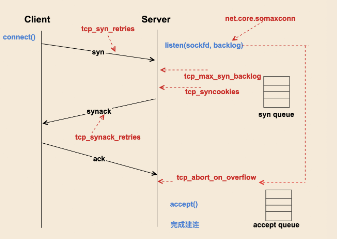
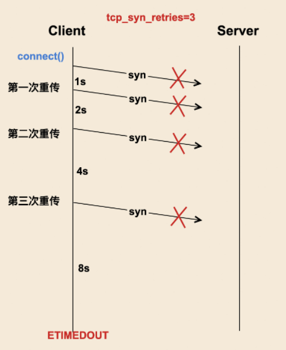
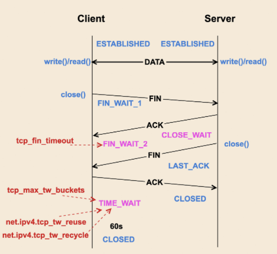
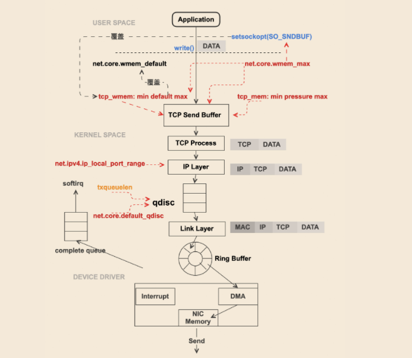
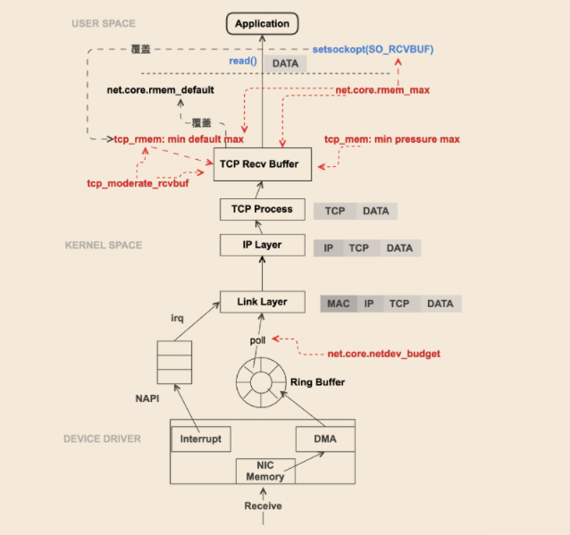
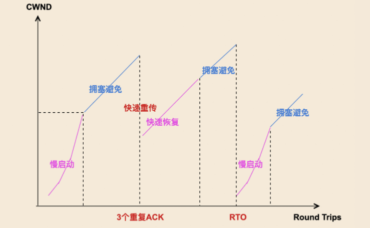
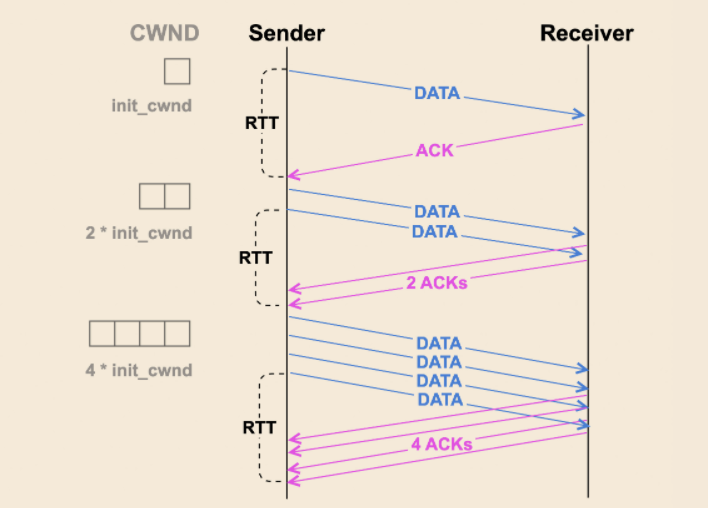
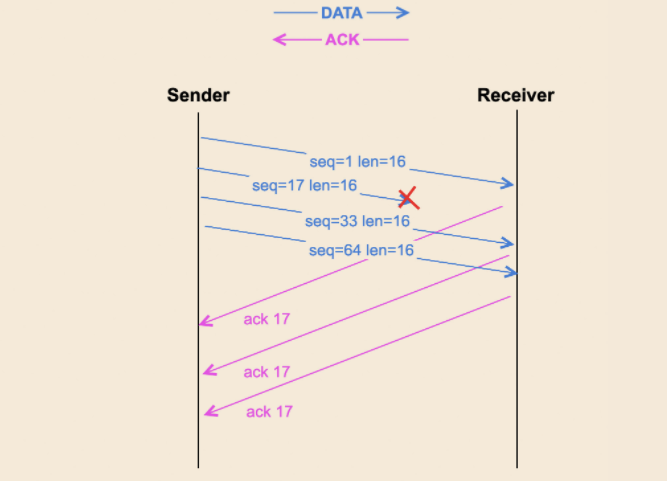
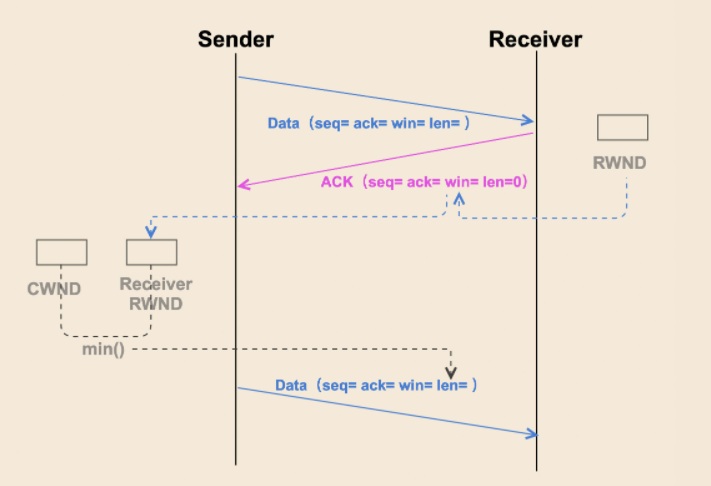
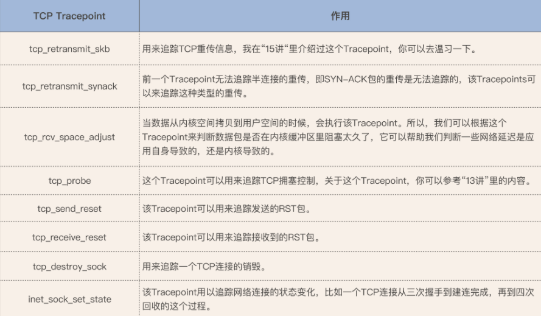

## <center>linux网络调优</center>

[TOC]

&emsp;&emsp;通过`/proc`文件系统可以修改linux的很多配置参数，可以根据特定的业务需求而作相应的修改。这些配置项在`/proc/sys/`中，通过`sudo sysctl -a`可以列出所有这些配置选项，这些列出的配置选项都是以`/proc/sys/`为根路径，比如`kernel.yama.ptrace_scope = 1`就在`/proc/sys/kernel/yama/ptrace_scope`文件中。网络相关的参数配置项在`/proc/sys/net`中。

**&emsp;&emsp;以下的建议都是站在让网络性能更好的角度，从而可能引起其他cpu或内存资源使用和性能降低。**

---

### 一、影响tcp连接断开的参配置参数







**`net.ipv4.tcp_syn_retries`**
&emsp;&emsp;连接时的syn包重传最大次数，板子默认值为6。**建议调小**。

**`net.ipv4.tcp_max_syn_backlog`**
&emsp;&emsp;接收连接端的半连接队列(积压队列)的最大长度，板子默认值为128。**建议调大**。

**`net.ipv4.tcp_syncookies`**
&emsp;&emsp;有效缓解SYN Flood 攻击的参数，ubuntu默认为1，即开启。**板子上没有这个配置**。

**`net.ipv4.tcp_synack_retries`**
&emsp;&emsp;连接时的synack包重传最大次数，板子默认值为5。**建议调小**。

**`net.core.somaxconn`**
&emsp;&emsp;全连接队列最大长度，板子默认值为4096。**建议调大**。全连接队列的长度是`listen(sockfd, backlog)`中的backlog参数设定的，当backlog超过somaxconn时队列长度就是somaxconn。

**`net.ipv4.tcp_abort_on_overflow`**
&emsp;&emsp;全连接队列满后对于新的连接会发送reset回给客户端来断开连接，ubuntu上默认为0，即关闭。**板子上没有**。

**`net.ipv4.tcp_fin_timeout`**
&emsp;&emsp;FIN_WAIT_2阶段的最长时间，超期后这一端会自动销毁连接。板子上默认值为60。**建议调小**。

**`net.ipv4.tcp_max_tw_buckets`**
&emsp;&emsp;TIME_WAIT状态的最大个数，板子上默认值为4096。**建议调小**。

**`net.ipv4.tcp_tw_reuse`**
&emsp;&emsp;复用处于TIME_WAIT状态的端口，板子默认为0。**建议开启**。


### 二、影响数据传输的配置参数





**`net.ipv4.tcp_wmem`**
&emsp;&emsp;tcp发送缓冲区的大小，板子和主机都默认4096 16384 4194304。**建议调大**。

**`net.core.wmem_max`**
&emsp;&emsp;如果tcp发送缓冲区超过了这个值就等于这个值。板子默认180224，主机212992**建议调大**，至少比tcp_wmem中的最大值大。

**`net.ipv4.tcp_mem`**
&emsp;&emsp;所有连接消耗的总内存。板子默认值为8535 11383  17070，单位为4k。**建议先看tracepoint**。

**`net.ipv4.ip_local_port_range`**
&emsp;&emsp;端口范围，建议调大。

**`qdisc队列长度`**
&emsp;&emsp;可用`ifconfig eth0 txqueuelen len`来调整为len长度。

**`net.core.default_qdisc`**
&emsp;&emsp;排队规则，板子没有这个参数。

**`net.core.netdev_budget`**
&emsp;&emsp;napi中接收到一次网络数据中断后一次轮询的数据包数量，板子默认300。**在网络吞吐大的时候建议调大，但是会相应占用cpu，使得其他业务延迟增大**。

**`net.ipv4.tcp_rmem`**
&emsp;&emsp;tcp接收缓冲区的大小，板子默认值为4096  131072   6014368。**建议调大**。

**`net.ipv4.tcp_moderate_rcvbuf`**
&emsp;&emsp;可以控制tcp缓冲区大小是否自动调节。板子默认开启为1。

**`net.core.rmem_max`**
&emsp;&emsp;如果tcp接收缓冲区超过了这个值就等于这个值。板子默认180224，**建议调大**，至少比tcp_rmem中的最大值大。

**`net.ipv4.tcp_sack`**
&emsp;&emsp;选择确认，板子默认开启。**建议开启。**

**`net.ipv4.tcp_fack`**
&emsp;&emsp;向前确认，板子**默认关闭**。**建议开启。**


### 三、影响网络拥塞的配置参数









**` TCP_INIT_CWND(include/net/tcp.h)`**
&emsp;&emsp;初始拥塞窗口，内核设置为10。**建议调大**。**增大init_cwnd的值对于提升短连接的网络性能会很有效**，特别是数据量在慢启动阶段就能发送完的短连接。

**`net.ipv4.tcp_available_congestion_control`**
&emsp;&emsp;可选择的拥塞控制算法。**不可设置**。

**`net.ipv4.tcp_congestion_control`**
&emsp;&emsp;当前的拥塞空制算法。**可设置**。

**`TCP_RTO TCP_RTO_MIN TCP_TIMEOUT_INIT (include/net/tcp.h)`**
&emsp;&emsp;超时重传时间RTO的最大，最小和初始值。**建议调小**。

**`net.ipv4.tcp_window_scaling`**
&emsp;&emsp;接收窗口win字段默认只有16位，打开了这个配置可以支持更大的窗口。


### 四、板子上的网络工具常用命令

#### ifconfig

```c
ifconfig eth0 down
ifconfig eth0 txqueuelen XXXX
ifconfig eth0 mtu XXX
ifconfig eth0 up
```

#### tcpdump

```c
tcpdump -i eth0 -w tcpdumpfile
```

#### iperf3

```c
server: iperf3 -s >> /dev/null &

client: iperf3 -c serverip -t time  -P linknum 
//iperf3 -c 192.168.34.145 -t 1000 >> /dev/null &
```

#### netstat

```c
netstat -nat
netstat -nau
```

#### netperf

&emsp;&emsp;和iperf3作用类似。	

#### ethtool

```c
ethtool eth0
```


### 五、测试监控

#### 通过ftrace和debugfs监控
##### 1.内核编译前make menuconfig先把相关的ftrace配置项选中。
##### 2.挂载debugfs。
##### 3.打开总开关和相关tracepoint。

```c
/* 挂载debugs */
//可以在/etc/fstab中添加以下命令开机自动挂载
debugfs         /sys/kernel/debug       debugfs defaults        0       0
//也可以手动挂载
# mount -t debugfs debugfs /sys/kernel/debug

/* 创建/tracing目录软连接方便操作 */
ln -s /sys/kernel/debug/tracing /tracing
    
/* 打开总开关 */
# cat /sys/kernel/debug/tracing/tracing_on 
// 如果为0则打开它 
# echo 1 > /sys/kernel/debug/tracing/tracing_on 

/* 12 追踪tcp_mem超限*/
# echo 1 > /sys/kernel/debug/tracing/events/sock/sock_exceed_buf_limit/enable
/* 13 追踪拥塞窗口*/
# echo 1 > sys/kernel/debug/tracing/events/tcp/tcp_probe/enable
/* 15 追踪tcp重传*/
# echo 1 > sys/kernel/debug/tracing/events/tcp/tcp_retransmit_skb/enable
```

##### 4.查看事件发生。

```c
# cat /sys/kernel/debug/tracing/trace
//或者
# cat /sys/kernel/debug/tracing/trace_pipe
```

除了以上3个tracepoint以外，还有其他常用的tracepoint如下，他们都在tcp或者sock目录中：




#### 通过iperf3和top监控

##### 1、系统空载时的测试

```c
//用板子当服务器,先后台启动iperf3服务器端
# iperf3 -s >> /dev/null &

//然后在主机端开启iperf3客户端,192.168.33.176是板子ip
$ iperf3 -c 192.168.33.176 -t 3600
    
/* 修改以上各种配置参数，然后通过top和trace查看，但不能同时，因此先观测top后cat trace */
# top 
//分析完top再来看trace
打开各个相关events，然后先按默认参数cat看看，再按top的修改每改一个cat一下

```

**发现问题：如果板子网卡的mtu设置为1500，对面发送端不是1500就收不到数据包。**


##### 2、系统有较重的用户负载时的测试

**通过以下脚本创建用户负载**

```c
/* 加载10个后台进程 */
#! /bin/sh
echo "user load"
i=0
for i in `seq 5`
do
echo "process $i"
./userload &
done


/* 杀死ps aux输出中含有XXXX的进程 */
ps aux | grep XXXX | grep -v grep | awk '{print "kill "$1}' | sh
```


**增加用户cpu使用率的手段**

```c
1.调整用户进程和内核线程ksoftirqd的优先级或者改变调度类
renice newnice -p pid
chrt -f -p 99 172
chrt -0 -p 0 172
    
2.根据上述调优参数调节，适当减少网络的性能或者增加内存的使用来增加用户cpu使用率
sysctl -w net.core.netdev_budget=0

3.rps和rfs
echo 3 > /sys/class/net/eth1/queues/rx-0/rps_cpus 
echo 4096 > /proc/sys/net/core/rps_sock_flow_entries
echo 4096 > /sys/class/net/eth1/queues/rx-0/rps_flow_cnt
iperf3 -s > /dev/null &
iperf3 -c <serverip> -t 3600 
watch -d cat /proc/softirqs
top
```

