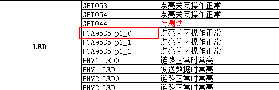

## <center>pca9535 io扩展板i2c转gpio</center>

[TOC]

---

### 一、pca9535转gpio概述

&emsp;&emsp;pca9535是一块i2c接口的io扩展芯片，具有16个io端口，可以写一个pca9535的i2c设备驱动注册进内核，通过应用程序调用文件系统接口和它通信，但是内核提供了一个更方便方法，内核提供了一个i2c转gpio驱动`gpio-pca953x.c`，在文件`driver/gpio`中，这个驱动将pca9535模拟成了一个gpio控制器，然后可以像操作普通的gpio一样通过/sys文件系统读写操作来操作pca9535上的io引脚，下文会展示这些操作。


### 二、准备工作

#### 2.1修改设备树

&emsp;&emsp;在编译设备树前先修改设备树源文件，板子对应的设备树源文件是`socfpga_cyclone5_socdk.dts`，在`arch/arm/boot/dts`目录下。在修改设备树文件前先参考`Documentation/devicetree/bindings/gpio`目录下的`gpio-pca953x.txt`：

```c
.....
Example:
        gpio@20 {
                compatible = "nxp,pca9505";
                reg = <0x20>;
                pinctrl-names = "default";
                pinctrl-0 = <&pinctrl_pca9505>;
                gpio-controller;
                #gpio-cells = <2>;
                interrupt-parent = <&gpio3>;
                interrupts = <23 IRQ_TYPE_LEVEL_LOW>;
        };
.....
```

&emsp;&emsp;文档中的Example下给出的就是一个例子，然后我们在设备树中加入如下节点：

```c
&i2c0 {
	.....

	gpio@21 {
		compatible = "nxp,pca9535";
		reg = <0x21>;
         gpio-controller;
	};
};
```

&emsp;&emsp;由pca9535的芯片手册和板子的硬件原理图得知pca9535的i2c地址为21。

#### 2.2修改内核配置

&emsp;&emsp;在编译内核前先修改内核配置，将`gpio-pca953x.c`编译进内核。具体配置路径为：

```c
Device Drivers --->
    GPIO Support --->
    	I2C GPIO expanders --->
    		PCA95[357]x, PCA9698, TCA64xx, and MAX7310 I/O ports
```

#### 2.3编译内核和设备树

&emsp;&emsp;执行`make clean` 和 `make -j12`，然后将zImage和socfpga_cyclone5_socdk.dtb拷贝到`/home/hanglory/tftpboot`目录下。不过在拷贝前最好先将原来的镜像备份。


### 三、操作演示



&emsp;&emsp;拿上图的红色标记的引脚做示范。pca9535有p0和p1两个端口，每个端口8个io引脚，因此p1_0代表第9个引脚。首先看下`/sys/class/gpio`目录下的内容：

```c
# ls
export        gpiochip1974  gpiochip2032
gpiochip1947  gpiochip2003  unexport
```

&emsp;&emsp;pca9535的gpio模拟控制器就是gpiochip2032，可以`cd gpiochip2032`进入`gpiochip2032`目录查看。

```c
# cd gpiochip2032/
# ls
base       device     label      ngpio      power      subsystem  uevent
# cat label
0-0021
# cat ngpio
16
```

&emsp;&emsp;从结果可以看出这就是pca9535芯片的gpio模拟控制器。2032就是第一个io引脚对应的gpio编号，因此p1_0的gpio编号为2040。

#### 读输入gpio

```c
# echo 2040 > /sys/class/gpio/export
# echo in > /sys/class/gpio/gpio2040/direction
# cat /sys/class/gpio/gpio2040/value
# echo 2040 > /sys/class/gpio/unexport
```

&emsp;&emsp;按以上步骤读取p1_0作为输入gpio的值。在`echo 2040 > /sys/class/gpio/export`之后会在`/sys/class/gpio`目录下产生一个gpio2040子目录，代表这个gpio引脚，最后`echo 2040 > /sys/class/gpio/unexport`这个子目录会消失。

#### 写输出gpio

```c
echo 2040 > /sys/class/gpio/export
echo out > /sys/class/gpio/gpio2040/direction
echo N > /sys/class/gpio/gpio2040/value
echo 2040 > /sys/class/gpio/unexport
```

&emsp;&emsp;按以上步骤控制p1_0作为输出gpio的值，其中`echo N > /sys/class/gpio/gpio2040/value`中的N为0或者1。可以观察板子发现，写1时灯亮，写0时灭。

