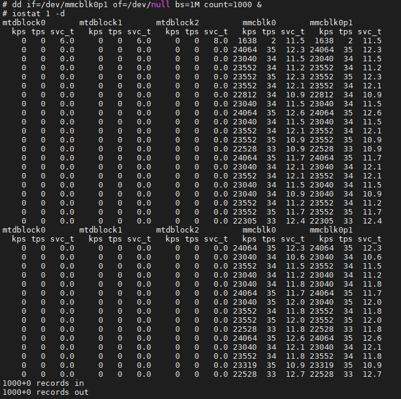
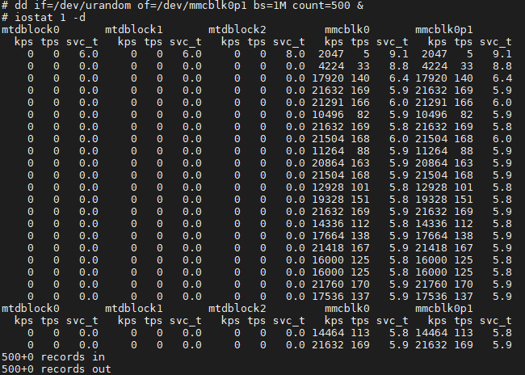
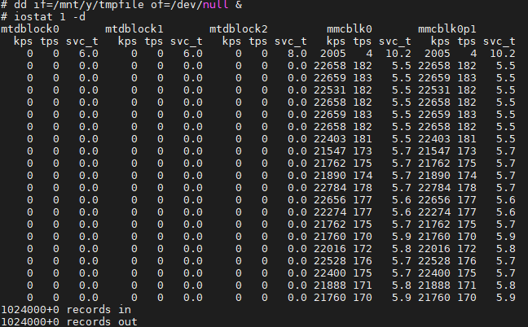
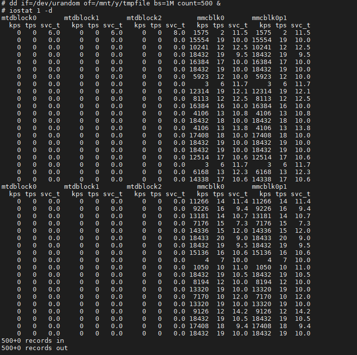
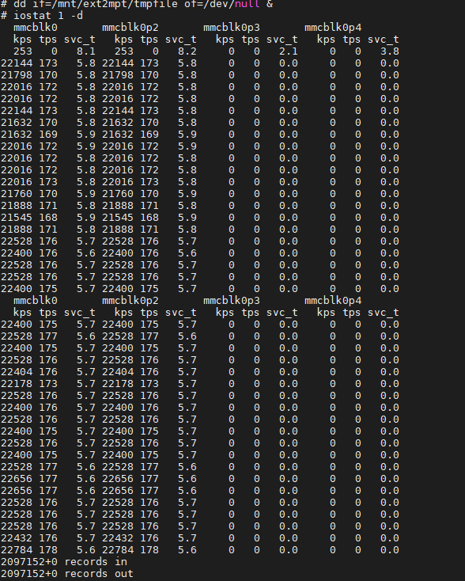
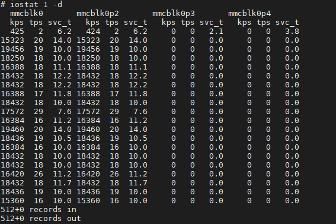
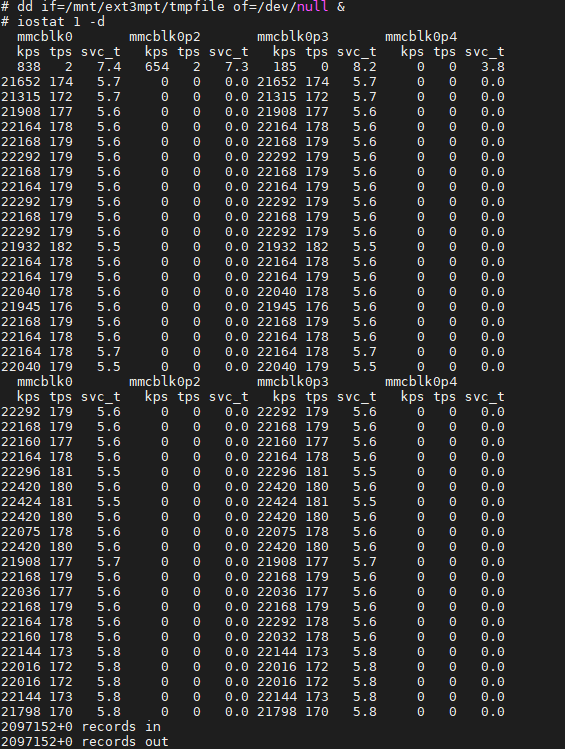
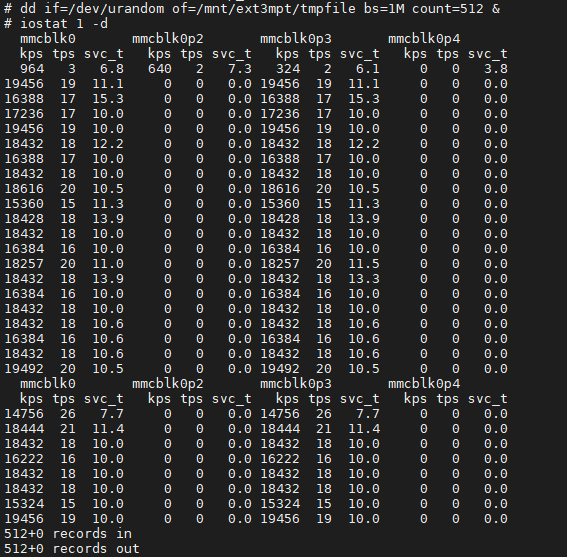
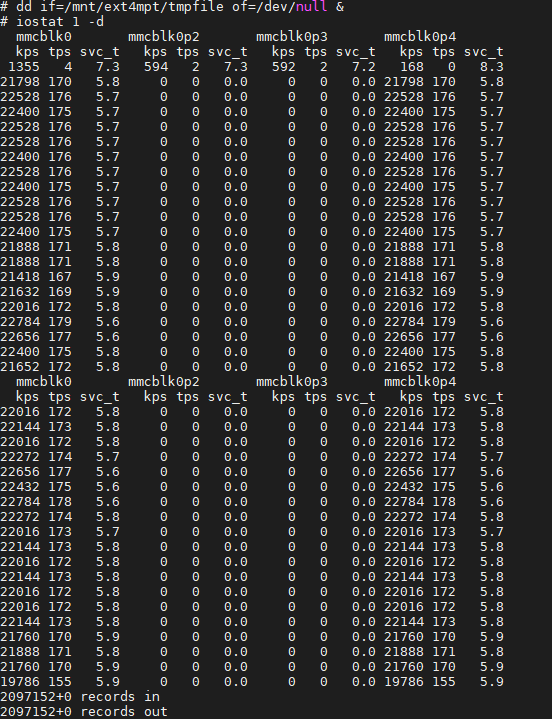
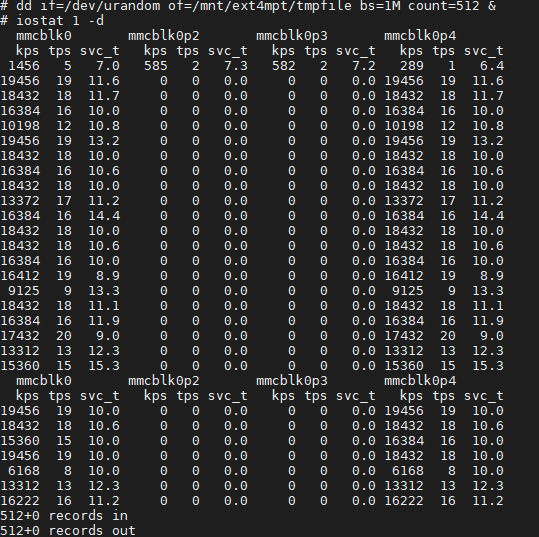

## <center>sd卡读写速度测试</center>

**以下示例的速度看kps列，单位为kb/s。**

**磁盘读**

```c
echo 3 > /proc/sys/vm/drop_caches
dd if=/dev/mmcblk0p1 of=/dev/null bs=1M count=1000 &
iostat 1 -d
```



**磁盘写**

```c
echo 3 > /proc/sys/vm/drop_caches
dd if=/dev/urandom of=/dev/mmcblk0p1 bs=1M count=500 &
iostat 1 -d
```



**fat32文件读**

```c
mkdir /mnt/y
mount /dev/mmcblk0p1 /mnt/y
dd if=/dev/urandom of=/mnt/y/tmpfile bs=1M count=500
echo 3 > /proc/sys/vm/drop_caches
dd if=/mnt/y/tmpfile of=/dev/null &
iostat 1 -d
```



**fat32文件写**

```c
echo 3 > /proc/sys/vm/drop_caches
dd if=/dev/urandom of=/mnt/y/tmpfile bs=1M count=500 &
iostat 1 -d
```




**先将sd卡分为4个分区，并将2,3,4分区分别格式化为ext2、ext3、ext4，然后按以下步骤操作文件读写**

**ext2文件读**

```c
mkdir /mnt/ext2mpt
mount /dev/mmcblk0p2 /mnt/ext2mpt
dd if=/dev/urandom of=/mnt/ext2mpt/tmpfile bs=1M count=1024
echo 3 > /proc/sys/vm/drop_caches
dd if=/mnt/ext2mpt/tmpfile of=/dev/null &
iostat 1 -d
```



**ext2文件写**

```c
echo 3 > /proc/sys/vm/drop_caches
dd if=/dev/urandom of=/mnt/ext2mpt/tmpfile bs=1M count=512 &
iostat 1 -d
```




**ext3文件读**

```c
mkdir /mnt/ext3mpt
mount /dev/mmcblk0p3 /mnt/ext3mpt
dd if=/dev/urandom of=/mnt/ext3mpt/tmpfile bs=1M count=1024
echo 3 > /proc/sys/vm/drop_caches
dd if=/mnt/ext3mpt/tmpfile of=/dev/null &
iostat 1 -d
```



**ext3文件写**

```c
echo 3 > /proc/sys/vm/drop_caches
dd if=/dev/urandom of=/mnt/ext3mpt/tmpfile bs=1M count=512 &
iostat 1 -d
```




**ext4文件读**

```c
mkdir /mnt/ext4mpt
mount /dev/mmcblk0p4 /mnt/ext4mpt
dd if=/dev/urandom of=/mnt/ext4mpt/tmpfile bs=1M count=1024
echo 3 > /proc/sys/vm/drop_caches
dd if=/mnt/ext4mpt/tmpfile of=/dev/null &
iostat 1 -d
```



**ext4文件写**

```c
echo 3 > /proc/sys/vm/drop_caches
dd if=/dev/urandom of=/mnt/ext4mpt/tmpfile bs=1M count=512 &
iostat 1 -d
```




### 总结

&emsp;&emsp;磁盘读速率大约22-24 mb/s，比较稳定；磁盘写速率11mb/s到22mb/s不等，波动相对较大不过速度基本在22mb/s左右；fat32和ext2、ext3、ext4文件读速率都在21-23 mb/s，比较稳定，相对磁盘读慢一点点；ext2、ext3、ext4文件写速率在15-20mb/s之间，相对磁盘写稳定一些，但是平均速率较慢一些，可能是数据量测试不够导致，fat32文件写速率在0-19mb/s之间，有很明显的几个瓶颈点，这是windows默认支持的文件系统，可能是linux对这个文件系统的支持不足或者linux有其他突发任务导致的，可继续观测。

