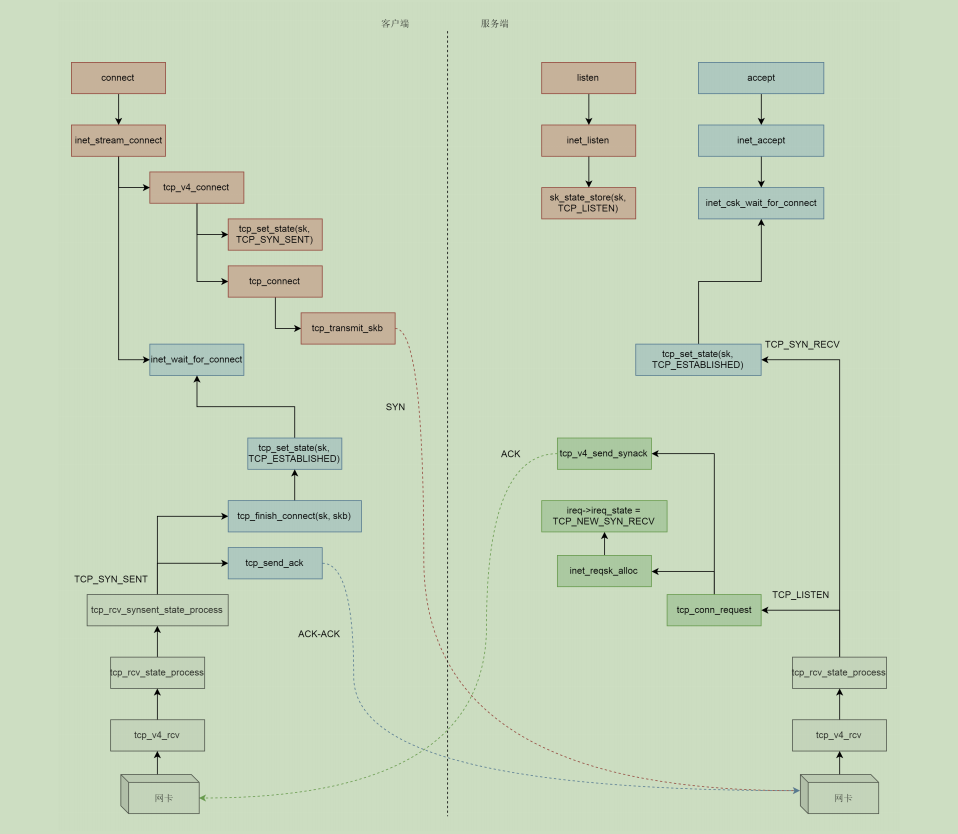

# <center>socket系统调用内核实现</center>
[TOC]
### 一、socket

#### 1.1 socket函数调用主要过程概图

**socket**

> sock_create
>
> > __sock_create
> >
> > > rcu_dereference
> > >
> > > inet_create
> > >
> > > > sk_alloc
> > > >
> > > > inet_sk
> > > >
> > > > sock_init_data
> > > >
> > > > tcp_v4_init_sock

> sock_map_fd
>
> > get_unused_fd_flags
> >
> > sock_alloc_file
> >
> > fd_install

#### 1.2 socket详细处理过程

##### 1.2.1 socket主函数流程

- 通过sock_create创建一个struct socket结构体以及struct sock等相关数据
- 通过sock_map_fd将创建的struct socket结构体和某个文件描述符绑定
- 返回一个文件描述符，后面的bind、connect等操作直接使用

```c
SYSCALL_DEFINE3(socket, int, family, int, type, int, protocol)
{
	int retval;
	struct socket *sock;
	int flags;
.....
    /* 创建一个struct socket结构体和struct sock结构体，并互相绑定 */
	retval = sock_create(family, type, protocol, &sock);
	if (retval < 0)
		goto out;

    /* 将这个struct socket结构体和某个文件描述符绑定 */
	retval = sock_map_fd(sock, flags & (O_CLOEXEC | O_NONBLOCK));
	if (retval < 0)
		goto out_release;
.....
    return retval；	/* 返回文件描述符 */
}
```

​		socket函数传入三个参数。第一个参数是**family**，表示地址族，对应的是网络层，常用的参数为AF_INET和AF_UNIX，AF_INET表示使用ipv4协议族，AF_UNIX表示不使用ip；第二个参数是**type**，表示套接字类型，对应的是传输层，常用的类型有SOCK_STREAM、SOCK_DGRAM和SOCK_RAW，分别对应tcp、udp和原始套接字，即直接操作ip层；第三个参数是**protocol**，表示协议，对应网络层和传输层的组合，常用的协议有IPPROTO_TCP、IPPROTO_UDP和IPPROTO_IP，分别对应以上三个类型。

##### 1.2.2 sock_create流程

- 创建struct socket，struct sock，struct inet_sock（对AF_INET）
- 设置struct socket，struct sock，struct inet_sock，其中重点是设置socket->ops = inet_stream_ops，sock ->sk_prot = tcp_prot，socket->sk = sock, sock->sk_socket = socket（对AF_INET和SOCK_STREAM）
- sk->sk_state  =	TCP_CLOSE

```c
int __sock_create(struct net *net, int family, int type, int protocol,
			 struct socket **res, int kern)
{
	int err;
	struct socket *sock;
	const struct net_proto_family *pf;
.....
	sock = sock_alloc();	/* 分配一个struct socket结构体 */
.....
	sock->type = type;	/* 通过type设置socket类型 */
.....
    /* 通过family找到对应的struct net_proto_family 
     * net_families在inet_init中的sock_register设置
    */
	pf = rcu_dereference(net_families[family]);
.....
    /* 调用struct net_proto_family中的create，对于AF_INET是inet_create */
	err = pf->create(net, sock, protocol, kern); 
.....
	*res = sock;	/* 将这个sock返回给sock_create的&sock参数中 */

	return 0;
.....
}
```

**参考数据**

```c
/**
 *  struct socket - general BSD socket
 *  @state: socket state (%SS_CONNECTED, etc)
 *  @type: socket type (%SOCK_STREAM, etc)
 *  @flags: socket flags (%SOCK_ASYNC_NOSPACE, etc)
 *  @ops: protocol specific socket operations
 *  @file: File back pointer for gc
 *  @sk: internal networking protocol agnostic socket representation
 *  @wq: wait queue for several uses
 */
struct socket {
	socket_state		state;
	short			type;
	unsigned long		flags;
	struct socket_wq __rcu	*wq;
	struct file		*file;
	struct sock		*sk;
	const struct proto_ops	*ops;
};

struct net_proto_family {
	int		family;
	int		(*create)(struct net *net, struct socket *sock,
				  int protocol, int kern);
	struct module	*owner;
};

// net/ipv4/af_inet.c
static const struct net_proto_family inet_family_ops = {
	.family = PF_INET,
	.create = inet_create,
	.owner	= THIS_MODULE,
};

struct inet_protosw {
	struct list_head list;
        /* These two fields form the lookup key.  */
	unsigned short	 type;	   /* This is the 2nd argument to socket(2). */
	unsigned short	 protocol; /* This is the L4 protocol number.  */
	struct proto	 *prot;
	const struct proto_ops *ops;
	unsigned char	 flags;      /* See INET_PROTOSW_* below.  */
};

static struct inet_protosw inetsw_array[] =
{
	{
		.type =       SOCK_STREAM,
		.protocol =   IPPROTO_TCP,
		.prot =       &tcp_prot,
		.ops =        &inet_stream_ops,
		.flags =      INET_PROTOSW_PERMANENT |
			      INET_PROTOSW_ICSK,
	},

	{
		.type =       SOCK_DGRAM,
		.protocol =   IPPROTO_UDP,
		.prot =       &udp_prot,
		.ops =        &inet_dgram_ops,
		.flags =      INET_PROTOSW_PERMANENT,
       },

       {
		.type =       SOCK_DGRAM,
		.protocol =   IPPROTO_ICMP,
		.prot =       &ping_prot,
		.ops =        &inet_dgram_ops,
		.flags =      INET_PROTOSW_REUSE,
       },

       {
	       .type =       SOCK_RAW,
	       .protocol =   IPPROTO_IP,	/* wild card */
	       .prot =       &raw_prot,
	       .ops =        &inet_sockraw_ops,
	       .flags =      INET_PROTOSW_REUSE,
       }
};
```

​		**sock_create**函数调用**__sock_create**函数来完成实际的工作。在**__sock_create**中先通过**sock_alloc**分配一个struct socket结构体，然后通过参数type设置这个socket的类型，再通过参数family从net_families数组中找到对应的struct net_proto_family结构体，然后调用里面的create函数，对于AF_INET是**inet_create**函数。
```c
static int inet_create(struct net *net, struct socket *sock, int protocol,
		       int kern)
{
	struct sock *sk;
	struct inet_protosw *answer;
	struct inet_sock *inet;
	struct proto *answer_prot;
	unsigned char answer_flags;
	int try_loading_module = 0;
	int err;

	sock->state = SS_UNCONNECTED;	/* 设置socket的状态为未连接 */

	/* Look for the requested type/protocol pair. */
lookup_protocol:
	err = -ESOCKTNOSUPPORT;
	rcu_read_lock();
    /* 
     * 根据type从inetsw数组中找出对应的协议结构体inet_protosw，
     * 因此根据family和type就能得到默认的protocol，
     * 在inet_init中注册inetsw_array到inetsw中
     */
	list_for_each_entry_rcu(answer, &inetsw[sock->type], list) {
		err = 0;
		/* 检查和处理protocal是否对应 */
		if (protocol == answer->protocol) {
			if (protocol != IPPROTO_IP)
				break;
		} else {
			/* Check for the two wild cases. */
			if (IPPROTO_IP == protocol) {	/* 如果传入的protocol为0，这是通常情况 */
				protocol = answer->protocol;	/* 然后将protocol置为answer的protocol */
				break;
			}
			if (IPPROTO_IP == answer->protocol)
				break;
		}
		err = -EPROTONOSUPPORT;
	}

.....
	/* 将数组中找到的inet_protosw的ops赋给socket，
	 * 对于SOCK_STREAM类型是inet_stream_ops
	 */
	sock->ops = answer->ops;
	answer_prot = answer->prot;
	answer_flags = answer->flags;
.....
    /* 申请一个struct sock，同时将answer->prot赋给sk */
	sk = sk_alloc(net, PF_INET, GFP_KERNEL, answer_prot);	
.....
	inet = inet_sk(sk);		/* 通过struct sock扩展为一个struct inet_sock */
.....

	inet->inet_id = 0;

    /* 设置sock->sk = sk, sk->sk_socket = socket */
    /* sk->sk_state  =	TCP_CLOSE */
	sock_init_data(sock, sk);	

    /* 设置struct sock */
	sk->sk_destruct	   = inet_sock_destruct;
	sk->sk_protocol	   = protocol;
	sk->sk_backlog_rcv = sk->sk_prot->backlog_rcv;

    /* 设置struct inet_sock */
	inet->uc_ttl	= -1;
	inet->mc_loop	= 1;
	inet->mc_ttl	= 1;
	inet->mc_all	= 1;
	inet->mc_index	= 0;
	inet->mc_list	= NULL;
	inet->rcv_tos	= 0;
.....
	if (sk->sk_prot->init) {	/* 剩下的一些sock初始化工作 */
		err = sk->sk_prot->init(sk);
		if (err)
			sk_common_release(sk);
	}
.....
}
```
​		上面重点关注的struct socket和struct sock的关系和区别，其中struct socket负责和上层应用交互，struct sock负责和下层协议栈交互，具体来说是struct socket中的ops(对于tcp是**inet_stream_ops**)和struct sock中的sk_prot(对于tcp是**tcp_prot**)。还有创建一个struct inet_sock结构体是通过struct sock扩展得到的，这就是类的思想，根据特定的family即AF_INET将通用的struct sock扩展为struct inet_sock。
```c
static int __init inet_init(void)
{	
.....
	/* 初始化inetsw数组每个元素，
     * 每个数组元素是一个链表，表示一种类型type，
     * 每个链表中的一个inet_protosw表示一个协议
     */
	for (r = &inetsw[0]; r < &inetsw[SOCK_MAX]; ++r)
		INIT_LIST_HEAD(r);
	/* 将inetsw_array数组中的元素注册到inetsw中 */
	for (q = inetsw_array; q < &inetsw_array[INETSW_ARRAY_LEN]; ++q)
		inet_register_protosw(q);
.....
}    
```

##### 1.2.3 sock_map_fd流程

- 申请一个文件描述符
- 申请一个struct file结构体newfile，设置newfile->private_data = sock
- 将申请得到的文件描述符fd和newfile绑定

```c
static int sock_map_fd(struct socket *sock, int flags)
{
	struct file *newfile;
	int fd = get_unused_fd_flags(flags);	/* 申请一个文件描述符 */
	if (unlikely(fd < 0))
		return fd;

	/* 申请一个struct file结构体newfile,
     * 设置newfile->private_data = sock,sock->file = file
     * 将申请得到的文件描述符fd和newfile绑定
	 */
	newfile = sock_alloc_file(sock, flags, NULL);
	if (likely(!IS_ERR(newfile))) {
		fd_install(fd, newfile);	
		return fd;
	}

	put_unused_fd(fd);
	return PTR_ERR(newfile);
}
```

```c
void fd_install(unsigned int fd, struct file *file)
{
    /* 
     * 将file设置到当前进程的struct files_struct结构体指针files的
     * struct fdtable结构体指针的fdt的struct file *类型的数组中的
     * 第fd项
     */
	__fd_install(current->files, fd, file);	
}

void __fd_install(struct files_struct *files, unsigned int fd,
		struct file *file)
{
	struct fdtable *fdt;
	spin_lock(&files->file_lock);
	fdt = files_fdtable(files);		/* fdt = files->fdt */
	BUG_ON(fdt->fd[fd] != NULL);
	rcu_assign_pointer(fdt->fd[fd], file);	/* fdt->fd[fd] = file */
	spin_unlock(&files->file_lock);
}


```

### 二、bind

#### 2.1 bind函数调用主要过程概图

   **bind**

> sockfd_lookup_light
>
> >    fdget
> >
> > > _\_fdget
> > >
> > > > _\_fget_light
> >
> > sock_from_file
>
> move_addr_to_kernel
>
> inet_bind
>
> > inet_csk_get_port

#### 2.2 bind详细处理过程

##### 2.2.1 bind主函数流程

- 根据socket调用返回的文件描述符，通过sockfd_lookup_light找到struct socket结构体sock
- 将用户空间的struct sockaddr结构体umyaddr拷贝到内核空间的struct sockaddr_storage结构体address
- 调用struct socket结构体sock中的ops域的bind，对AF_INET和SOCK_STREAM来说是inet_stream_ops中的inet_bind

```c
SYSCALL_DEFINE3(bind, int, fd, struct sockaddr __user *, umyaddr, int, addrlen)
{
	struct socket *sock;
	struct sockaddr_storage address;
	int err, fput_needed;

	/* 根据文件描述符找到sock */
	sock = sockfd_lookup_light(fd, &err, &fput_needed);
	if (sock) {
		/* 将sockaddr从用户拷到内核 */
		err = move_addr_to_kernel(umyaddr, addrlen, &address);
		if (err >= 0) {
			err = security_socket_bind(sock,
						   (struct sockaddr *)&address,
						   addrlen);
			if (!err)
				/* 对ip family调用inet_bind */
				err = sock->ops->bind(sock,
						      (struct sockaddr *)
						      &address, addrlen);
		}
		fput_light(sock->file, fput_needed);
	}
	return err;
}
```

**参考数据**

```c
struct fd {
	struct file *file;
	unsigned int flags;
};
```

##### 2.2.2 sockfd_lookup_light

- 根据文件描述符fd获取struct file结构体
- 根据struct file结构体获取struct socket结构体，然后返回

```c
static struct socket *sockfd_lookup_light(int fd, int *err, int *fput_needed)
{
	struct fd f = fdget(fd);	/* 根据fd获取包含struct file的struct fd */
	struct socket *sock;

	*err = -EBADF;
	if (f.file) {
		sock = sock_from_file(f.file, err);	/* 通过file获取sock */
		if (likely(sock)) {
			*fput_needed = f.flags;
			return sock;		/* 返回struct socket结构体指针sock */
		}
		fdput(f);		
	}
	return NULL;
}
```

> fdget(fd) -> \_\_fdget(fd) -> \_\_fget_light(fd, FMODE_PATH) 

```c
static unsigned long __fget_light(unsigned int fd, fmode_t mask)
{
	struct files_struct *files = current->files; /* 获取当前进程的files */
	struct file *file;

	if (atomic_read(&files->count) == 1) {	/* 如果files->count == 1 */
        /* 从当前进程的files中提取文件描述符fd对应的struct file */
		file = __fcheck_files(files, fd);	
		if (!file || unlikely(file->f_mode & mask))
			return 0;
		return (unsigned long)file;
	} else {		/* 如果files->count ！= 1 */
        /* 从当前进程的files中提取文件描述符fd对应的struct file */
		file = __fget(fd, mask);
		if (!file)
			return 0;
		return FDPUT_FPUT | (unsigned long)file;
	}
}
```

##### 2.2.3 inet_bind函数流程

- 根据传入的struct sockaddr和struct socket进行检查和相关附属信息设置
- 调用sock->sk->sk_prot->get_port检查端口是否冲突，检查是否可以绑定
- 如果可以绑定则设置本方ip地址inet->inet_saddr和端口inet->inet_sport为传入的参数，设置对方ip地址inet->inet_daddr和端口号inet->inet_dport都为0，表示不知道对方是谁；如果不能绑定，则以上数据都设为0

```c
int inet_bind(struct socket *sock, struct sockaddr *uaddr, int addr_len)
{
	struct sockaddr_in *addr = (struct sockaddr_in *)uaddr;	
	struct sock *sk = sock->sk;
	struct inet_sock *inet = inet_sk(sk);	
	struct net *net = sock_net(sk);			
	unsigned short snum;
	int chk_addr_ret;
	int err;

	/* If the socket has its own bind function then use it. (RAW) */
	if (sk->sk_prot->bind) {
		err = sk->sk_prot->bind(sk, uaddr, addr_len);
		goto out;
	}
.....

	if (addr->sin_family != AF_INET) {
		/* Compatibility games : accept AF_UNSPEC (mapped to AF_INET)
		 * only if s_addr is INADDR_ANY.
		 */
		err = -EAFNOSUPPORT;
		if (addr->sin_family != AF_UNSPEC ||
		    addr->sin_addr.s_addr != htonl(INADDR_ANY))
			goto out;
	}
.....    
	snum = ntohs(addr->sin_port);	/* 根据传入的sockaddr获得端口号 */
.....
    /* 设置本方的ip地址 */
    inet->inet_rcv_saddr = inet->inet_saddr = addr->sin_addr.s_addr;
.....    
	/* 调用inet_csk_get_port检查端口是否冲突，检查是否可以绑定 */
	if (sk->sk_prot->get_port(sk, snum)) {
		inet->inet_saddr = inet->inet_rcv_saddr = 0;	/* 如果不能绑定设为0 */
		err = -EADDRINUSE;
		goto out_release_sock;
	}
.....
    inet->inet_sport = htons(inet->inet_num);	 /* 设置本方的端口号 */
	inet->inet_daddr = 0;			/* 设置对方的ip地址 */
	inet->inet_dport = 0;			/* 设置本方的端口号 */
.....    
out_release_sock:
	release_sock(sk);
out:
	return err;
}
```

### 三、listen

#### 3.1 listen函数调用主要过程概图

> sockfd_lookup_light
>
> inet_listen
>
> > inet_csk_listen_start
> >
> > > reqsk_queue_alloc
> > >
> > > inet_csk_get_port

#### 3.2 listen详细处理过程

##### 3.2.1  listen主函数流程

- 根据socket调用返回的文件描述符，通过sockfd_lookup_light找到struct socket结构体sock
- 调用struct socket结构体sock中的ops域的listen，对AF_INET和SOCK_STREAM来说是inet_stream_ops中的inet_listen

```c
SYSCALL_DEFINE2(listen, int, fd, int, backlog)
{
	struct socket *sock;
	int err, fput_needed;
	int somaxconn;

    /* 根据文件描述符找到sock */
	sock = sockfd_lookup_light(fd, &err, &fput_needed);
	if (sock) {
		somaxconn = sock_net(sock->sk)->core.sysctl_somaxconn;
		if ((unsigned int)backlog > somaxconn)
			backlog = somaxconn;

		err = security_socket_listen(sock, backlog);
		if (!err)
			/* 如果是ip family，调用inet_listen */
			err = sock->ops->listen(sock, backlog);

		fput_light(sock->file, fput_needed);
	}
	return err;
}
```

##### 3.2.2 inet_listen函数流程

- 检查socket状态
- 如果不在listen状态调用inet_csk_listen_start进入监听状态

```c
/*
 *	Move a socket into listening state.
 */
int inet_listen(struct socket *sock, int backlog)
{
	struct sock *sk = sock->sk;
	unsigned char old_state;
	int err;
.....
    /* 如果sock处于连接状态或者不是SOCK_STREAM类型套接字则返回 */
	if (sock->state != SS_UNCONNECTED || sock->type != SOCK_STREAM)
		goto out;

    /* 如果tcp状态即不是close也不是listen则返回 */
	old_state = sk->sk_state;	
	if (!((1 << old_state) & (TCPF_CLOSE | TCPF_LISTEN)))
		goto out;


	if (old_state != TCP_LISTEN) { /* 如果之前不在listen状态 */
.....
		/*
		 * 如果这个socket还不在TCP_LISTEN状态，
		 * 会调用inet_csk_listen_start进入监听状态 
		 */
		err = inet_csk_listen_start(sk, backlog);
		if (err)
			goto out;
	}
    
    /* 如果已经在listen状态则只能改backlog */
	sk->sk_max_ack_backlog = backlog;
	err = 0;

out:
	release_sock(sk);
	return err;
}
```

##### 3.2.3 inet_csk_listen_start

- sk->sk_state = TCP_LISTEN

```c
int inet_csk_listen_start(struct sock *sk, const int nr_table_entries)
{
	struct inet_sock *inet = inet_sk(sk);
    /* 获取包含struct inet_sock的struct inet_connection_sock结构体 */
	struct inet_connection_sock *icsk = inet_csk(sk);	
    /* 如果已连接队列有连接则返回 */
	int rc = reqsk_queue_alloc(&icsk->icsk_accept_queue, nr_table_entries);
	if (rc != 0)
		return rc;

.....
	sk->sk_state = TCP_LISTEN;	/* 设置tcp状态为listen */
	if (!sk->sk_prot->get_port(sk, inet->inet_num)) {	/* 判断端口是否冲突 */
		inet->inet_sport = htons(inet->inet_num);

		sk_dst_reset(sk);
		sk->sk_prot->hash(sk);

		return 0;
	}

	sk->sk_state = TCP_CLOSE;	/* 如果端口冲突则将tcp关闭 */
	__reqsk_queue_destroy(&icsk->icsk_accept_queue);
	return -EADDRINUSE;
}
```

### 四、accept

#### 4.1 accept函数调用主要过程概图

**accept**

> sockfd_lookup_light
>
> sock_alloc
>
> get_unused_fd_flags
>
> sock_alloc_file
>
> inet_accept
>
> > inet_csk_accept
> >
> > > inet_csk_wait_for_connect
> > >
> > > > prepare_to_wait_exclusive
> > > >
> > > > schedule_timeout
> > >
> > > reqsk_queue_remove
>
> fd_install

#### 4.2  accept详细处理过程

##### 4.2.1 accept主函数流程

- 创建新的socket用作已连接socket，并设置
- 调用inet_csk_accept

```c
SYSCALL_DEFINE3(accept, int, fd, struct sockaddr __user *, upeer_sockaddr,
		int __user *, upeer_addrlen)
{
	return sys_accept4(fd, upeer_sockaddr, upeer_addrlen, 0);
}
```

```c
SYSCALL_DEFINE4(accept4, int, fd, struct sockaddr __user *, upeer_sockaddr,
		int __user *, upeer_addrlen, int, flags)
{
	struct socket *sock, *newsock;
	struct file *newfile;
	int err, len, newfd, fput_needed;
	struct sockaddr_storage address;

	if (flags & ~(SOCK_CLOEXEC | SOCK_NONBLOCK))
		return -EINVAL;

	if (SOCK_NONBLOCK != O_NONBLOCK && (flags & SOCK_NONBLOCK))
		flags = (flags & ~SOCK_NONBLOCK) | O_NONBLOCK;
	/* 根据文件描述符找到sock */
	sock = sockfd_lookup_light(fd, &err, &fput_needed);
	if (!sock)
		goto out;

	err = -ENFILE;
	/* 创建新的socket用于新连接通信，原来的socket继续监听 */
	newsock = sock_alloc();
	if (!newsock)
		goto out_put;
	/* 设置newsock */
	newsock->type = sock->type;
	newsock->ops = sock->ops;

	/*
	 * We don't need try_module_get here, as the listening socket (sock)
	 * has the protocol module (sock->ops->owner) held.
	 */
	__module_get(newsock->ops->owner);

    /* 获取一个文件描述符给newsock */
	newfd = get_unused_fd_flags(flags);
	if (unlikely(newfd < 0)) {
		err = newfd;
		sock_release(newsock);
		goto out_put;
	}
    /* 给newsock申请一个struct file */
	newfile = sock_alloc_file(newsock, flags, sock->sk->sk_prot_creator->name);
	if (unlikely(IS_ERR(newfile))) {
		err = PTR_ERR(newfile);
		put_unused_fd(newfd);
		sock_release(newsock);
		goto out_put;
	}

	err = security_socket_accept(sock, newsock);
	if (err)
		goto out_fd;

	/* inet_stream_ops的accept函数，
     * 也即inet_accept，然后inet_accept中调用inet_csk_accept。
     */
	err = sock->ops->accept(sock, newsock, sock->file->f_flags);
	if (err < 0)
		goto out_fd;

.....

	/* 绑定newfd和newfile */
	fd_install(newfd, newfile);
	err = newfd;

out_put:
	fput_light(sock->file, fput_needed);
out:
	return err;
out_fd:
	fput(newfile);
	put_unused_fd(newfd);
	goto out_put;
}
```

​		accept函数的实现，印证了socket的原理中说的那样，原来的socket是监听socket，这里我们会找到原来的struct socket，并基于它去创建一个新的newsock。这才是连接socket。除此之外，我们还会创建一个新的struct file和fd，并关联到socket。inet_accept会调用struct sock的sk1->sk_prot->accept，也即tcp_prot的accept函数，inet_csk_accept函数。

##### 4.2.2 inet_csk_accept流程

- 读取icsk_accept_queue队列
- 如果队列不为空则取出一个连接的sock返回，如果为空且是阻塞模式，则inet_csk_wait_for_connect进入睡眠等待连接

```c
struct sock *inet_csk_accept(struct sock *sk, int flags, int *err)
{
	struct inet_connection_sock *icsk = inet_csk(sk);
	struct request_sock_queue *queue = &icsk->icsk_accept_queue;
	struct sock *newsk;
	struct request_sock *req;
	int error;

	lock_sock(sk);

	/* We need to make sure that this socket is listening,
	 * and that it has something pending.
	 */
	error = -EINVAL;
	if (sk->sk_state != TCP_LISTEN) /* 如果不是TCP_LISTEN则退出 */
		goto out_err;

	/* Find already established connection */
	if (reqsk_queue_empty(queue)) {		/* 如果accept_queue队列为空 */
        /* 如果非阻塞模式就直接返回0 */
		long timeo = sock_rcvtimeo(sk, flags & O_NONBLOCK);

		/* 非阻塞模式直接退出，不睡眠 */
		error = -EAGAIN;
		if (!timeo)
			goto out_err;
        
		/* 如果阻塞模式则让出cpu，睡眠等待timeo */
		error = inet_csk_wait_for_connect(sk, timeo);
		if (error)
			goto out_err;
	}
    
	/* 如果再次CPU醒来且
	 * icsk_accept_queue不为空，或者本来就不空则从
	 * 队列中取出一个struct sock对象赋值给newsk。
 	 */
	req = reqsk_queue_remove(queue);
	newsk = req->sk;

	sk_acceptq_removed(sk);	/* 计数减一 */
.....
	return newsk;	/* 返回newsock */
.....
}
```

##### 4.2.3 inet_csk_wait_for_connect流程

- 将当前进程设置为TASK_INTERRUPTIBLE状态，让出cpu睡眠
- 醒来后如果队列不为空则返回

```c
/*
 * Wait for an incoming connection, avoid race conditions. This must be called
 * with the socket locked.
 */
static int inet_csk_wait_for_connect(struct sock *sk, long timeo)
{
	struct inet_connection_sock *icsk = inet_csk(sk);
	DEFINE_WAIT(wait);
	int err;

	for (;;) {
        /* 将当前进程设置为TASK_INTERRUPTIBLE状态，挂在等待队列wait上 */
		prepare_to_wait_exclusive(sk_sleep(sk), &wait,
					  TASK_INTERRUPTIBLE);
		release_sock(sk);
		if (reqsk_queue_empty(&icsk->icsk_accept_queue))
			timeo = schedule_timeout(timeo);	/* 主动调度，让出cpu */
		sched_annotate_sleep();
		lock_sock(sk);
		err = 0;
        /* 醒来后如果队列不为空则返回，说明不是信号唤醒，而是有了链接，由链接逻辑唤醒 */
		if (!reqsk_queue_empty(&icsk->icsk_accept_queue))
			break;
		err = -EINVAL;
		if (sk->sk_state != TCP_LISTEN)	/* 如果醒来还空，看是否连接状态异常 */
			break;
		err = sock_intr_errno(timeo);	/* 如果醒来还空，看是否超时 */
        /* 看是否有信号处理 */
		if (signal_pending(current))	/* 如果醒来还空，看是否有信号处理 */
			break;
		err = -EAGAIN;
		if (!timeo)
			break;
	}
	finish_wait(sk_sleep(sk), &wait);
	return err;
}
```

### 五、connect

#### 5.1 connect函数调用主要过程概图



#### 5.2 connect详细处理过程

##### 5.2.1 connect主函数流程

- 根据文件描述符找到sock
- 拷贝用户空间的套接字地址到内核空间
- 调用inet_stream_connect

```c
SYSCALL_DEFINE3(connect, int, fd, struct sockaddr __user *, uservaddr,
		int, addrlen)
{
	struct socket *sock;
	struct sockaddr_storage address;
	int err, fput_needed;
	/* 根据文件描述符找到sock */
	sock = sockfd_lookup_light(fd, &err, &fput_needed);
	if (!sock)
		goto out;
    /* 拷贝用户空间的套接字地址到内核空间 */
	err = move_addr_to_kernel(uservaddr, addrlen, &address);
	if (err < 0)
		goto out_put;

	err = security_socket_connect(sock, (struct sockaddr *)&address, addrlen);
	if (err)
		goto out_put;
	/* 对tcp调用inet_stream_connect */
	err = sock->ops->connect(sock, (struct sockaddr *)&address, addrlen,
				 sock->file->f_flags);
out_put:
	fput_light(sock->file, fput_needed);
out:
	return err;
}
```

##### 5.2.2 inet_stream_connect流程

​		inet_stream_connect中调用__inet_stream_connect。

```c
/*
 *	Connect to a remote host. There is regrettably still a little
 *	TCP 'magic' in here.
 */
int __inet_stream_connect(struct socket *sock, struct sockaddr *uaddr,
			  int addr_len, int flags)
{
	struct sock *sk = sock->sk;
	int err;
	long timeo;

	.....

	switch (sock->state) {
	default:
		err = -EINVAL;
		goto out;
	case SS_CONNECTED:		
		err = -EISCONN;
		goto out;
	case SS_CONNECTING:
		err = -EALREADY;
		/* Fall out of switch with err, set for this state */
		break;
	case SS_UNCONNECTED:	/* 客户端进入connect时正常情况处于SS_UNCONNECTED即close状态 */
		err = -EISCONN;
		if (sk->sk_state != TCP_CLOSE)
			goto out;
		/* 调用tcp_prot的tcp_v4_connect */
		err = sk->sk_prot->connect(sk, uaddr, addr_len);
		if (err < 0)
			goto out;
		/* 在调用tcp_v4_connect发送syn之后将sock设置为SS_CONNECTING
		 * 在tcp_v4_connect中将sock->sk->sk_state设置为TCP_SYN_SENT
         */
		sock->state = SS_CONNECTING;

		/* Just entered SS_CONNECTING state; the only
		 * difference is that return value in non-blocking
		 * case is EINPROGRESS, rather than EALREADY.
		 */
		err = -EINPROGRESS;
		break;
	}
    
	/* 获取sk的发送超时时间 */
	timeo = sock_sndtimeo(sk, flags & O_NONBLOCK);

	if ((1 << sk->sk_state) & (TCPF_SYN_SENT | TCPF_SYN_RECV)) {
		.....
        /* 等待服务器的ack包 */
		if (!timeo || !inet_wait_for_connect(sk, timeo, writebias))
			goto out;
		/* 看是否超时 */
		err = sock_intr_errno(timeo);
		if (signal_pending(current))
			goto out;
	}

	/* Connection was closed by RST, timeout, ICMP error
	 * or another process disconnected us.
	 */
    /* 看是否连接由于RST, timeout, ICMP error等被关闭 */
	if (sk->sk_state == TCP_CLOSE)
		goto sock_error;

	/* 完成连接，将sock状态设置为SS_CONNECTED */
	sock->state = SS_CONNECTED;
	err = 0;
out:
	return err;

sock_error:
	err = sock_error(sk) ? : -ECONNABORTED;
	sock->state = SS_UNCONNECTED;
	if (sk->sk_prot->disconnect(sk, flags))
		sock->state = SS_DISCONNECTING;
	goto out;
}
```

​		在\_\_inet_stream_connect里面，我们发现，如果socket处于SS_UNCONNECTED状态，这是正常情况，那就调用struct sock的sk->sk_prot->connect，也即tcp_prot的connect函数— — **tcp_v4_connect**函数。

```c
/* This will initiate an outgoing connection. */
int tcp_v4_connect(struct sock *sk, struct sockaddr *uaddr, int addr_len)
{
	struct sockaddr_in *usin = (struct sockaddr_in *)uaddr;
	struct inet_sock *inet = inet_sk(sk);
	struct tcp_sock *tp = tcp_sk(sk);
	__be16 orig_sport, orig_dport;
	__be32 daddr, nexthop;
	struct flowi4 *fl4;
	struct rtable *rt;
	int err;
	struct ip_options_rcu *inet_opt;

.....
	/* 设置路由，即设置从哪个网卡发送出去 */
	orig_sport = inet->inet_sport;		
	orig_dport = usin->sin_port;		
	fl4 = &inet->cork.fl.u.ip4;
	rt = ip_route_connect(fl4, nexthop, inet->inet_saddr,
			      RT_CONN_FLAGS(sk), sk->sk_bound_dev_if,
			      IPPROTO_TCP,
			      orig_sport, orig_dport, sk);
.....
    /* 发送syn之前设置tcp状态为TCP_SYN_SENT */
	tcp_set_state(sk, TCP_SYN_SENT);		
	err = inet_hash_connect(&tcp_death_row, sk);
	if (err)
		goto failure;

	inet_set_txhash(sk);

	rt = ip_route_newports(fl4, rt, orig_sport, orig_dport,
			       inet->inet_sport, inet->inet_dport, sk);
	if (IS_ERR(rt)) {
		err = PTR_ERR(rt);
		rt = NULL;
		goto failure;
	}
	/* OK, now commit destination to socket.  */
	sk->sk_gso_type = SKB_GSO_TCPV4;
	sk_setup_caps(sk, &rt->dst);

    /* 设置序列号 */
	if (!tp->write_seq && likely(!tp->repair))
		tp->write_seq = secure_tcp_sequence_number(inet->inet_saddr,
							   inet->inet_daddr,
							   inet->inet_sport,
							   usin->sin_port);

	inet->inet_id = tp->write_seq ^ jiffies;

    /* 发送syn */
	err = tcp_connect(sk);

	rt = NULL;
	if (err)
		goto failure;

	return 0;

failure:
	/*
	 * This unhashes the socket and releases the local port,
	 * if necessary.
	 */
	tcp_set_state(sk, TCP_CLOSE);	
	ip_rt_put(rt);
	sk->sk_route_caps = 0;
	inet->inet_dport = 0;
	return err;
}
```

​		在tcp_v4_connect函数中，ip_route_connect其实是做一个路由的选择。为什么呢？因为三次握手马上就要发送一个SYN包了，这就要凑齐源地址、源端口、目标地址、目标端口。目标地址和目标端口是服务端的，已经知道源端口是客户端随机分配的，源地址应该用哪一个呢？这时候要选择一条路由，看从哪个网卡出去，就应该填写哪个网卡的IP地址。接下来，在发送SYN之前，我们先将客户端socket的状态设置为TCP_SYN_SENT。然后初始化TCP的seq num，也即write_seq，然后调用**tcp_connect**进行发送。

```c
int tcp_connect(struct sock *sk)
{
	struct tcp_sock *tp = tcp_sk(sk);
	struct sk_buff *buff;
	int err;
	
    /* 一些初始化设置,设置包含sk的tcp_sock结构体的中的tcp参数，如序列号，窗口等 */
	tcp_connect_init(sk);
.....
	/* 申请一个sk buf */
	buff = sk_stream_alloc_skb(sk, 0, sk->sk_allocation);
	if (unlikely(!buff))
		return -ENOBUFS;
	/* 初始化一个syn包 */
	tcp_init_nondata_skb(buff, tp->write_seq++, TCPHDR_SYN);
	tp->retrans_stamp = tcp_time_stamp;
	tcp_connect_queue_skb(sk, buff);
	tcp_ecn_send_syn(sk, buff);

	/* 发送SYN包 */
	err = tp->fastopen_req ? tcp_send_syn_data(sk, buff) :
	      tcp_transmit_skb(sk, buff, 1, sk->sk_allocation);
.....
	/* 设置了一个timer，如果SYN发送不成功，则再次发送 */
	inet_csk_reset_xmit_timer(sk, ICSK_TIME_RETRANS,
				  inet_csk(sk)->icsk_rto, TCP_RTO_MAX);
	return 0;
}
```

​		回到\_\_inet_stream_connect函数，在调用sk->sk_prot->connect之后，inet_wait_for_connect会一直等待客户端收到服务端的ACK。服务端在accept之后进入syn_recv状态，通过inet_csk_wait_for_connect处于等待中。

##### 5.2.3 conect阶段的tcp层接收处理

```c
static const struct net_protocol tcp_protocol = {
	.early_demux	=	tcp_v4_early_demux,
	.handler	=	tcp_v4_rcv,
	.err_handler	=	tcp_v4_err,
	.no_policy	=	1,
	.netns_ok	=	1,
	.icmp_strict_tag_validation = 1,
};
```

​		通过struct net_protocol结构中的handler进行接收，调用的函数是tcp_v4_rcv。接下来的调用链为tcp_v4_rcv->tcp_v4_do_rcv->tcp_rcv_state_process。tcp_rcv_state_process，顾名思义，是用来处理接收一个网络包后引起状态变化的。

```c
int tcp_rcv_state_process(struct sock *sk, struct sk_buff *skb,
			  const struct tcphdr *th, unsigned int len)
{
	struct tcp_sock *tp = tcp_sk(sk);
	struct inet_connection_sock *icsk = inet_csk(sk);
	struct request_sock *req;
	int queued = 0;
	bool acceptable;
	u32 synack_stamp;

	tp->rx_opt.saw_tstamp = 0;

	switch (sk->sk_state) {
	case TCP_CLOSE:
		goto discard;

     /* listen状态分支，对服务器 */
	case TCP_LISTEN:	
		if (th->ack)
			return 1;

		if (th->rst)
			goto discard;

		if (th->syn) {		/* 如果接收到的是syn包则回送syn-ack */
			if (th->fin)
				goto discard;
            /* 调用tcp_v4_conn_request回送syn-ack */
			if (icsk->icsk_af_ops->conn_request(sk, skb) < 0)
				return 1;

			kfree_skb(skb);
			return 0;
		}
		goto discard;

     /* SYN_SENT状态分支，对客户端 */
	case TCP_SYN_SENT:
         /* 如果收到服务器的syn-ack，回送ackack */
		queued = tcp_rcv_synsent_state_process(sk, skb, th, len);
		if (queued >= 0)
			return queued;

		/* Do step6 onward by hand. */
		tcp_urg(sk, skb, th);
		__kfree_skb(skb);
		tcp_data_snd_check(sk);
		return 0;
	}

	.....
     /*
      * 剩下的内容暂时未分析
     */

	/* step 5: check the ACK field */
	acceptable = tcp_ack(sk, skb, FLAG_SLOWPATH |
				      FLAG_UPDATE_TS_RECENT) > 0;

	switch (sk->sk_state) {
	case TCP_SYN_RECV:		/* SYN_RECV分支，对服务器 */
		if (!acceptable)
			return 1;

		/* Once we leave TCP_SYN_RECV, we no longer need req
		 * so release it.
		 */
		if (req) {
			synack_stamp = tcp_rsk(req)->snt_synack;
			tp->total_retrans = req->num_retrans;
			reqsk_fastopen_remove(sk, req, false);
		} else {
			synack_stamp = tp->lsndtime;
			/* Make sure socket is routed, for correct metrics. */
			icsk->icsk_af_ops->rebuild_header(sk);
			tcp_init_congestion_control(sk);

			tcp_mtup_init(sk);
			tp->copied_seq = tp->rcv_nxt;
			tcp_init_buffer_space(sk);
		}
		smp_mb();
		tcp_set_state(sk, TCP_ESTABLISHED);
		sk->sk_state_change(sk);

		/* Note, that this wakeup is only for marginal crossed SYN case.
		 * Passively open sockets are not waked up, because
		 * sk->sk_sleep == NULL and sk->sk_socket == NULL.
		 */
		if (sk->sk_socket)
			sk_wake_async(sk, SOCK_WAKE_IO, POLL_OUT);

		tp->snd_una = TCP_SKB_CB(skb)->ack_seq;
		tp->snd_wnd = ntohs(th->window) << tp->rx_opt.snd_wscale;
		tcp_init_wl(tp, TCP_SKB_CB(skb)->seq);
		tcp_synack_rtt_meas(sk, synack_stamp);

		if (tp->rx_opt.tstamp_ok)
			tp->advmss -= TCPOLEN_TSTAMP_ALIGNED;

		if (req) {
			/* Re-arm the timer because data may have been sent out.
			 * This is similar to the regular data transmission case
			 * when new data has just been ack'ed.
			 *
			 * (TFO) - we could try to be more aggressive and
			 * retransmitting any data sooner based on when they
			 * are sent out.
			 */
			tcp_rearm_rto(sk);
		} else
			tcp_init_metrics(sk);

		tcp_update_pacing_rate(sk);

		/* Prevent spurious tcp_cwnd_restart() on first data packet */
		tp->lsndtime = tcp_time_stamp;

		tcp_initialize_rcv_mss(sk);
		tcp_fast_path_on(tp);
		break;

	case TCP_FIN_WAIT1: {
		struct dst_entry *dst;
		int tmo;

		/* If we enter the TCP_FIN_WAIT1 state and we are a
		 * Fast Open socket and this is the first acceptable
		 * ACK we have received, this would have acknowledged
		 * our SYNACK so stop the SYNACK timer.
		 */
		if (req != NULL) {
			/* Return RST if ack_seq is invalid.
			 * Note that RFC793 only says to generate a
			 * DUPACK for it but for TCP Fast Open it seems
			 * better to treat this case like TCP_SYN_RECV
			 * above.
			 */
			if (!acceptable)
				return 1;
			/* We no longer need the request sock. */
			reqsk_fastopen_remove(sk, req, false);
			tcp_rearm_rto(sk);
		}
		if (tp->snd_una != tp->write_seq)
			break;

		tcp_set_state(sk, TCP_FIN_WAIT2);
		sk->sk_shutdown |= SEND_SHUTDOWN;

		dst = __sk_dst_get(sk);
		if (dst)
			dst_confirm(dst);

		if (!sock_flag(sk, SOCK_DEAD)) {
			/* Wake up lingering close() */
			sk->sk_state_change(sk);
			break;
		}

		if (tp->linger2 < 0 ||
		    (TCP_SKB_CB(skb)->end_seq != TCP_SKB_CB(skb)->seq &&
		     after(TCP_SKB_CB(skb)->end_seq - th->fin, tp->rcv_nxt))) {
			tcp_done(sk);
			NET_INC_STATS_BH(sock_net(sk), LINUX_MIB_TCPABORTONDATA);
			return 1;
		}

		tmo = tcp_fin_time(sk);
		if (tmo > TCP_TIMEWAIT_LEN) {
			inet_csk_reset_keepalive_timer(sk, tmo - TCP_TIMEWAIT_LEN);
		} else if (th->fin || sock_owned_by_user(sk)) {
			/* Bad case. We could lose such FIN otherwise.
			 * It is not a big problem, but it looks confusing
			 * and not so rare event. We still can lose it now,
			 * if it spins in bh_lock_sock(), but it is really
			 * marginal case.
			 */
			inet_csk_reset_keepalive_timer(sk, tmo);
		} else {
			tcp_time_wait(sk, TCP_FIN_WAIT2, tmo);
			goto discard;
		}
		break;
	}

	case TCP_CLOSING:
		if (tp->snd_una == tp->write_seq) {
			tcp_time_wait(sk, TCP_TIME_WAIT, 0);
			goto discard;
		}
		break;

	case TCP_LAST_ACK:
		if (tp->snd_una == tp->write_seq) {
			tcp_update_metrics(sk);
			tcp_done(sk);
			goto discard;
		}
		break;
	}

	/* step 6: check the URG bit */
	tcp_urg(sk, skb, th);

	/* step 7: process the segment text */
	switch (sk->sk_state) {
	case TCP_CLOSE_WAIT:
	case TCP_CLOSING:
	case TCP_LAST_ACK:
		if (!before(TCP_SKB_CB(skb)->seq, tp->rcv_nxt))
			break;
	case TCP_FIN_WAIT1:
	case TCP_FIN_WAIT2:
		/* RFC 793 says to queue data in these states,
		 * RFC 1122 says we MUST send a reset.
		 * BSD 4.4 also does reset.
		 */
		if (sk->sk_shutdown & RCV_SHUTDOWN) {
			if (TCP_SKB_CB(skb)->end_seq != TCP_SKB_CB(skb)->seq &&
			    after(TCP_SKB_CB(skb)->end_seq - th->fin, tp->rcv_nxt)) {
				NET_INC_STATS_BH(sock_net(sk), LINUX_MIB_TCPABORTONDATA);
				tcp_reset(sk);
				return 1;
			}
		}
		/* Fall through */
	case TCP_ESTABLISHED:
		tcp_data_queue(sk, skb);
		queued = 1;
		break;
	}

	/* tcp_data could move socket to TIME-WAIT */
	if (sk->sk_state != TCP_CLOSE) {
		tcp_data_snd_check(sk);
		tcp_ack_snd_check(sk);
	}

	if (!queued) {
discard:
		__kfree_skb(skb);
	}
	return 0;
}

```

​		服务端在listen之后和处理客户端connect发送的syn包之前是处于TCP_LISTEN状态的，而且发过来的包是SYN，因而就有了上面的代码，调用icsk->icsk_af_ops->conn_request函数。struct inet_connection_sock对应的操作是inet_connection_sock_af_ops，按照下面的定义，其实调用的是tcp_v4_conn_request。

```c
const struct inet_connection_sock_af_ops ipv4_specific = {
.....
    .conn_request = tcp_v4_conn_request,
.....
};
```

​		tcp_v4_conn_request会调用tcp_conn_request，这个函数也比较长，里面调用了send_synack，但实际调用的是tcp_v4_send_synack。具体发送的过程我们不去管它，看注释我们能知道，这是收到了SYN后，回复一个SYN-ACK，回复完毕后，服务端处于**TCP_SYN_RECV**。

```c
int tcp_conn_request(struct request_sock_ops *rsk_ops,
		     const struct tcp_request_sock_ops *af_ops,
		     struct sock *sk, struct sk_buff *skb)
{
.....
	err = af_ops->send_synack(sk, dst, &fl, req,
				  skb_get_queue_mapping(skb), &foc);
.....
}


/*
 *	Send a SYN-ACK after having received a SYN.
 *	This still operates on a request_sock only, not on a big
 *	socket.
 */
static int tcp_v4_send_synack(struct sock *sk, struct dst_entry *dst,
			      struct flowi *fl,
			      struct request_sock *req,
			      u16 queue_mapping,
			      struct tcp_fastopen_cookie *foc)
{
.....
}
```

​		这个时候，轮到客户端接收网络包了。都是TCP协议栈，所以过程和服务端没有太多区别，还是会走到tcp_rcv_state_process函数的，只不过由于客户端目前处于**TCP_SYN_SENT**状态，就进入了下面的代码分支。

```c
int tcp_rcv_state_process(struct sock *sk, struct sk_buff *skb)
{
.....
    switch (sk->sk_state) {
.....
    case TCP_SYN_SENT:
         /* 发送ackack，并设置为ESTABLISHED状态 */
		queued = tcp_rcv_synsent_state_process(sk, skb, th, len);
		if (queued >= 0)
			return queued;

		/* Do step6 onward by hand. */
		tcp_urg(sk, skb, th);
		__kfree_skb(skb);
		tcp_data_snd_check(sk);
		return 0;
	}
.....
}
```

​		tcp_rcv_synsent_state_process会调用tcp_send_ack，发送一个ACK-ACK，发送后客户端处于TCP_ESTABLISHED状态。
​		然后又轮到服务端接收网络包了，我们还是归tcp_rcv_state_process函数处理。由于服务端目前处于状TCP_SYN_RECV状态，因而又走了另外的分支。当收到这个网络包的时候，服务端也处于TCP_ESTABLISHED状态，三次握手结束。

```c
int tcp_rcv_state_process(struct sock *sk, struct sk_buff *skb)
{
.....
	switch (sk->sk_state) {
	case TCP_SYN_RECV:		/* SYN_RECV分支，对服务器 */
		if (!acceptable)
			return 1;

.....
		tcp_set_state(sk, TCP_ESTABLISHED);		/* 连接完成，设置为TCP_ESTABLISHED状态 */
.....
		break;
.....
}
```

