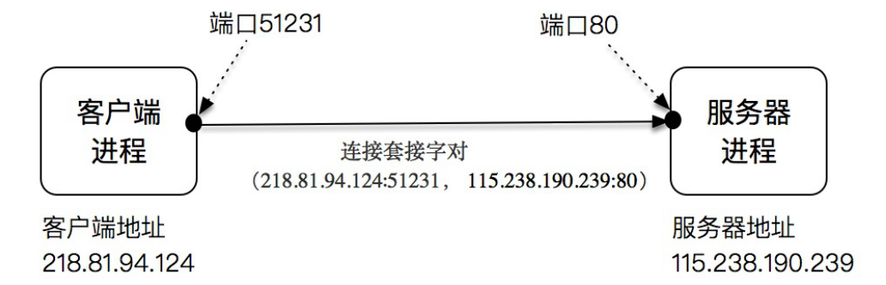
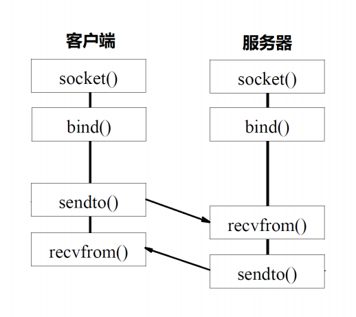
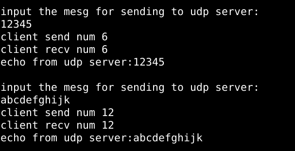
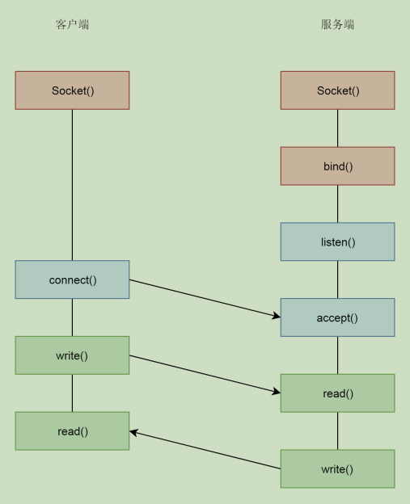
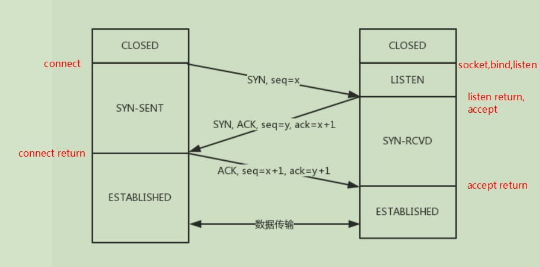
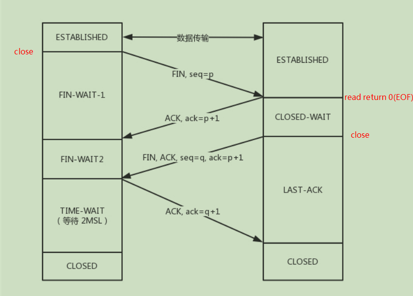
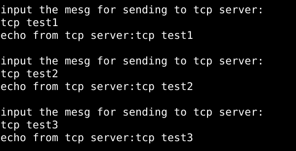

# <center>socket编程</center>


### 一、socket、IP和端口号概述

​		**Socket**中文翻译是插口或者插槽。虽然我们是写软件程序，但是你可以想象为弄一根网线，一头插在客户端，一头插在服务端，然后进行通信。所以在通信之前，双方都要建立一个Socket。
​		在网络中，**IP**用来标识一台主机，而**端口号**标识一个进程，因此IP和端口唯一标识一台主机上的某个进程。而一个连接可以通过过客户端-服务器端的IP和端口唯一确定，这叫做套接字对，按照下面的四元组表示：

```c
                    (clientip:clientport, serverip:serverport)
```

​		下面图表示了一个客户端-服务器之间的连接：




### 二、UDP编程模型

​		UDP是没有连接的协议，因此只需在通信两端分别创建socket并绑定对应的IP和端口号后即可通信。下图就是UDP编程模型的函数调用流程。本文实现的一个udp服务器和客户端通信就是按下面模型，客户端和服务器都处于死循环中，每个循环客户端从标准输入接收数据发送给服务器，服务器接收客户端发送过来的信息然后原样返回，客户端收到服务器的回送信息后输出到标准输出。



#### 1、UDP服务器编程

##### 1.1 UDP服务器主函数

- 创建服务器端socket
- 设置服务器socket地址结构体
- 将服务器socket绑定到指定的ip和端口
- 进入和客户端交互过程

```c
int main(int argc, char ** argv)
{
	int sockfd;
	struct sockaddr_in servaddr,cliaddr;

	/* 创建服务器端socket */
	sockfd = Socket(AF_INET, SOCK_DGRAM, 0);

	/* 填充服务器套接字地址结构体 */
	bzero(&servaddr, sizeof(servaddr));
	servaddr.sin_family = AF_INET;
	servaddr.sin_addr.s_addr = htonl(INADDR_ANY);	//INADDR_ANY表示主机上的任意一张网卡ip
	servaddr.sin_port = htons(SERV_PORT);				
	
	/* 将socket绑定到servaddr指定的ip和端口 */
	Bind(sockfd, (struct sockaddr *)&servaddr, sizeof(servaddr));	

	/* 进入和客户端交互的死循环回送函数 */
	udp_echo(sockfd, (struct sockaddr *)&cliaddr, sizeof(cliaddr));		

	return 0;		
}
```

##### 1.2 UDP服务器回送函数

- 接收客户端数据
- 回送数据

```c
static void udp_echo(int sockfd, struct sockaddr *pcliaddr, socklen_t clilen)
{
	int n;
	socklen_t len;
	char mesg[MAXLINE];

	for ( ; ; ) {

		len = clilen;
        /* 接收客户端数据 */
		n = Recvfrom(sockfd, mesg, MAXLINE, 0, pcliaddr, &len);
		printf("server recv num %d\n",n);

        /* 回送数据 */
		n = Sendto(sockfd, mesg, n, 0, pcliaddr, len);
		printf("server send num %d\n",n);
	}
}
```

#### 2、UDP客户端编程

##### 2.1 UDP客户端主函数

- 创建客户端socket
- 设置服务器和客户端socket地址结构体
- 将客户端socket绑定到指定的ip和端口
- 进入和服务器交互过程

```c
int main(int argc, char ** argv)
{
	int sockfd;
	struct sockaddr_in servaddr,cliaddr;

	/* 创建客户端socket */
	sockfd = Socket(AF_INET, SOCK_DGRAM, 0);

	/* 填充服务器和客户端套接字地址结构体 */
	bzero(&servaddr, sizeof(servaddr));
	servaddr.sin_family = AF_INET;
	servaddr.sin_addr.s_addr = inet_addr(SERV_ADDR);		
	servaddr.sin_port = htons(SERV_PORT);				
	
	bzero(&cliaddr, sizeof(cliaddr));
	cliaddr.sin_family = AF_INET;
	cliaddr.sin_addr.s_addr = inet_addr(CLI_ADDR);		
	cliaddr.sin_port = htons(CLI_PORT);	

	/* 
	 * 将socket绑定到cliaddr指定的ip和端口
	 * 这不是必须的，因为服务器端接收函数会得到客户端地址 
	 */
	Bind(sockfd, (struct sockaddr *)&cliaddr, sizeof(cliaddr));

	/* 进入和服务器交互过程 */	
	udp_send(sockfd, (struct sockaddr *)&servaddr, sizeof(servaddr));

	return 0;		
}
```

##### 2.2 UDP客户端和服务器的交互函数

- 从标准输入设备输入要发送给服务器的数据
- 发送数据给服务器
- 接收回送数据
- 打印回送数据

```c
static void udp_send(int sockfd, struct sockaddr *pservaddr, socklen_t servlen)
{
	int n;
	char sendline[MAXLINE];
	char recvline[MAXLINE];
	
	for ( ; ; ) {
		printf("input the mesg for sending to udp server:\n");

        /* 从标准输入得到要发送的数据 */
		bzero(sendline, MAXLINE);
		fgets(sendline, MAXLINE-1, stdin);
		
        /* 发送数据给服务器 */
		n = Sendto(sockfd, sendline, strlen(sendline), 0, pservaddr, servlen);
		printf("client send num %d\n",n);
	
        /* 接收回送数据 */
		bzero(recvline, MAXLINE);
		n = Recvfrom(sockfd, recvline, MAXLINE, 0, NULL, NULL);

		printf("client recv num %d\n",n);
		recvline[n] = 0; 
        /* 打印回送数据 */
		printf("echo from udp server:%s\n", recvline);

	}
	
}
```

#### 3、现象



​		以上是实验现象，分别从键盘输入12345和abcdefghijk发送给udp服务器，服务器原样返回。


### 三、TCP编程模型

#### 1、TCP通用编程模型



##### 1.1 监听和连接

​		服务器端先建立一个监听socket，通过bind给这个socket绑定一个ip地址和端口，然后通过listen监听这个端口。服务器通常有多个网卡，即多个ip地址，可以选择监听某个ip地址也可通过监听0.0.0.0来监听所有ip地址。在服务器进入监听状态后，客户端就可以通过connect发起连接了。
​		在内核中，为每个socket维护两个队列。一个是已经建立了连接的队列，这时候连接三次握手已经完毕，处于established状态；一个是还没有完全建立连接的队列，这个时候三次握手还没完成，处于syn_rcvd的状态。当listen返回时说明有已经established的连接，然后通过accept拿出一个来处理，此时返回一个**已连接socket**，而传给accept的第一个参数是**监听socket**。接下来的通信使用已连接socket，而监听socket继续用来监听其他客户端的连接。


```c
/*
 * @ domain: 地址族，网络层，如ipV4协议族，AF_INET
 * @ type: 类型，传输层，如tcp，SOCK_STREAM
 * @ protocol: 协议，一般为0，表示由domain和type组合默认
 * @ return: 成功则返回非负描述符，失败返回-1
 */
int socket(int domain, int type, int protocol);

/*
 * @ sockfd: 套接字描述符
 * @ addr: 套接字地址
 * @ addrlen: 套接字地址长度
 * @ return: 成功返回0，失败返回-1
 */
int bind(int sockfd, const struct sockaddr *addr,socklen_t addrlen);

/*
 * @ sockfd: 套接字描述符
 * @ backlog: 排队连接的最大数目
 * @ return: 成功返回0，失败返回-1
 */
int listen(int sockfd, int backlog);

/*
 * @ sockfd: 套接字描述符
 * @ addr: 套接字地址
 * @ addrlen: 套接字地址长度
 * @ return: 成功返回非负已连接描述符，失败返回-1
 */
int accept(int sockfd, struct sockaddr *addr, socklen_t *addrlen);
```



##### 1.2 收发数据

​		

##### 1.3 关闭连接	

​		关闭连接通常情况时客户端主动关闭，服务器被动关闭。状态图如下：



#### 2、 TCP服务器编程	
​		tcp服务器通常需要能够同时处理多个连接，有典型的三种模式：
**(1) 多进程方式 :** 这就相当于你是一个代理，在那里监听来的请求。一旦建立了一个连接，就会有一个已连接Socket，这
​						   时候你可以创建一个子进程，然后将基于已连接Socket的交互交给这个新的子进程来做。
**(2) 多线程方式 :** 与多进程方式类似，只不过是创建新线程来处理新连接，因为线程较进程轻量级，共享数据也更方便，						   具有较大的优势。
**(3) IO多路复用方式 :** 在一个进程或线程中，通过监听多个文件描述符来处理连接请求。
​		本文暂且只实现一个多进程方式的服务器，只为展示tcp服务器编程的基本思想。和上文的udp一样，实现一个回射服务器，即客户端发送什么服务器就返回什么。
##### 2.1 TCP服务器主函数

- 创建监听socket
- 设置服务器地址结构体
- 将监听socket绑定到服务器地址和端口
- 监听
- 对每个连接生成一个子进程处理

```c
int main(int argc, char ** argv)
{
	int listenfd, connfd;
	pid_t childpid;
	socklen_t clilen;
	struct sockaddr_in servaddr,cliaddr;

    /* 创建监听socket */
	listenfd = Socket(AF_INET,SOCK_STREAM, 0);

    /* 设置服务器地址结构体 */
	bzero(&servaddr, sizeof(servaddr));
	servaddr.sin_family = AF_INET;
	servaddr.sin_addr.s_addr = htonl(INADDR_ANY);		
	servaddr.sin_port = htons(SERV_PORT);	

    /* 将监听socket绑定到服务器地址结构体指定的ip和端口 */
	Bind(listenfd, (struct sockaddr *)&servaddr, sizeof(servaddr));		

    /* 
     * 监听服务器地址结构体指定的端口，
     * 因为INADDR_ANY，所以监听服务器所有的网卡
     */
	Listen(listenfd, MAXLISTEN);	

    /*
     * 从已建立连接的队列中取出一个，
     * 生成一个子进程处理这个连接
     */
	for ( ; ; ) {
		clilen = sizeof(cliaddr);
        /* 取出一个已建立的连接 */
		connfd = Accept(listenfd, (struct sockaddr *)&cliaddr, &clilen);	
		if ( (childpid = Fork()) == 0) {		/* 子进程 */
			Close(listenfd);			
			tcp_echo(connfd);		/* 和客户端交互 */
			exit(0);
		}
		Close(connfd);		/* 父进程关闭connfd */
	}

}
```

##### 2.2 TCP服务器回送函数

- 接收客户端数据
- 将数据返回给客户端

```c
static void tcp_echo(int sockfd)
{
	ssize_t n;
	char buf[MAXLINE];

again:	
	while ( (n = read(sockfd, buf, MAXLINE)) > 0 )		/* 接收客户端的数据 */
		Writen(sockfd, buf, n);		/* 将数据返回给客户端 */

    /* 如果n为0说明客户端close */
	if (n < 0 && errno == EINTR)
		goto again;
	else if (n < 0)
		perror("tcp_echo failed");
	
}
```

#### 3、 TCP客户端编程

##### 3.1  TCP客户端主函数

- 创建客户端socket
- 设置服务器地址结构体
- 发起和服务器的连接
- 和服务器交互数据

```c
int main(int argc, char ** argv)
{
	int sockfd;
	struct sockaddr_in servaddr;
	
    /* 创建客户端socket */
	sockfd = Socket(AF_INET,SOCK_STREAM, 0);

    /* 设置服务器地址结构体 */
	bzero(&servaddr, sizeof(servaddr));
	servaddr.sin_family = AF_INET;
	servaddr.sin_addr.s_addr = inet_addr(SERV_ADDR);		
	servaddr.sin_port = htons(SERV_PORT);

    /* 发起和服务器的连接 */
	Connect(sockfd, (struct sockaddr *)&servaddr, sizeof(servaddr));

    /* 和服务器交互数据 */
	tcp_send(sockfd);

	return 0;	
}
```

##### 3.2  TCP客户端和服务器的交互函数

- 从标准输入设备获取要发送给服务器的数据
- 将数据发送给服务器
- 读取服务器返回的数据
- 将服务器返回的数据显示到标准输出设备上

```c
static void tcp_send(int sockfd)
{
	int n;
	char sendline[MAXLINE];
	char recvline[MAXLINE];

	for ( ; ; ) {
		printf("input the mesg for sending to tcp server:\n");
        
		bzero(sendline, MAXLINE);
		fgets(sendline, MAXLINE-1, stdin);		/* 从标准输入设备获取要发送给服务器的数据 */
		
		Writen(sockfd, sendline, strlen(sendline));	/* 将数据发送给服务器 */

		n = Readline(sockfd, recvline, MAXLINE);	/* 读取服务器返回的数据 */
		if (n = 0)
			printf("tcp server quit\n");
 
		printf("echo from tcp server:%s\n", recvline);	/* 将服务器返回的数据显示到标准输出设备上 */	
	}	
	
}
```



​		上图测试结果验证了代码的正确性。