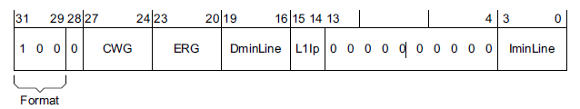

# </center>使用dma时的缓存软件处理<center>

### 一、dma概括



​		上图展示了dma的工作原理与流程，dma解放了cpu，使得设备和内存在传输数据时cpu可以处理别的事务。可以概括为以下情况：

1、首先通过cpu设置dma控制器dmac，包括源地址、目的地址、数据长度，如上图紫色路线。

2、如果源是device，目的是ddr，则dma方向是设备向内存写数据，如上图红色路线。

3、如果源是ddr，目的是device，则dma方向是设备从内存读数据，如上图蓝色路线。


### 二、dma区域的缓存软件处理


```
cache-v7.S
/*
 *	dma_map_area(start, size, dir)
 *	- start	- kernel virtual start address - r0
 *	- size	- size of region - r1
 *	- dir	- DMA direction - r2
 */
ENTRY(v7_dma_map_area)
	add	r1, r1, r0				//r1 = end address
	teq	r2, #DMA_FROM_DEVICE	//测试是从device到ddr，还是从ddr到device
	beq	v7_dma_inv_range		//如果是从device到ddr
	b	v7_dma_clean_range		//如果是从ddr到device
ENDPROC(v7_dma_map_area)


...

/* SPDX-License-Identifier: GPL-2.0 */
#ifndef _LINUX_DMA_DIRECTION_H
#define _LINUX_DMA_DIRECTION_H

enum dma_data_direction {
	DMA_BIDIRECTIONAL = 0,
	DMA_TO_DEVICE = 1,
	DMA_FROM_DEVICE = 2,
	DMA_NONE = 3,
};

#endif
```
​		首先入口是v7_dma_map_area(start, size, dir)，**这个函数做的事是将某段内存映射为dma区域后要如何正确的处理cpu中的cache**。start是dma区域起始地址，size是区域大小，dir是dma方向，即是设备读内存还是写内存。在v7_dma_map_area函数中根据dir方向的不同来对缓存作不同处理。如果数据方向是从设备到内存，则调用v7_dma_inv_range，如果数据方向是从内存到设备，则调用v7_dma_clean_range。


```c
/*
 * dcache_line_size - get the minimum D-cache line size from the CTR register
 * on ARMv7.
 */
	.macro	dcache_line_size, reg, tmp
	mrc	p15, 0, \tmp, c0, c0, 1		@ read ctr
	lsr	\tmp, \tmp, #16
	and	\tmp, \tmp, #0xf		@ cache line size encoding
	mov	\reg, #4			@ bytes per word
	mov	\reg, \reg, lsl \tmp		@ actual cache line size
	.endm
```
​		无论v7_dma_inv_range还是v7_dma_clean_range最开始要做的就是获取cache的行大小。首先读取Cache Type Register，该寄存器各字段如下。其中只关注DminLine字段，这个字段表示的是所有dcache和ucache中最小的缓存行的字数的$log_2$，经过lsr和and后DminLine被右移到最右边4位，并将其他位清0。假设缓存行为A字，那么DminLine = $log_2$A ，通过最后两行的mov指令得到 reg = 4 << $log_2$A，即行的字节大小。




```c
/*
 *	v7_dma_inv_range(start,end)
 *
 *	Invalidate the data cache within the specified region; we will
 *	be performing a DMA operation in this region and we want to
 *	purge old data in the cache.
 *
 *	- start   - virtual start address of region
 *	- end     - virtual end address of region
 */
v7_dma_inv_range:
	dcache_line_size r2, r3				//r2 = dcache line size
	sub	r3, r2, #1						//r3 = r2 - 1
	tst	r0, r3							// r0 & r3
	bic	r0, r0, r3						//将r0中的start address最低那几位清0，即dcache line size对齐

	mcrne	p15, 0, r0, c7, c14, 1		@ clean & invalidate D / U line，将r0指向的一行clean到内存然后失效掉
	addne	r0, r0, r2					//将r0指到下一行

	tst	r1, r3
	bic	r1, r1, r3						//将r1中的end address最低那几位清0，即dcache line size对齐
	mcrne	p15, 0, r1, c7, c14, 1		@ clean & invalidate D / U line，将r1指向的一行clean到内存然后失效掉
	cmp	r0, r1
1:
	mcrlo	p15, 0, r0, c7, c6, 1		@ invalidate D / U line，将r0指向的一行失效
	addlo	r0, r0, r2					//将r0指到下一行
	cmplo	r0, r1						//看r0有没有到end address
	blo	1b								//如果没有继续clean
	dsb	st
	ret	lr								//返回调用v7_dma_clean_range的地方
ENDPROC(v7_dma_inv_range)
```

​		如果数据方向是从设备到内存，则进入v7_dma_inv_range，传进的参数start和end指定用作dma区域的内存起始和结尾地址，因为数据是从设备写到该区域，所以cpu中对应该区域的缓存可以直接失效处理就可以了。但是有个边界情况要处理，就是传进来的dma区域的起始和结尾地址不是缓存行对齐的，而缓存无论失效还是清操作都是按行为单位，因此这种不对齐的情况要特殊处理，处理方法就是把不对齐的区域起始或结束地址所对应的缓存行清到内存中，然后再失效，而其他对齐的行直接失效处理。


```c
/*
 *	v7_dma_clean_range(start,end)
 *	- start   - virtual start address of region
 *	- end     - virtual end address of region
 */
v7_dma_clean_range:
	dcache_line_size r2, r3		//r2 = dcache line size
	sub	r3, r2, #1				//r3 = r2 - 1	
	bic	r0, r0, r3				//将r0中的start address最低那几位清0，即dcache line size对齐

1:
	mcr	p15, 0, r0, c7, c10, 1		@ clean D / U line，将r0指向的一行clean到poc(内存)
	add	r0, r0, r2					//将r0指到下一行
	cmp	r0, r1						//看r0有没有到end address
	blo	1b							//如果没有继续clean
	dsb	st
	ret	lr							//返回调用v7_dma_clean_range的地方
ENDPROC(v7_dma_clean_range)
```

​		如果数据方向是从内存到设备，则进入v7_dma_clean_range。传进的参数start和end指定用作dma区域的内存起始和结尾地址，因为数据方向设备读取该区域，所以需要将cpu中该区域的缓存清到内存中，防止设备读取到的不是最新的数据。因为传进的边界地址可能不是缓存行对齐，所以在清缓存操作前先将边界地址作对齐处理，这样只会多清一部分，而且清缓存不会造成计算或处理出错。
