## <center>初版双boot启动设计实现</center>

[TOC]

---

### 一、概述

#### 1. QSPI镜像布局和内存



&emsp;&emsp;如上图所示是启动前的qspi中的镜像布局和启动后的ddr中的布局，其中preloader和uboot在ddr内存中运行的地址没有画出。

#### 2. 启动流程概述

&emsp;&emsp;首先开机启动的是固化在芯片rom中的启动代码，rom阶段的代码是芯片厂商固化好的，因此这部分流程我们无法更改。rom固件将preloader-mkpimage.bin加载到sram中启动，然后preloader-mkpimage.bin首先尝试加载启动u-boot.img，如果镜像验证通过则正常启动u-boot.img，没通过则加载u-boot.img备份启动，在u-boot.img中首先尝试加载启动zImage，如果镜像验证通过则正常启动，没通过则加载zImage备份启动。
&emsp;&emsp;preloader和uboot共用同一套代码，位置为`/home/hanglory/yezheng/altera/15.0/embedded/examples/hardware/cv_soc_devkit_ghrd/software/spl_bsp/uboot-socfpga`。


### 二、PRELOADER启动UBOOT

&emsp;&emsp;preloader进入到board_init_r（common/spl/spl.c）函数后会加载启动uboot，如下所示，下面所展示的都是简化的代码，将不重要的代码分支和宏定义删除了。

```c
void board_init_r(gd_t *dummy1, ulong dummy2)
{
	u32 boot_device;
	spl_board_init();	/* 大部分硬件初始化 */
	boot_device = spl_boot_device();	/* 获取启动存储介质类型 */
	switch (boot_device) {
	case BOOT_DEVICE_SPI:	/* qspi启动 */
		spl_spi_load_image();   /* 提取头部信息到spl_image，加载uboot镜像到ddr，但没校验 */
		break;
	default:
		hang();
	}
    /* 校验和启动uboot */
	jump_to_image_no_args(&spl_image); 
}
```

&emsp;&emsp;在board_init_r最后启动uboot的流程中首先通过spl_spi_load_image函数提取uboot头部信息到spl_image，加载uboot镜像到ddr，但还没校验，如下所示。

```c
void spl_spi_load_image(void)
{
	struct spi_flash *flash;
	struct image_header *header;
    flash = spi_flash_probe(CONFIG_SPL_SPI_BUS, CONFIG_SPL_SPI_CS,
                   CONFIG_SF_DEFAULT_SPEED, SPI_MODE_3);
    /* 将64字节头部读取到这个内存地址 */
	header = (struct image_header *)(CONFIG_SYS_TEXT_BASE);
    /* 从qspi中加载uboot的64字节头部到header处 */
	spi_flash_read(flash, CONFIG_SYS_SPI_U_BOOT_OFFS, 0x40,
			(void *) header);	
    /* 解释头部将信息提取到全局变量spl_image中 */
	spl_parse_image_header(header);	
    /* 根据头部提取的信息将uboot加载到正确的地址 */
	spi_flash_read(flash, CONFIG_SYS_SPI_U_BOOT_OFFS,
		       spl_image.size, (void *)spl_image.load_addr); 
}
```

&emsp;&emsp;spl_spi_load_image首先将uboot64字节的头部从qspi读取到ddr的CONFIG_SYS_TEXT_BASE地址处，然后通过spl_parse_image_header提取头部信息到spl_image，最后根据提取得到的uboot镜像加载地址将uboot全体从qspi加载到ddr加载地址上。

```c
__weak void __noreturn jump_to_image_no_args(struct spl_image_info *spl_image)
{
	typedef void __noreturn (*image_entry_noargs_t)(u32 *);
    /* uboot的入口地址 */
	image_entry_noargs_t image_entry =
			(image_entry_noargs_t) spl_image->entry_point;
	u32 calculated_crc;
	if (spl_image->crc_size != 0) {
        /* 计算crc校验值 */
		calculated_crc = crc32_wd(0,
			(unsigned char *)spl_image->entry_point,
			spl_image->crc_size, CHUNKSZ_CRC32);
        /* 如果计算得到的crc校验值等于头部的crc校验值则校验通过，否则加载启动uboot备份 */
		if (calculated_crc != spl_image->crc) {
/***********************************************************************************************
 * 				hanglory double boot
 * 				author yezheng
 *********************************************************************************************/
			/* 校验不通过则加载启动uboot备份 */
             //hang();
			hanglory_spl_boot();
		} else
			debug("OK\n");
	}
	/* 校验通过，跳到uboot入口地址正常启动 */
	image_entry((u32 *)boot_params_ptr);
}

```

&emsp;&emsp;回到board_init_r，在spl_spi_load_image提取uboot头部信息和加载uboot镜像到ddr之后还有两件事没做，就是校验uboot和启动uboot。jump_to_image_no_args负责做这两件事，如果校验通过则跳到uboot入口地址，如果校验没通过则通过hanglory_spl_boot启动uboot备份。

```c
/***********************************************************************************************
 * 				hanglory double boot
 * 				author yezheng
 *               hanglory_spl_spi.c
 *********************************************************************************************/
#include <hanglory_config.h>
.....
struct hanglory_image_info hanglory_spl_image; 

/* 分析头部信息，提取到hanglory_spl_image */
static void hanglory_spl_parse_image_header(const struct image_header *header)
{
	u32 header_size = sizeof(struct image_header);

	if (image_get_magic(header) == IH_MAGIC) {
		if (hanglory_spl_image.flags & SPL_COPY_PAYLOAD_ONLY) {
			hanglory_spl_image.load_addr = image_get_load(header);
			hanglory_spl_image.entry_point = image_get_ep(header);
			hanglory_spl_image.size = image_get_data_size(header);
		} else {
			....
		}
		hanglory_spl_image.os = image_get_os(header);
		hanglory_spl_image.name = image_get_name(header);
		hanglory_spl_image.crc = image_get_dcrc(header);
		hanglory_spl_image.crc_size = image_get_data_size(header);		
	} else {
		.....
	}
}

/* 加载备份uboot到ddr,同时提取头部信息到hanglory_spl_image
 * 实现和spl_spi_load_image一样，除了读取qpsi地址不同
*/
static void hanglory_spl_spi_load_image(void)
{
	struct spi_flash *flash;
	struct image_header *header;
	flash = spi_flash_probe(CONFIG_SPL_SPI_BUS, CONFIG_SPL_SPI_CS,
				CONFIG_SF_DEFAULT_SPEED, SPI_MODE_3);
	header = (struct image_header *)(CONFIG_SYS_TEXT_BASE);
	spi_flash_read(flash, CONFIG_HANGLORY_SPI_U_BOOT_OFFS, 0x40,
			(void *) header);
	hanglory_spl_parse_image_header(header);
	spi_flash_read(flash, CONFIG_HANGLORY_SPI_U_BOOT_OFFS,
		       hanglory_spl_image.size, (void *)hanglory_spl_image.load_addr);
}

/* crc校验和启动，参考jump_to_image_no_args() */
static void hanglory_spl_crc_check_and_boot(void)
{
	u32 calculated_crc;
	if (hanglory_spl_image.crc_size != 0) {
        /* 计算crc校验值 */
		calculated_crc = crc32_wd(0,
			(unsigned char *)hanglory_spl_image.entry_point,
			hanglory_spl_image.crc_size, CHUNKSZ_CRC32);
        /* 如果计算得到的crc校验值等于头部的crc校验值则校验通过，否则挂起 */
		if (calculated_crc != hanglory_spl_image.crc) {		
			hang();		/* 校验没通过，挂起 */
		} else
			debug("OK\n");
	} else {	
		hang();	/*  头部没有crc值，同样挂起 */
	}

	/* 校验通过跳到入口地址启动uboot */
	typedef void __noreturn (*image_entry_noargs_t)(void);
	/* 入口地址 */
	image_entry_noargs_t image_entry =
		(image_entry_noargs_t)hanglory_spl_image.entry_point;
	image_entry();	/* 跳到uboot入口地址 */
}

/* 加载启动uboot备份 */
void hanglory_spl_boot(void)
{
	/* 加载备份uboot，提取头部信息到hanglory_spl_image */
	hanglory_spl_spi_load_image();
	/* 校验和启动uboot */
	hanglory_spl_crc_check_and_boot();	

}
```

&emsp;&emsp;hanglory_spl_boot流程大体上和 board_init_r最后启动uboot流程一样，这里不再从头分析，主要说明其中**两个不同**。**第一**，从不同的qspi地址加载镜像，首选启动从CONFIG_SYS_SPI_U_BOOT_OFFS（0x60000）处加载uboot镜像，备份启动从CONFIG_HANGLORY_SPI_U_BOOT_OFFS（0x2060000）处加载uboot备份镜像。**第二**，首选启动在uboot的crc校验不通过时要通过hanglory_spl_boot进入备份启动流程，而备份启动在uboot的crc校验不通过直接通过hang挂起，避免进入无限死循环。


### 三、UBOOT启动KERNEL

#### 1. 未修改的UBOOT启动KERNEL过程

未修改前的uboot环境变量如下：

```c
bootcmd=mw.b 0x100 0xff 0x700000;tftp 0x8000 zImage;tftp 0x100 socfpga_cyclone5_socdk.dtb;run qspiboot
...
fdtaddr=0x00000100
...    
loadaddr=0x8000
...   
qspiboot=setenv bootargs console=ttyS0,115200 root=${qspiroot} rw rootfstype=${qspirootfstype};bootz ${loadaddr} - ${fdtaddr}
...
qspiroot=/dev/mtdblock1
...
qspirootfstype=jffs2
...
```

&emsp;&emsp;bootcmd是uboot最后启动内核的环境变量，它的过程是：首先从ddr地址0x100开始写0x700000字节的0xff，然后通过tftp服务将内核镜像zImage和设备树socfpga_cyclone5_socdk.dtb从主机分别下载到ddr的0x8000和0x100地址，最后通过run qspiboot命令启动内核。qspiboot首先设置通过setenv bootargs设置内核启动参数，通过源码分析这里其实修改了设备树中的内核参数属性，最后通过bootz启动之间下载到指定地址的zImage。

#### 2. 双boot版的UBOOT启动KERNEL过程

双boot版和未修改版除了启动内核流程之外还有以下两方面的不同：

- 未修改版uboot启动的是没有64字节头部的zImage，不包含crc校验信息，使用bootz命令启动；双boot版启动的是有64字节头部的uImage，包含crc校验信息，使用bootm命令启动。
- 未修改版uboot启动内核是通过tftp服从主机下载内核和设备树镜像到内存启动的方式，但真正产品上不能这样做，要事先将镜像烧写到flash中，然后从flash加载到内存启动。

双boot版uboot环境变量如下：

```c
qspiroot=/dev/mtdblock1
qspirootfstype=jffs2
/* 内核加载地址 */
loadaddr=0x8000
/* 设备树加载地址 */    
fdtaddr=0x00000100
 
/* 内核大小 */    
kernelsize=0x600000
/* 设备树大小 */    
fdtsize=0x10000   
    
/* 第一启动分区 */    
  
/* 内核在qspi中的地址 */    
kernelqspioffs=0xa0000  
/* 设备树在qspi中的地址 */    
fdtqspioffs=0x50000
    
/* 备份启动分区 */
    
 /* 备份内核在qspi中的地址 */    
secondkernelqspioffs=0x20a0000  
/* 备份设备树在qspi中的地址 */    
secondfdtqspioffs=0x2050000   
   
/* 首选uImage校验通过，bootm正常启动 */
oriboot=bootm ${loadaddr} - ${fdtaddr}    
    
firstqspiboot=setenv bootargs console=ttyS0,115200 root=${qspiroot} rw rootfstype=${qspirootfstype};hangloryboot

secondqspiboot=setenv bootargs console=ttyS0,115200 root=${qspiroot} rw rootfstype=${qspirootfstype};bootm ${loadaddr} - ${fdtaddr}

/* 第一选择启动，事先在windows使用altera工具烧写镜像到qspi中 */
bootcmdstag1=sf probe;mw.b ${fdtaddr} 0xff ${fdtsize};sf read ${fdtaddr} ${fdtqspioffs} ${fdtsize}
bootcmdstag2=mw.b ${loadaddr} 0xff ${kernelsize};sf read ${loadaddr} ${kernelqspioffs} ${kernelsize};run firstqspiboot
bootcmd=bootcmdstag1;bootcmdstag2

/* 首选uImage校验没通过，加载启动备份内核 */
secondbootstag1=sf probe;mw.b ${fdtaddr} 0xff ${fdtsize};sf read ${fdtaddr} ${secondfdtqspioffs} ${fdtsize}
secondbootstag2=mw.b ${loadaddr} 0xff ${kernelsize};sf read ${loadaddr} ${secondkernelqspioffs} ${kernelsize};run secondqspiboot
secondboot=secondbootstag1;secondbootstag2
```

&emsp;&emsp;以上环境变量已经基本展示了整个双boot版的uboot启动内核的过程，唯一没有展示出来的是hangloryboot命令，这需要单独实现一个uboot的hangloryboot命令。**hangloryboot命令要做的是**：首先对uImage校验，如果通过校验则通过oriboot正常启动内核，如果没通过则通过secondboot加载启动备份内核。

```c
/***********************************************************************************************
 * 				hanglory double boot
 * 				author yezheng
 *               hangloryboot.c
 *********************************************************************************************/
#define DEBUG
.....
#include <hanglory_config.h>

/* 存储uImage头部信息的变量 */    
struct hanglory_image_info hanglory_uboot_image; 

/* 分析头部信息，提取到hanglory_uboot_image */
static void hanglory_uboot_parse_image_header(const struct image_header *header)
{
	u32 header_size = sizeof(struct image_header);

	if (image_get_magic(header) == IH_MAGIC) {
		.....
		} else {
			printf("coming here hahahahahahaha\n");
			hanglory_uboot_image.entry_point = image_get_ep(header);		
			hanglory_uboot_image.load_addr = hanglory_uboot_image.entry_point -
				header_size;					
			hanglory_uboot_image.size = image_get_data_size(header) +
				header_size;					
		}
		hanglory_uboot_image.os = image_get_os(header);
		hanglory_uboot_image.name = image_get_name(header);
		hanglory_uboot_image.crc = image_get_dcrc(header);
		hanglory_uboot_image.crc_size = image_get_data_size(header);	
	} else {
		.....
	}
}


/* 对uImage进行crc校验 */
static int hanglory_uboot_crc_check(void)
{
	u32 calculated_crc;
	if (hanglory_uboot_image.crc_size != 0) {
		/* 计算crc校验值 */
		calculated_crc = crc32_wd(0,
			(unsigned char *)hanglory_uboot_image.entry_point,
			hanglory_uboot_image.crc_size, CHUNKSZ_CRC32);
        /* 如果计算得到的crc校验值等于头部的crc校验值则返回0表示通过，否则返回错误码 */
		if (calculated_crc != hanglory_uboot_image.crc) {		
			return -EAGAIN;		/* 校验没通过，返回错误码 */
		} else {	
			return 0;		/* 校验没通过，返回0 */
		}
	} else {
		return -EAGAIN;		/* 头部没有crc值，同样返回错误码 */
	}
}

static int do_hangloryboot(cmd_tbl_t *cmdtp, int flag, int argc, char * const argv[])
{
	char *s;

	/* 提取uImage头部 */
	struct image_header *header;
	header = (struct image_header *)(CONFIG_KERNEL_LOAD_ADDR);
	hanglory_uboot_parse_image_header(header);

	/* 对uIamge校验 */
	int ret;
	ret = hanglory_uboot_crc_check();	/* 对uImage进行crc校验 */
	
	/* 如果通过则执行oriboot命令，没通则执行secondboot命令 */
	if (ret == 0) {
		s = getenv("oriboot");
		run_command_list(s, -1, 0);
	} else {
		s =getenv("secondboot");
		run_command_list(s, -1, 0);
	}
	return 0;
}

U_BOOT_CMD(
	hangloryboot,	CONFIG_SYS_MAXARGS,	1,	do_hangloryboot,
	"short help info",	//help不带参数显示的帮助信息
	"long help info"	//help hanglory显示的帮助信息
);
```

&emsp;&emsp;实现了hangloryboot命令后可得到**完整的双boot版uboot启动内核流程**：bootcmd是最后uboot启动内核的命令，首先清除fdt需要用到的内存，将首选fdt从qspi加载到内存，然后清除内核需要用到的内存，将首选内核从qspi加载到内存，最后通过firstqspiboot尝试使用首选设备树启动首选内核。firstqspiboot首先设置内核启动命令行参数，然后运行hangloryboot命令。hangloryboot命令首先对uImage校验，如果通过校验则通过bootm正常启动内核，如果没通过则通过secondboot加载启动备份内核。**secondboot**和bootcmd类似，首先清除fdt需要用到的内存，将备份fdt从qspi加载到内存，然后清除内核需要用到的内存，将备份内核从qspi加载到内存，最后通过secondqspiboot尝试使用备份设备树启动备份内核。secondqspiboot首先设置内核启动命令行参数，最后就通过bootm正常启动备份内核。