## <center>双boot启动设计</center>

### 一、双boot启动概述

​		因为flash有可能会出现某些区域坏死的现象，因此为了防止镜像存放的区域坏死，要在flash中再开辟存放备份镜像的区域，如果正常启动是由于镜像所在的flash区域损坏，则通过备份镜像启动。



​		上图所示是各部分镜像在qspi中的大致分布，并不是准确的分布，比如C区和D区还有dtb没有画出来，镜像之间不一定紧挨着，还可能有空隙，这些都可以通过代码指定。


### 二、启动流程

**1.** 首先开机启动的是固化在芯片rom中的启动代码，然后rom启动代码将A区preloader加载到sram中，然后根据preloader镜像头部信息验证镜像是否可启动，如果不可启动则加载B区备用镜像，直到可以启动或者退出。**rom阶段的代码是芯片厂商固化好的，因此这部分流程我们无法更改，preloader和其备用也需要按照芯片手册烧写到固定的位置。**

**2.** preloader主要负责初始化ddr，最后将uboot从C区中加载到ddr，然后通过镜像头部验证uboot镜像完整性，如果镜像不可启动，说明是C区中的uboot损坏，然后从D区加载uboot备份到ddr启动。

**3.** uboot加载C区kernel到ddr中，然后通过镜像头部验证kernel镜像完整性，如果镜像不可启动，说明是C区中的uboot损坏，然后从D区加载uboot备份到ddr启动。**无论是从C区加载的uboot还是D区加载的uboot都是先加载启动C区的kernel。**

**4.** linux启动后在挂载根文件系统前验证C区rootfs区域是否损坏，如果没有问题则挂载C区的rootfs，否则验证D区然后挂载D区的rootfs。


### 三、启动流程代码分析和补丁

#### 1. 原版preloader启动uboot

```c
void board_init_r(gd_t *dummy1, ulong dummy2)
{
    ...
	/* 从flash中加载uboot到ddr */
	if (boot_from_devices(&spl_image, spl_boot_list,
			      ARRAY_SIZE(spl_boot_list))) {
		puts(SPL_TPL_PROMPT "failed to boot from all boot devices\n");
		hang();
	}
    ...
    /* 填充spl_image余下的主要内容 */
	spl_board_prepare_for_boot();	
    /* 直接跳转到uboot入口地址 */
	jump_to_image_no_args(&spl_image);	
}
        
```

```c
static int boot_from_devices(struct spl_image_info *spl_image,
			     u32 spl_boot_list[], int count)
{
	int i;

	for (i = 0; i < count && spl_boot_list[i] != BOOT_DEVICE_NONE; i++) {
		struct spl_image_loader *loader;

		loader = spl_ll_find_loader(spl_boot_list[i]);
		...
		/* 从flash加载uboot到ddr,同时可能根据配置校验 */
		if (loader && !spl_load_image(spl_image, loader)) {
			spl_image->boot_device = spl_boot_list[i];
			return 0;
		}
	}

	return -ENODEV;
}
```

```c
static int spl_load_image(struct spl_image_info *spl_image,
			  struct spl_image_loader *loader)
{
	int ret;
	struct spl_boot_device bootdev;

	bootdev.boot_device = loader->boot_device;
	bootdev.boot_device_name = NULL;
	/* 加载镜像到ddr，同时将头部读取到spl_image中 */
	ret = loader->load_image(spl_image, &bootdev);
    /* 如果开启了crc校验配置则进行校验 */
#ifdef CONFIG_SPL_LEGACY_IMAGE_CRC_CHECK
	if (!ret && spl_image->dcrc_length) {
		/* check data crc */
		ulong dcrc = crc32_wd(0, (unsigned char *)spl_image->dcrc_data,
				      spl_image->dcrc_length, CHUNKSZ_CRC32);
		if (dcrc != spl_image->dcrc) {
			puts("SPL: Image data CRC check failed!\n");
---			ret = -EINVAL;
+++			ret = spl_uboot_secondry_boot();            
		}
	}
#endif
	return ret;
}
```


#### 2. 双boot版preloader启动uboot

在双boot启动中打开`CONFIG_SPL_LEGACY_IMAGE_CRC_CHECK`配置，同时修改源码，如上所示，当校验不通过时则通过`hanglory_spl_boot()`尝试加载启动备份uboot镜像，而不是直接返回错误码。

```c
void hanglory_spl_boot(void)
{
    /* 将备份uboot从qspi D区加载到ddr */
    hanglory_spl_spi_load_image();
    /* crc校验和启动 */ 
    hanglory_spl_crc_check_and_boot();
}
```

`spl_uboot_secondry_boot`设计大体如上所示，先从qspi备份区D区加载备份uboot镜像到ddr，然后校验成功后启动，失败则挂起。

```c
/* 加载备份uboot到ddr,同时提取头部信息到spl_image */
static void hanglory_spl_spi_load_image(void)
{
	struct spi_flash *flash;
	struct image_header *header;

	/*
	 * Load U-Boot image from SPI flash into RAM
	 */

	flash = spi_flash_probe(CONFIG_SPL_SPI_BUS, CONFIG_SPL_SPI_CS,
				CONFIG_SF_DEFAULT_SPEED, SPI_MODE_3);
	if (!flash) {
		puts("SPI probe failed.\n");
		hang();
	}

	/* use CONFIG_SYS_TEXT_BASE as temporary storage area */
	header = (struct image_header *)(CONFIG_SYS_TEXT_BASE);

	/* Load u-boot, mkimage header is 64 bytes. */
	spi_flash_read(flash, CONFIG_HANGLORY_SPI_U_BOOT_OFFS, 0x40,
			(void *) header);	//读取64字节头部
	hanglory_spl_parse_image_header(header);	//提取头部信息到spl_image
    /* 根据头部信息得到真正的加载地址，将整个包括64字节头部法人uboot镜像加载到加载地址 */
	spi_flash_read(flash, CONFIG_HANGLORY_SPI_U_BOOT_OFFS,
		       spl_image.size, (void *)spl_image.load_addr);
}
```


```c
/* crc校验和启动，参考jump_to_image_no_args() */
static void hanglory_spl_crc_check_and_boot(void)
{
	/* crc校验 */	
	u32 calculated_crc;
	if (spl_image.crc_size != 0) {
		debug("Verifying Checksum ... ");
		calculated_crc = crc32_wd(0,
			(unsigned char *)spl_image.entry_point,
			spl_image.crc_size, CHUNKSZ_CRC32);
		if (calculated_crc != spl_image.crc) {		/* 校验没通过，挂起 */
			puts("Bad image with mismatched CRC\n");
			debug("CRC calculate from 0x%08x "
				"with length 0x%08x\n",
				spl_image.entry_point, spl_image.size);
			debug("CRC Result : Expected 0x%08x "
				"Calculated 0x%08x\n",
				spl_image.crc, calculated_crc);
			hang();
		} else
			debug("OK\n");
	}

	/* crc校验通过后启动uboot */
	typedef void __noreturn (*image_entry_noargs_t)(void);

	image_entry_noargs_t image_entry =
		(image_entry_noargs_t)spl_image.entry_point;

	debug("image entry point: 0x%lx\n", spl_image.entry_point);
	image_entry();
}

```


#### 3. 原版uboot启动kernel

```c
bootcmd=mw.b 0x100 0xff 0x700000;tftp 0x8000 zImage;tftp 0x100 socfpga_cyclone5_socdk.dtb;run qspiboot
...
fdtaddr=0x00000100
...    
loadaddr=0x8000
...   
qspiboot=setenv bootargs console=ttyS0,115200 root=${qspiroot} rw rootfstype=${qspirootfstype};bootz ${loadaddr} - ${fdtaddr}
...
qspiroot=/dev/mtdblock1
...
qspirootfstype=jffs2
...
```

bootcmd是uboot最后启动linux的环境变量，首先从ddr地址0x100开始写0x700000字节的0xff，然后通过tftp服务将内核镜像zImage和设备树socfpga_cyclone5_socdk.dtb从主机分别下载到ddr的0x8000和0x100地址，最后通过run qspiboot命令启动内核。qspiboot首先设置通过setenv bootargs设置内核启动参数，通过源码分析这里其实修改了设备树中的内核参数属性，最后通过bootz启动之间下载到指定地址的内核。由此可见bootz是uboot最后一条命令，我们重点关注bootz做了什么。其中bootz命令会首先调用do_bootz函数，之后就一步步启动。


#### 4.双boot版uboot启动kernel

双boot启动内核和原版除了启动流程还主要有以下两方面不同：

- 原版uboot启动的是没有头部的zImage，因此该镜像不包含有校验信息的头部，所以双boot版要启动的是有头部的uImage。

- 原版uboot启动内核是通过tftp服从主机下载内核和设备树镜像到内存启动的方式，但真正产品上不能这样做，要事先将镜像烧写到flash中，然后从flash加载到内存启动。

因此环境变量修改如下：

```c
qspiroot=/dev/mtdblock1
qspirootfstype=jffs2
/* 内核加载地址 */
loadaddr=0x8000
/* 设备树加载地址 */    
fdtaddr=0x00000100
 
/* 内核大小 */    
kernelsize=0x600000
/* 设备树大小 */    
fdtsize=0x10000   
    
/* 第一启动分区 */    
  
/* 内核在qspi中的地址 */    
kernelqspioffs=0xa0000  
/* 设备树在qspi中的地址 */    
fdtqspioffs=0x50000
    
/* 备份启动分区 */
    
 /* 备份内核在qspi中的地址 */    
secondkernelqspioffs=0x20a0000  
/* 备份设备树在qspi中的地址 */    
secondfdtqspioffs=0x2050000   
    
oriboot=bootm ${loadaddr} - ${fdtaddr}    
    
firstqspiboot=setenv bootargs console=ttyS0,115200 root=${qspiroot} rw rootfstype=${qspirootfstype};hangloryboot

secondqspiboot=setenv bootargs console=ttyS0,115200 root=${qspiroot} rw rootfstype=${qspirootfstype};bootm ${loadaddr} - ${fdtaddr}

/* 第一选择启动，事先在windows使用altera工具烧写镜像到qspi中 */
bootcmdstag1=sf probe;mw.b ${fdtaddr} 0xff ${fdtsize};sf read ${fdtaddr} ${fdtqspioffs} ${fdtsize}
bootcmdstag2=mw.b ${loadaddr} 0xff ${kernelsize};sf read ${loadaddr} ${kernelqspioffs} ${kernelsize};run firstqspiboot
bootcmd=bootcmdstag1;bootcmdstag2

/* 备用启动 */
secondbootstag1=sf probe;mw.b ${fdtaddr} 0xff ${fdtsize};sf read ${fdtaddr} ${secondfdtqspioffs} ${fdtsize}
secondbootstag2=mw.b ${loadaddr} 0xff ${kernelsize};sf read ${loadaddr} ${secondkernelqspioffs} ${kernelsize};run secondqspiboot
secondboot=secondbootstag1;secondbootstag2
```

**重点是实现一个hangloryboot命令，hangloryboot命令首先对uImage校验，如果通过则执行oriboot。如果没通过则执行secondboot。**不再用bootz命令启动而用bootm启动，bootm启动的是有64字节头部的uImage，bootz启动的是没有64字节头部的zImage。

**uboot命令hello添加示范**

```c
/*hello cmd show*/

#include <common.h>
#include <command.h>

static int do_hello(cmd_tbl_t *cmdtp, int flag, int argc, char * const argv[])
{
	printf("hello cmd\n");
	return 0;
}

U_BOOT_CMD(
	hello,	CONFIG_SYS_MAXARGS,	1,	do_hello,
	"short help info",	//help不带参数显示的帮助信息
	"long help info"	//help hello显示的帮助信息
);

```


**双boot启动kernel源码修改分析：**

​		和spl启动uboot不同，不需要像修改spl启动uboot阶段流程代码那样要修改uboot启动kernel阶段代码，但是要修改启动命令，如上所示，uboot最后启动kernel的命令是bootm，我们修改bootm，该命令首先。。。

```c
#include <command.h>
#include <common.h>
//#include <spi.h>
//#include <spi_flash.h>
#include <errno.h>
//#include <spl.h>
#include <hanglory_config.h>
#include <image.h>
//#include <malloc.h>


struct hanglory_image_info hanglory_uboot_image; 

/* 分析头部信息，提取到hanglory_uboot_image */
static void hanglory_uboot_parse_image_header(const struct image_header *header)
{
	u32 header_size = sizeof(struct image_header);

	if (image_get_magic(header) == IH_MAGIC) {
		if (hanglory_uboot_image.flags & SPL_COPY_PAYLOAD_ONLY) {
			/*
			 * On some system (e.g. powerpc), the load-address and
			 * entry-point is located at address 0. We can't load
			 * to 0-0x40. So skip header in this case.
			 */
			hanglory_uboot_image.load_addr = image_get_load(header);
			hanglory_uboot_image.entry_point = image_get_ep(header);
			hanglory_uboot_image.size = image_get_data_size(header);
		} else {
			printf("coming here hahahahahahaha\n");
			hanglory_uboot_image.entry_point = image_get_load(header);		//除去头部后的地址
			/* Load including the header */
			hanglory_uboot_image.load_addr = hanglory_uboot_image.entry_point -
				header_size;					//头部地址
			hanglory_uboot_image.size = image_get_data_size(header) +
				header_size;					//镜像的长度（包括头部）
		}
		hanglory_uboot_image.os = image_get_os(header);
		hanglory_uboot_image.name = image_get_name(header);
		hanglory_uboot_image.crc = image_get_dcrc(header);
		hanglory_uboot_image.crc_size = image_get_data_size(header);		//crc的数据长度，不包括头部
		debug("spl: payload image: %s load addr: 0x%x size: %d\n",
			hanglory_uboot_image.name, hanglory_uboot_image.load_addr, hanglory_uboot_image.size);
	} else {
		debug("mkimage signature not found - ih_magic = %x\n",
			header->ih_magic);
		hanglory_uboot_image.size = 0;
		hanglory_uboot_image.entry_point = 0;
		hanglory_uboot_image.load_addr = 0;
		hanglory_uboot_image.os = 0;
		hanglory_uboot_image.name = "LINUX";
		hanglory_uboot_image.crc_size = 0;
	}
}


static int hanglory_uboot_crc_check(void)
{
	/* crc校验 */	
	u32 calculated_crc;
	if (hanglory_uboot_image.crc_size != 0) {
		debug("Verifying Checksum ... ");
		calculated_crc = crc32_wd(0,
			(unsigned char *)hanglory_uboot_image.entry_point,
			hanglory_uboot_image.crc_size, CHUNKSZ_CRC32);
		if (calculated_crc != hanglory_uboot_image.crc) {		/* 校验没通过，返回错误码 */
			puts("Bad image with mismatched CRC\n");
			debug("CRC calculate from 0x%08x "
				"with length 0x%08x\n",
				hanglory_uboot_image.entry_point, hanglory_uboot_image.size);
			debug("CRC Result : Expected 0x%08x "
				"Calculated 0x%08x\n",
				hanglory_uboot_image.crc, calculated_crc);
			return -EAGAIN;
		} else {	
			debug("OK\n");
			return 0;
		}
	} else {
		debug("wrong image header\n");	
		return -EAGAIN;
	}

}

static int do_hangloryboot(cmd_tbl_t *cmdtp, int flag, int argc, char * const argv[])
{
	//char *s;
	//s = getenv("XXXX");
	//run_command_list(s, -1, 0);

	/* 提取uImage头部 */
	struct image_header *header;
	header = (struct image_header *)(CONFIG_KERNEL_LOAD_ADDR);
	hanglory_uboot_parse_image_header(header);

	/* 对uIamge校验 */
	int ret;
	ret = hanglory_uboot_crc_check();
	
	/* 如果通过则执行oriboot命令，没通则执行secondboot命令 */

	return 0;
}

U_BOOT_CMD(
	hangloryboot,	CONFIG_SYS_MAXARGS,	1,	do_hangloryboot,
	"short help info",	//help不带参数显示的帮助信息
	"long help info"	//help hanglory显示的帮助信息
);

```


