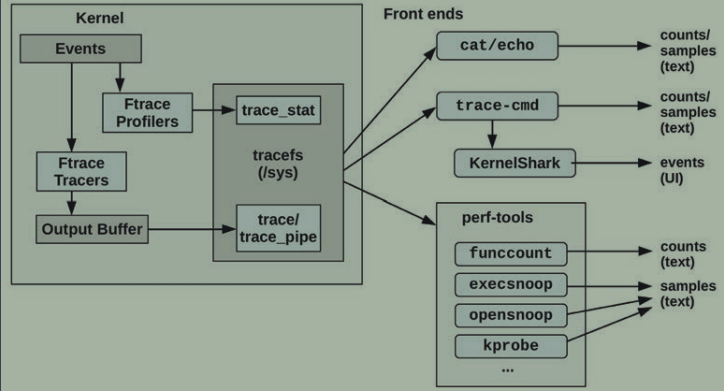
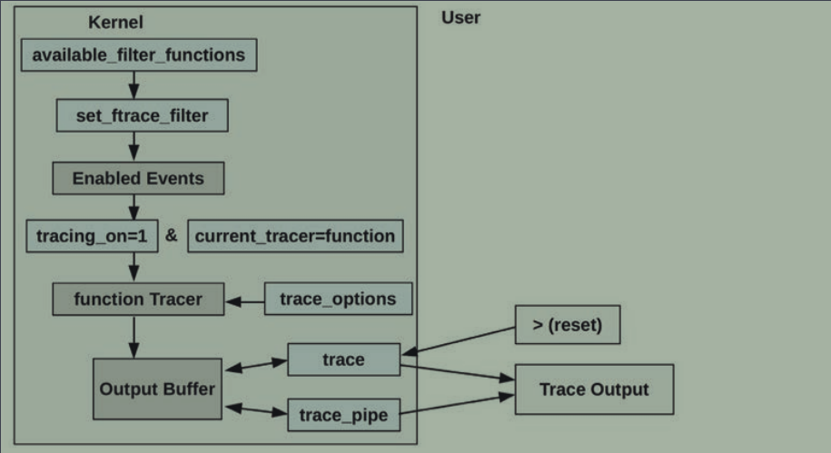
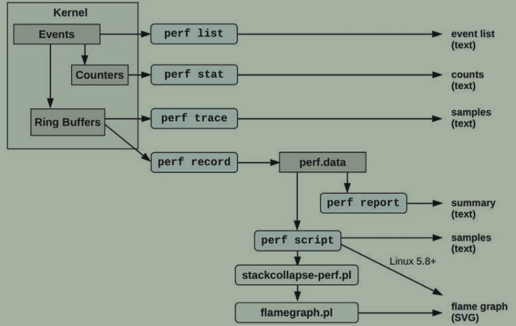
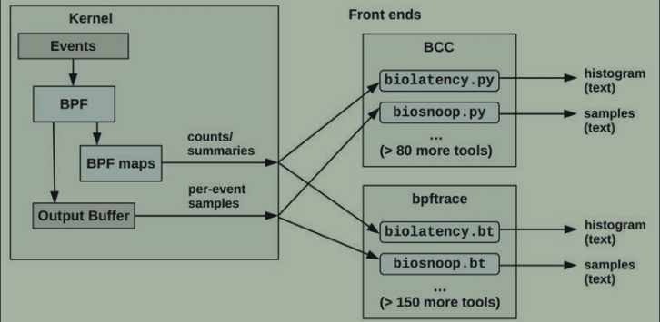
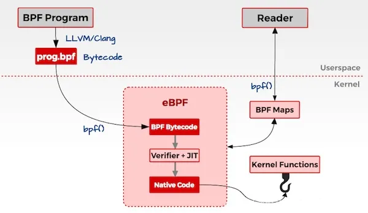

## <center>嵌入式常用性能调试手段</center>
[TOC]

### 一、ftrace

#### 1. 概述

&emsp;&emsp;Ftrace是Linux官方的tracer，一个由不同的tracers和profilers组成的多功能工具。它可以在没有任何额外的用户级前端的情况下使用，这使得它特别适合存储空间有限的嵌入式Linux环境。ftrace软件架构如下所示：



#### 2. 使用

&emsp;&emsp;ftrace跟踪使用涉及的设置和读取的文件如下所示：



#### 3. 原理


### 二、perf

#### 1. 概述

&emsp;&emsp;Perf是Linux官方的profiler。它和ftrace一样也是一个具有profiling和tracing的多功能工具，是内核perf_events可观察性子系统的前端。perf_events也被称为Linux(PCL)或Linux性能事件(LPE)的性能计数器。perf_events和perf前端始于性能监视计数器(PMC)功能，但后来也发展到支持基于事件的跟踪源：跟踪点、k探针、u探针和USDT。



#### 2. 使用

##### 2.1 编译

&emsp;&emsp;切换到\<kernel\>/tools/perf目录下，然后make ARCH=arm CROSS_COMPILE就可以在该目录下编译得到交叉编译的perf，最后拷贝到板子或者使用nfs挂载就可以使用。

##### 2.1 perf list

&emsp;&emsp;在性能剥析调试前首先要知道我们的目标是什么，使用`perf list`可列出我们可以追踪剥析的事件。在板子上执行得到结果如下：

```c
  /* */ 
  branch-instructions OR branches                    [Hardware event]
  branch-misses                                      [Hardware event]
  cache-misses                                       [Hardware event]
  cache-references                                   [Hardware event]
  cpu-cycles OR cycles                               [Hardware event]
  instructions                                       [Hardware event]
  stalled-cycles-backend OR idle-cycles-backend      [Hardware event]
  stalled-cycles-frontend OR idle-cycles-frontend    [Hardware event]
  .....
      
  /* 只有perf使用的静态函数探针 */    
  alignment-faults                                   [Software event]
  bpf-output                                         [Software event]
  context-switches OR cs                             [Software event]
  cpu-clock                                          [Software event]
  cpu-migrations OR migrations                       [Software event]
  dummy                                              [Software event]
  emulation-faults                                   [Software event]
  major-faults                                       [Software event]
  minor-faults                                       [Software event]
  page-faults OR faults                              [Software event]
  task-clock                                         [Software event]
  .....
      
  /* */    
  L1-dcache-load-misses                              [Hardware cache event]
  L1-dcache-loads                                    [Hardware cache event]
  L1-dcache-store-misses                             [Hardware cache event]
  L1-dcache-stores                                   [Hardware cache event]
  L1-icache-load-misses                              [Hardware cache event]
  branch-load-misses                                 [Hardware cache event]
  branch-loads                                       [Hardware cache event]
  dTLB-load-misses                                   [Hardware cache event]
  dTLB-store-misses                                  [Hardware cache event]
  iTLB-load-misses                                   [Hardware cache event]
  .....
      
   /* 除了perf还有其他工具使用的静态函数探针 */ 
  alarmtimer:alarmtimer_cancel                       [Tracepoint event]
  alarmtimer:alarmtimer_fired                        [Tracepoint event]
  alarmtimer:alarmtimer_start                        [Tracepoint event]
  alarmtimer:alarmtimer_suspend                      [Tracepoint event]
  block:block_bio_backmerge                          [Tracepoint event]
  block:block_bio_bounce                             [Tracepoint event]
  block:block_bio_complete                           [Tracepoint event]
  block:block_bio_frontmerge                         [Tracepoint event]
  block:block_bio_queue                              [Tracepoint event]
  .....
```

&emsp;&emsp;嵌入式上的perf列出的事件基本只有Software event和Tracepoint event。其中Software event是内核在代码在代码中使用变量对某些硬件事件计数；Tracepoint event通常指的是静态探针事件，但是在perf list显示的Tracepoint event包含了动态探针事件比如kprobe，uprobe，不过动态探针事件一开始并没有，需要生成添加才会在perf list中显示。

列出当前所有的事件：

```c
perf list
```

列出tcp系列的静态探针事件：

```c
perf list 'tcp:*'
```

列出包含tcp字符串的事件：

```c
perf list tcp		//无论tcp在字符串中的任何位置
```

##### 2.2 perf stat

&emsp;&emsp;`perf stat`命令用来计数事件，它是高效并准确的，它利用内核上下文中的变量统计software event和利用pmc寄存器统计硬件事件。所以可以在采样前利用perf stat大概估算一个事件的频率再调整频率。比如下面获取一秒内的sched:sched_switch事件的次数：

```c
root@~# perf stat -e sched:sched_switch -a -- sleep 1
 Performance counter stats for 'system wide':
               119      sched:sched_switch
       1.003069870 seconds time elapsed
```

常用方法如下：

```c
/* -e 指定统计的事件，如果没有指定任何事件则默认为cpu-clock,context-switches,cpu-migrations,page-faults
 * -a 指定全部cpu在command期间，如果没有则只是针对当前cpu在command期间
 * -A 显示每个cpu的统计，需要和-I intelval搭配
 * -- 不是强制的，可读性强，将command分开
 */
perf stat -- sleep 1	//统计sleep 1指令期间的当前cpu的默认事件，只是sleep命令在cpu上执行的期间，
    				 //大概就是开始执行sleep进程到释放cpu睡眠前这段时间,非常短,2毫秒左右
perf stat -e cs -a -- sleep 1	//统计sleep 1指令期间的所有cpu一起的cs事件
perf stat -e cs,cycles -a -- sleep 1	
perf stat -e cs -a -A -I 1000 -- sleep 50	//1000ms间隔统计一次每个cpu的cs事件 
perf stat -p 15 -- sleep 2  //统计pid15的默认事件
```

##### 2.3 perf record

&emsp;&emsp;`perf record`采样事件数据保存到文件中，然后通过perf record或者perf script读取分析这个文件。

```c
/* -F 采样频率 
 * -g 函数栈
 */
perf record -e sched:sched_switch -a -- sleep 30
perf record -F 50 -a -g -- sleep 30
```

##### 2.4 perf report

&emsp;&emsp;`perf report`读取`perf record`生成的perf.data文件然后概括汇总显示。

```c
/* --tui 默认，交互模式
 * --stdio 没有交互，展开显示
 */
perf report
perf report --stdio
```

##### 2.5 perf script

&emsp;&emsp;和perf report一样读取perf.data文件，但是是将每个采样格式化后输出，没有概括汇总，通常情况下是为了火焰图才使用，不怎么单独使用。

##### 2.6 火焰图

&emsp;&emsp;传统的perf命令其实不是很直观，下面火焰图登场，它能清晰的展现函数的调用关系和所占用cpu的比例。具体步骤如下，具体要说明一下$前缀的命令表示在主机，#前缀的命令表示在开发板。

```c
/* 主机上下载火焰图工具脚本并切换到火焰图工具目录 */
$ git clone --depth 1 https://github.com/brendangregg/FlameGraph
$ cd FlameGraph
/* 生成perf.data */
# perf record -F 99 -a -g -- sleep 10
/* 转化为可直接读取的格式 */
# perf script > out.perf
/* 将out.perf拷贝到主机的FlameGraph目录下 */
# cp out.perf /root/nfs
$ cp /home/hanglory/nfs_share/out.perf /home/hanglory/yezheng/git/FlameGraph/
/* 过滤包含cpu_idle名的函数，但是显示会有误导性，比如default_idle_call
 * 的上一层子函数有arch_cpu_idle和__irq_svc,下面的命令过滤了arch_cpu_idle，
 * 然后上面只剩__irq_svc，感觉default_idle_call分配了所有时间给了__irq_svc
 */
$ ./stackcollapse-perf.pl out.perf | grep -v cpu_idle > out.folded	//过滤cpu_idle
/* 生成火焰图文件out.svg，最后用谷歌浏览器或其他工具打开就可以看了 */    
$ ./flamegraph.pl out.folded > out.svg
```

##### 2.7 perf probe

&emsp;&emsp;动态探针事件相关的子命令，显示在perf list的tracepoint event中。

```c

```


##### 2.x perf annotate

##### 2.x perf top

##### 2.x perf trace

##### 2.x perf ftrace

#### 3. 原理


### 三、kprobe

#### 1. 概述

#### 2. 使用

#### 3. 原理


### 四、ebpf

#### 1. 概述



#### 2. 嵌入式上使用 -- 前端ply

#### 3. 原理




### 五、kgdb


### 六、资源管理


### 七、/proc和/sys

#### 1. 系统内存

```c
/****************
/proc/meminfo.
未考虑锁定内存的情况下有下式：
pagecache = Buffers + Cached + SwapCached = Active(file) + Inactive(file) + Shmem + SwapCached.
tmpfs占用的内存页不映射具体的文件，但也是基于文件系统的页，因此不统计在AnonPages，而是统计在了Cached、Shmem、Active(anon)、Inactive(anon)、Mapped(当内存页被attached)中.
file-backed页包含匿名共享页.
Active(anon)+Inactive(anon) = AnonPages(私有匿名) + Shmem(共享匿名)一般情况下成立，但如果AnonPages或者Shmem有内存页被mlock了就不等，此时Active(anon)+Inactive(anon)减小Unevictable和Mlocked增大
*****************/

MemTotal:        2003724 kB		//所有可用的ram大小，即物理内存减去预留的和内核代码
MemFree:         1977444 kB		//表示系统尚未使用的物理内存MemTotal-MemFree就是用掉的
MemAvailable:    1934672 kB		//MemFree加上已用但可回收的物理内存
Buffers:               0 kB		//直接读写外存设备、文件系统元数据(比如superblock)所使用的缓存
Cached:             5800 kB		//读写普通文件使用的缓存,和共享匿名映射内存，都是file-backed
SwapCached:            0 kB		//匿名页交换到交换分区然后交换回来占用的内存
Active:             4124 kB		//最近被访问的内存页
Inactive:           2284 kB		//长时间未访问的内存页
Active(anon):        644 kB		//最近访问的私有匿名页和共享匿名页
Inactive(anon):       12 kB		//长时间未访问的私有匿名页和共享匿名页
Active(file):       3480 kB		//最近访问的除了共享匿名页的file-backed页
Inactive(file):     2272 kB		//长时间未访问的除了共享匿名页的file-backed页
Unevictable:           0 kB		//不能page-out和swap-out的内存页，有VM_LOCKED、SHM_LOCK和ramfs
Mlocked:               0 kB		//被mlock()锁定的内存大小
HighTotal:       1245184 kB
HighFree:        1236868 kB
LowTotal:         758540 kB
LowFree:          740576 kB
SwapTotal:             0 kB
SwapFree:              0 kB
Dirty:                 0 kB		//脏页，但不包括Writeback和NFS_Unstable
Writeback:             0 kB		//正准备写入外存设备的页
AnonPages:           632 kB		//私有匿名映射内存页
Mapped:             1712 kB		//Cached的子集，当不再和进程关联后Mapped减小但Cached不会直到被回收
Shmem:                48 kB		//用户共享内存、tmpfs、devtmpfs等(本质都是匿名映射的共享内存)
KReclaimable:       3696 kB		//
Slab:               8432 kB		//缓存inode，dentry等内核数据结构
SReclaimable:       3696 kB		//可回收slab
SUnreclaim:         4736 kB		//不可回收slab
KernelStack:         352 kB		//内核栈
PageTables:           72 kB		//页表占用的内存
NFS_Unstable:          0 kB		//nfs的缓存
Bounce:                0 kB
WritebackTmp:          0 kB
CommitLimit:     1001860 kB
Committed_AS:          0 kB
VmallocTotal:     245760 kB		//可用虚拟内存总大小
VmallocUsed:         336 kB		
VmallocChunk:          0 kB
Percpu:              192 kB
```

#### 2. 进程内存

```c
/****************
/proc/<pid>/maps
*****************/
```


```c
/****************
/proc/<pid>/smaps
*****************/
```


### 八、应用调试

#### 1. strace

```c
strace ./app
strace -e trace=xx,yy ./app  //追踪xx,yy
strace -e xx,yy ./app  //追踪xx,yy
strace -e trace=!xx,yy ./app  //追踪xx,yy
strace -e !xx,yy ./app  //追踪非xx,yy
strace -c ./app		//列出调用次数和时间的总结
strace -i ./app		//显示地址
strace -p `pidof <prog>`  //追踪已经启动的进程
strace -t|tt ./app		//显示系统调用的执行时刻，一个是按秒一个按毫秒
```

#### 2. gdb

```c
//参考github的gdb.md和DEBUG HACKS中文版--深入调试的技术和工具
```

#### 3. valgrind

```c
valgrind --tool=memcheck --leak-check=summary ./app	// no|summary|full
valgrind  --leak-check=summary ./app //memcheck为默认工具，所以等价于上一句
```

#### 4. ps

```c
ps -o XXX  //XXX随便输入，输错了然后提示ps: bad -o argument 'PID', supported arguments: user,group,comm,args,pid,ppid,pgid,tty,vsz,sid,stat,rss
 
	//comm 程序名 
	//vsz 进程虚拟内存大小，单位kb
	//rss 进程驻留物理内存大小，不包括交换分区
```

#### 5. top

```c
//c 切换显示所有cpu
//s 切换显示内存信息
```

#### 6. free

```c
/*
 *下面指的都是物理内存
 */

//total
//used
//free
	//未分配的物理内存大小
//shared
//buff/cache 
	//buff是读写文件映射的缓存
	//cache是直接读写磁盘的缓存
//available
	//实际可用的物理内存大小，是估算出来的不太准，一般比free大，但在这个板子比free小，不知为啥
	//available = free + shared + buff/cache - 不可回收部分
	//不可回收部分有(tmpfs、ramfs、进程间通信的共享内存)、不可回收slab等
```

