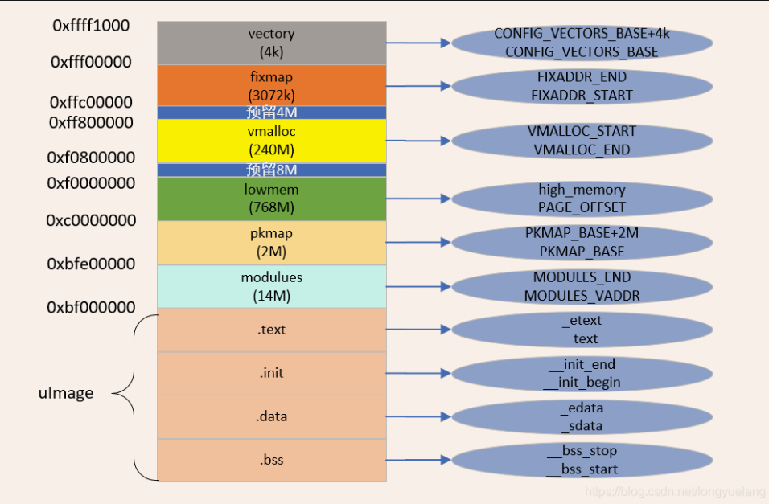

## <center>高端内存使用</center>

[TOC]

---

### 1.内核高端虚拟内存布局



- vector：异常向量表虚拟地址

- fixmap：用于固定映射和临时映射

- vmalloc：用于给vmalloc/ioremap动态分配内存

- lowmem：线性映射区

- pkmap：用于永久映射

- modules：加载模块的虚拟地址

- .text .init .data .bss：内核镜像几个核心的段对应的虚拟地址


### 2.映射

#### 2.1固定映射

&emsp;&emsp;映射到fixmap区，内核代码中事先实现，用于将某些特定的物理地址映射到fixmap空间，早期设置决定。

#### 2.2永久映射 

&emsp;&emsp;映射到pkmap区，通过kmap调用来映射。函数使用方法如下：

```c
    /*
     * PKMAP Virtual Space.
     * 0                                                        4G
     * +---------------+---------------------------------+------+
     * |               |                                 |      |
     * |               |   Persister Mappings (FIXMAP)   |      |
     * |               |                                 |      |
     * +---------------+---------------------------------+------+
     *                 A                                 A
     *                 |                                 |
     *                 |                                 |
     *                 |                                 |
     *                 o                                 o
     *             PKMAP_BASE           PKMAP_BASE+(LAST_PKMAP * PAGE_SIZE))
     */
    struct page *high_page  = NULL;
    unsigned int *KMAP_init = NULL;

    /* Allocate a page from Highmem */
    high_page = alloc_pages(__GFP_HIGHMEM, 0);
    /* Map on pkmap */
    KMAP_int  = kmap(high_page);
    printk("[*]unsigned int *KMAP_int:       Address: %#08x\n",
                               (unsigned int)(unsigned long)KMAP_int);
    if (KMAP_int)
        kunmap(high_page);
    __free_pages(high_page, 0);
```

&emsp;&emsp;首先使用alloc_pages函数和\_\_GFP_HIGHMEM标志从高端内存分配一个物理页，然后使用kmap函数将这个物理页映射到pkmap区域，程序可以这个返回地址使用这段内存，当不使用这段内存时通过kukmap和\_\_free_pages函数释放。使用内核模块测试如下：

```c
#include <linux/module.h>   
#include <linux/gfp.h> 			 //alloc_pages __GPF_HIGHMEM
#include <linux/mm_types.h>     //struct page

extern void* high_memory;

#include <asm/fixmap.h>   
#include <asm/pgtable.h>   
#include <asm/memory.h>   
#include <asm/highmem.h>   

static int __init kmap_example_init(void)
{
	printk("kmap example init\n");
    unsigned long fixaddr_end,fixaddr_start;
    unsigned long vmalloc_end,vmalloc_start;
    unsigned long lowmem_end,lowmem_start;
    unsigned long pkmap_end,pkmap_start;
    fixaddr_end = FIXADDR_END;
    fixaddr_start = FIXADDR_START;
    vmalloc_end = VMALLOC_END;
    vmalloc_start = VMALLOC_START;
    lowmem_start = PAGE_OFFSET;
    lowmem_end = (unsigned long)high_memory;
    pkmap_start = PKMAP_BASE;
    pkmap_end = PKMAP_BASE + 0x200000;

    printk("***************************************************\n");
    printk("FIXMAP:      %8lx -- %8lx\n", fixaddr_start, fixaddr_end);
    printk("VMALLOC:     %8lx -- %8lx\n", vmalloc_start, vmalloc_end);
    printk("LOWMEM:      %8lx -- %8lx\n", lowmem_start, lowmem_end);
    printk("PKMAP:       %8lx -- %8lx\n", pkmap_start, pkmap_end);
    printk("***************************************************\n");


    struct page *high_page = NULL;
    unsigned int *KMAP_int = NULL;

    /* Allocate a page from Highmem */
    high_page = alloc_pages(__GFP_HIGHMEM, 0);
    /* Map on pkmap */
    KMAP_int  = kmap(high_page);
    printk("[*]unsigned int *KMAP_int:       Address: %#08x\n",
                               (unsigned int)(unsigned long)KMAP_int);
    if (KMAP_int)
        kunmap(high_page);
    __free_pages(high_page, 0);


	return 0;
}


static void __exit kmap_example_exit(void)
{
	printk("kmap example exit\n");
}

module_init(kmap_example_init);
module_exit(kmap_example_exit);

MODULE_AUTHOR("yeshen");
MODULE_DESCRIPTION("kmap example");
MODULE_LICENSE("GPL");
```

板子上测试得到的结果如下 ：

```c
root@/lib/modules/5.5.0-00065-gff94549704ff/extra# insmod kmap_example.ko
[   58.787147] kmap example init
[   58.790110] ***************************************************
[   58.796036] FIXMAP:      ffc00000 -- fff00000
[   58.800374] VMALLOC:     f0800000 -- ff800000
[   58.804745] LOWMEM:      c0000000 -- f0000000
[   58.809084] PKMAP:       bfe00000 -- c0000000
[   58.813435] ***************************************************
[   58.819334] [*]unsigned int *KMAP_int:       Address: 0xbfe2b000
```

&emsp;&emsp;从结果可以看到kmap得到的虚拟地址0xbfe2b000落在PKMAP区域中。

#### 2.3临时映射

&emsp;&emsp;临时映射也叫原子映射，用于不可阻塞的场景。映射到fixmap区，驱动开发人员通常通过高级接口kmap_atomic调用来映射，而内核开发人员有时会通过低级接口\_\_fix_to_virt()和set_fixmap()来使用。**低级接口使用方法**如下：

```c
   /* 
    * FIXMAP Virtual Space.
    * 0                                                       4G
    * +--------------------------------+----------------+------+
    * |                                |                |      |
    * |                                |  Fixmap Space  |      |
    * |                                |                |      |
    * +--------------------------------+----------------+------+
    *                                  A                A
    *                                  |                |
    *                                  |                |
    *                                  |                |
    *                                  o                o
    *                             FIXADDR_START    FIXADDR_TOP
    */
    struct page *high_page;
    int idx, type;
    unsigned long vaddr;

    /* Allocate a physical page */
    high_page = alloc_page(__GFP_HIGHMEM);

    /* Obtain current CPU's FIX_KMAP_BEGIN */
    type = kmap_atomic_idx_push();
    idx  = FIX_KMAP_BEGIN + type + KM_TYPE_NR * smp_processor_id();

    /* Obtain fixmap virtual address by index */
    vaddr = __fix_to_virt(idx);
    /* Associate fixmap virtual address with physical address */
    set_fixmap(idx, page_to_phys(high_page));

    printk("[*]unsignd long vaddr:       Address: %#08x\n",
                               (unsigned int)(unsigned long)vaddr);

    /* Remove associate with fixmap */
    clear_fixmap(idx);
	__free_pages(high_page, 0);
```

&emsp;&emsp;首先使用alloc_page函数和\_\_GFP_HIGHMEM申请一个高端物理内存页，然后通过kmap_atomic_idx_push函数从FIX_KMAP_BEGIN 到 FIX_KMAP_END 中获取当前cpu的临时映射区索引。最后通过 \_\_fix_to_virt和 set_fixmap函数将这个高端内存页映射到临时映射区，内核就可以使用这块虚拟内存区。如果不再使用这部分内存区，使用 clear_fixmap和\_\_free_pages释放这段虚拟内存和物理页。使用内核模块测试如下：

```c
#include <linux/module.h>   
#include <linux/gfp.h>  //alloc_pages __GPF_HIGHMEM
#include <linux/mm_types.h>     //struct page
#include <linux/highmem.h>
#include <linux/smp.h>

extern void* high_memory;

#include <asm/fixmap.h>   
#include <asm/pgtable.h>   
#include <asm/memory.h>   
#include <asm/highmem.h>   
#include <asm/kmap_types.h>
#include <asm-generic/fixmap.h>

static int __init lowapi_atomic_example_init(void)
{
    printk("lowapi_atomic map example init\n");
    unsigned long fixaddr_end,fixaddr_start;
    unsigned long vmalloc_end,vmalloc_start;
    unsigned long lowmem_end,lowmem_start;
    unsigned long pkmap_end,pkmap_start;
    fixaddr_end = FIXADDR_END;
    fixaddr_start = FIXADDR_START;
    vmalloc_end = VMALLOC_END;
    vmalloc_start = VMALLOC_START;
    lowmem_start = PAGE_OFFSET;
    lowmem_end = (unsigned long)high_memory;
    pkmap_start = PKMAP_BASE;
    pkmap_end = PKMAP_BASE + 0x200000;

    printk("***************************************************\n");
    printk("FIXMAP:      %8lx -- %8lx\n", fixaddr_start, fixaddr_end);
    printk("VMALLOC:     %8lx -- %8lx\n", vmalloc_start, vmalloc_end);
    printk("LOWMEM:      %8lx -- %8lx\n", lowmem_start, lowmem_end);
    printk("PKMAP:       %8lx -- %8lx\n", pkmap_start, pkmap_end);
    printk("***************************************************\n");


    struct page *high_page;
    int idx, type;
    unsigned long vaddr;

    /* Allocate a physical page */
    high_page = alloc_page(__GFP_HIGHMEM);

    /* Obtain current CPU's FIX_KMAP_BEGIN */
    type = kmap_atomic_idx_push();
    idx  = type + KM_TYPE_NR * smp_processor_id();

    /* Obtain fixmap virtual address by index */
    vaddr = __fix_to_virt(iFIX_KMAP_BEGIN + idx);
    /* Associate fixmap virtual address with physical address */
    set_fixmap(idx, page_to_phys(high_page));

    printk("[*]unsignd long vaddr:       Address: %#08x\n",
                               (unsigned int)(unsigned long)vaddr);

    /* Remove associate with fixmap */
    clear_fixmap(idx);
	__free_page(high_page);
    
    return 0;
}


static void __exit lowapi_atomic_example_exit(void)
{
    printk("lowapi atomic map example exit\n");
}

module_init(lowapi_atomic_example_init);
module_exit(lowapi_atomic_example_exit);

MODULE_AUTHOR("yeshen");
MODULE_DESCRIPTION("lowapi atomic map example");
MODULE_LICENSE("GPL");
```

板子上测试得到的结果如下 ：

```c
root@/lib/modules/5.5.0-00071-g32eb0b9d742b/extra# insmod atomic_low.ko
[   58.514430] atomic_example: loading out-of-tree module taints kernel.
[   58.521286] lowapi_atomic map example init
[   58.525370] ***************************************************
[   58.531313] FIXMAP:      ffc00000 -- fff00000
[   58.535651] VMALLOC:     f0800000 -- ff800000
[   58.539988] LOWMEM:      c0000000 -- f0000000
[   58.544340] PKMAP:       bfe00000 -- c0000000
[   58.548680] ***************************************************
[   58.554591] [*]unsignd long vaddr:       Address: 0xffefe000
```

&emsp;&emsp;从结果可以看到临时映射低级接口得到的虚拟地址0xffefe000落在FIXMAP区域中。

**高级接口使用方法**如下：

```c
    struct page *high_page  = NULL;
    unsigned int *KMAP_atomic = NULL;

    /* Allocate a page from Highmem */
    high_page = alloc_pages(__GFP_HIGHMEM, 0);
    /* Map on pkmap */
    KMAP_atomic  = kmap_atomic(high_page);
    printk("[*]unsigned int *KMAP_atomic:       Address: %#08x\n",
                               (unsigned int)(unsigned long)KMAP_atomic);
    if (KMAP_atomic)
        kunmap_atomic(KMAP_atomic);	
    __free_pages(high_page, 0);
```

&emsp;&emsp;首先使用alloc_pages函数和\_\_GFP_HIGHMEM标志从高端内存分配一个物理页，然后使用kmap_atomic函数将这个物理页映射到fixmap中的临时映射区，程序可以这个返回地址使用这段内存，当不使用这段内存时通过kunmap_atomic和\_\_free_pages函数释放，但其实kunmap_atomic不是必要的，下一个临时映射会自动覆盖。使用内核模块测试如下：

```c
#include <linux/module.h>   
#include <linux/gfp.h>  //alloc_pages __GPF_HIGHMEM
#include <linux/mm_types.h>     //struct page
#include <linux/highmem.h>
#include <linux/smp.h>

extern void* high_memory;

#include <asm/fixmap.h>   
#include <asm/pgtable.h>   
#include <asm/memory.h>   
#include <asm/highmem.h>   
#include <asm/kmap_types.h>
#include <asm-generic/fixmap.h>


static int __init highapi_atomic_example_init(void)
{
    printk("highapi_atomic map example init\n");
    unsigned long fixaddr_end,fixaddr_start;
    unsigned long vmalloc_end,vmalloc_start;
    unsigned long lowmem_end,lowmem_start;
    unsigned long pkmap_end,pkmap_start;
    fixaddr_end = FIXADDR_END;
    fixaddr_start = FIXADDR_START;
    vmalloc_end = VMALLOC_END;
    vmalloc_start = VMALLOC_START;
    lowmem_start = PAGE_OFFSET;
    lowmem_end = (unsigned long)high_memory;
    pkmap_start = PKMAP_BASE;
    pkmap_end = PKMAP_BASE + 0x200000;

    printk("***************************************************\n");
    printk("FIXMAP:      %8lx -- %8lx\n", fixaddr_start, fixaddr_end);
    printk("VMALLOC:     %8lx -- %8lx\n", vmalloc_start, vmalloc_end);
    printk("LOWMEM:      %8lx -- %8lx\n", lowmem_start, lowmem_end);
    printk("PKMAP:       %8lx -- %8lx\n", pkmap_start, pkmap_end);
    printk("***************************************************\n");


    struct page *high_page  = NULL;
    unsigned int *KMAP_atomic = NULL;

    /* Allocate a page from Highmem */
    high_page = alloc_pages(__GFP_HIGHMEM, 0);
    /* Map on pkmap */
    KMAP_atomic  = kmap_atomic(high_page);
    printk("[*]unsigned int *KMAP_atomic:       Address: %#08x\n",
                               (unsigned int)(unsigned long)KMAP_atomic);
    if (KMAP_atomic)
        kunmap_atomic(KMAP_atomic);	/* 其实做不做都行 */
    __free_pages(high_page, 0);
    
    return 0;
}


static void __exit highapi_atomic_example_exit(void)
{
    printk("highapi atomic map example exit\n");
}

module_init(highapi_atomic_example_init);
module_exit(highapi_atomic_example_exit);

MODULE_AUTHOR("yeshen");
MODULE_DESCRIPTION("highapi atomic map example");
MODULE_LICENSE("GPL");
```

板子上测试得到的结果如下 ：

```c
root@/lib/modules/5.5.0-00071-g32eb0b9d742b/extra# insmod atomic_high.ko
[  357.915859] highapi_atomic map example init
[  357.920032] ***************************************************
[  357.925971] FIXMAP:      ffc00000 -- fff00000
[  357.930312] VMALLOC:     f0800000 -- ff800000
[  357.934682] LOWMEM:      c0000000 -- f0000000
[  357.939021] PKMAP:       bfe00000 -- c0000000
[  357.943379] ***************************************************
[  357.949275] [*]unsigned int *KMAP_atomic:       Address: 0xffefd000
```

&emsp;&emsp;从结果可以看到临时映射高级接口得到的虚拟地址0xffefd000落在FIXMAP区域中。


### 3.内存分配

#### 3.1 kmalloc

&emsp;&emsp;kamalloc函数返回的虚拟地址通常在normal(lowmem)区，且物理地址连续（在x86中如果使用GFP_DMA标记分配会返回dma区，但arm的内核虚拟地址中没有dma区）。函数使用方法如下：

```c
    /*
     * Normal Virtual Space
     * 0                                                       4G
     * +-------+-----------------------------------+------------+
     * |       |                                   |            |
     * |       |       Normal Virtual Space        |            |
     * |       |                                   |            |
     * +-------+-----------------------------------+------------+
     *         A                                   A
     *         |                                   |
     *         |                                   |
     *         |                                   |
     *         o                                   o    
     *    PAGE_OFFSET                         high_memory
     */
    unsigned int *NORMAL_int = NULL;

    NORMAL_int = (unsigned int *)kmalloc(sizeof(unsigned int), GFP_KERNEL);
    printk("[*]unsigned int *NORMAL_int:     Address: %#08x\n",
                                 (unsigned int)(unsigned long)NORMAL_int);
    if (NORMAL_int)
        kfree(NORMAL_int);
```

&emsp;&emsp;使用kmalloc直接返回可以使用的虚拟内存地址，GFP_KERNEL是最为常用的标志，在申请内存时可以阻塞，因此不可以用在中断上下文，如果不想阻塞可以使用GFP_ATOMIC，当不再使用这片内存时使用kfree函数释放。使用内核模块测试如下：

```c
#include <linux/module.h>   
#include <linux/gfp.h>  //alloc_pages __GPF_HIGHMEM
#include <linux/mm_types.h>     //struct page

extern void* high_memory;

#include <asm/fixmap.h>   
#include <asm/pgtable.h>   
#include <asm/memory.h>   
#include <asm/highmem.h>   
#include <linux/slab.h>   

static int __init kmalloc_example_init(void)
{
	printk("kmalloc example init\n");
    unsigned long fixaddr_end,fixaddr_start;
    unsigned long vmalloc_end,vmalloc_start;
    unsigned long lowmem_end,lowmem_start;
    unsigned long pkmap_end,pkmap_start;
    fixaddr_end = FIXADDR_END;
    fixaddr_start = FIXADDR_START;
    vmalloc_end = VMALLOC_END;
    vmalloc_start = VMALLOC_START;
    lowmem_start = PAGE_OFFSET;
    lowmem_end = (unsigned long)high_memory;
    pkmap_start = PKMAP_BASE;
    pkmap_end = PKMAP_BASE + 0x200000;

    printk("***************************************************\n");
    printk("FIXMAP:      %8lx -- %8lx\n", fixaddr_start, fixaddr_end);
    printk("VMALLOC:     %8lx -- %8lx\n", vmalloc_start, vmalloc_end);
    printk("LOWMEM:      %8lx -- %8lx\n", lowmem_start, lowmem_end);
    printk("PKMAP:       %8lx -- %8lx\n", pkmap_start, pkmap_end);
    printk("***************************************************\n");


    unsigned int *NORMAL_int = NULL;

    NORMAL_int = (unsigned int *)kmalloc(sizeof(unsigned int), GFP_KERNEL);
    printk("[*]unsigned int *NORMAL_int:     Address: %#08x\n",
                                 (unsigned int)(unsigned long)NORMAL_int);
    if (NORMAL_int)
        kfree(NORMAL_int);

	return 0;
}


static void __exit kmalloc_example_exit(void)
{
	printk("kmalloc example exit\n");
}

module_init(kmalloc_example_init);
module_exit(kmalloc_example_exit);

MODULE_AUTHOR("yeshen");
MODULE_DESCRIPTION("kmalloc example");
MODULE_LICENSE("GPL");
```

板子上测试得到的结果如下 ：

```c
root@/lib/modules/5.5.0-00071-g32eb0b9d742b/extra# insmod kmalloc_example.ko
[  460.066273] kmalloc example init
[  460.069494] ***************************************************
[  460.075452] FIXMAP:      ffc00000 -- fff00000
[  460.079791] VMALLOC:     f0800000 -- ff800000
[  460.084173] LOWMEM:      c0000000 -- f0000000
[  460.088513] PKMAP:       bfe00000 -- c0000000
[  460.092865] ***************************************************
[  460.098762] [*]unsigned int *NORMAL_int:     Address: 0xeea18980
```

&emsp;&emsp;从结果可以看到kmalloc(..., GFP_KERNEL)得到的虚拟地址0xeea18980落在LOWMEM区域中。

#### 3.2 vmalloc

&emsp;&emsp;vmalloc函数返回的虚拟地址在vmalloc区，且物理地址不一定连续，在申请内存时可以阻塞。函数使用方法如下：

```c
    /*
     * VMALLOC Virtual Space
     * 0                                                       4G
     * +---------+----------------+-----------------------+-----+
     * |         |                |                       |     |
     * |         |                | VMALLOC Virtual Space |     |
     * |         |                |                       |     |
     * +---------+----------------+-----------------------+-----+
     *           A                A                       A
     *           |                |                       |
     *           | <------------> |                       |
     *           | VMALLOC_OFFSET |                       |
     *           |                |                       |
     *           o                o                       o
     *      high_memory      VMALLOC_START           VMALLOC_END
     */
    unsigned int *VMALLOC_int = NULL;

    VMALLOC_int = (unsigned int *)vmalloc(sizeof(unsigned int));
    printk("[*]unsigned int *VMALLOC_int:    Address: %#08x\n",
                               (unsigned int)(unsigned long)VMALLOC_int);
    if (VMALLOC_int)
        vfree(VMALLOC_int);
```

&emsp;&emsp;vmalloc函数用于从vmalloc区域中分配一段可用的虚拟内存，当不在使用时使用vfree函数释放。使用内核模块测试如下：

```c
#include <linux/module.h>   
#include <linux/gfp.h>  //alloc_pages __GPF_HIGHMEM
#include <linux/mm_types.h>     //struct page
#include <linux/vmalloc.h>     

extern void* high_memory;

#include <asm/fixmap.h>   
#include <asm/pgtable.h>   
#include <asm/memory.h>   
#include <asm/highmem.h>   

static int __init vmalloc_example_init(void)
{
	printk("vmalloc example init\n");
    unsigned long fixaddr_end,fixaddr_start;
    unsigned long vmalloc_end,vmalloc_start;
    unsigned long lowmem_end,lowmem_start;
    unsigned long pkmap_end,pkmap_start;
    fixaddr_end = FIXADDR_END;
    fixaddr_start = FIXADDR_START;
    vmalloc_end = VMALLOC_END;
    vmalloc_start = VMALLOC_START;
    lowmem_start = PAGE_OFFSET;
    lowmem_end = (unsigned long)high_memory;
    pkmap_start = PKMAP_BASE;
    pkmap_end = PKMAP_BASE + 0x200000;

    printk("***************************************************\n");
    printk("FIXMAP:      %8lx -- %8lx\n", fixaddr_start, fixaddr_end);
    printk("VMALLOC:     %8lx -- %8lx\n", vmalloc_start, vmalloc_end);
    printk("LOWMEM:      %8lx -- %8lx\n", lowmem_start, lowmem_end);
    printk("PKMAP:       %8lx -- %8lx\n", pkmap_start, pkmap_end);
    printk("***************************************************\n");


    unsigned int *VMALLOC_int = NULL;

    VMALLOC_int = (unsigned int *)vmalloc(sizeof(unsigned int));
    printk("[*]unsigned int *VMALLOC_int:    Address: %#08x\n",
                               (unsigned int)(unsigned long)VMALLOC_int);
    if (VMALLOC_int)
        vfree(VMALLOC_int);

	return 0;
}


static void __exit vmalloc_example_exit(void)
{
	printk("vmalloc example exit\n");
}

module_init(vmalloc_example_init);
module_exit(vmalloc_example_exit);

MODULE_AUTHOR("yeshen");
MODULE_DESCRIPTION("vmalloc example");
MODULE_LICENSE("GPL");
```

板子上测试得到的结果如下 ：

```c
root@/lib/modules/5.5.0-00071-g32eb0b9d742b/extra# insmod vmalloc_example.ko
[  575.954002] vmalloc example init
[  575.957223] ***************************************************
[  575.963163] FIXMAP:      ffc00000 -- fff00000
[  575.967503] VMALLOC:     f0800000 -- ff800000
[  575.971874] LOWMEM:      c0000000 -- f0000000
[  575.976216] PKMAP:       bfe00000 -- c0000000
[  575.980551] ***************************************************
[  575.986493] [*]unsigned int *VMALLOC_int:    Address: 0xf081f000

```

&emsp;&emsp;从结果可以看到vmalloc得到的虚拟地址0xf081f000落在VMALLOC区域中。


### 头文件引用

```c
#include <asm/fixmap.h>
    FIXADDR_END
    FIXADDR_START
    FIX_KMAP_BEGIN

#include <asm/pgtable.h>
    VMALLOC_END
    VMALLOC_START

#include <asm/memory.h>
    PAGE_OFFSET
    high_memory

#include <asm/highmem.h>
    PKMAP_BASE + 0X200000
    PKMAP_BASE
    kmap

#include <linux/slab.h>
    kmalloc

#include <linux/vmalloc.h>
    vmalloc

#include <linux/gfp.h>
    alloc_pages
    __GFP_HIGHMEM

#include <linux/mm_types.h>
    struct page
    
#include <linux/highmem.h> 
    kmap_atomic_idx_push

#include <asm/kmap_types.h> 
    KM_TYPE_NR

#include <linux/smp.h> 
    smp_processor_id

#include <asm-generic/fixmap.h> 
    __fix_to_virt
    set_fixmap
```
